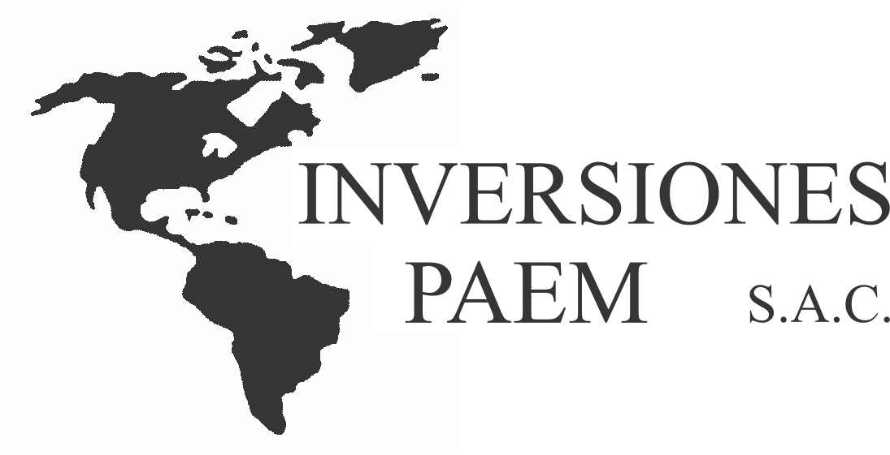

# Inversiones Paem SAC
## Acerca de la empresa
### Logo

### Descripción de la empresa
El grupo empresarial multinacional cuenta con más de una década de experiencia en servicios de tercerización (outsourcing) operando en **conservación de frutas, verduras y fabricación de alimentos especializados**. Se presenta como un aliado estratégico confiable para ayudar a cumplir los objetivos de sus clientes, brindando servicios oportunos y de calidad.
### Misión
*"En Inversiones PAEM SAC, nos comprometemos a ser el aliado estratégico confiable de nuestros clientes, proporcionando servicios de tercerización de primera clase en la conservación de frutas, verduras y la fabricación de alimentos especializados. Con más de una década de experiencia, nos esforzamos por ofrecer soluciones integrales y oportunas que cumplan y superen las expectativas de calidad, contribuyendo así al éxito y crecimiento de nuestros clientes."*
### Visión
*"Nos visualizamos como líderes en el sector de servicios de tercerización, reconocidos por nuestra excelencia operativa, innovación constante y compromiso inquebrantable con la satisfacción del cliente. Aspiramos a expandir nuestra presencia multinacional, ampliando nuestro portafolio de servicios y estableciendo nuevos estándares de calidad en cada mercado en el que operamos."*
### Clientes Principales
- Plaza Vea
- Mebol
- Vivanda
### Datos extra
- **RUC:** 20604057796
- **Razón Social:** Inversiones Paem S.A.c
- **Dirección:** Calle las exportaciones N°167 Urbanización Pro Industrial 07031 San Martín, Peru
- **Teléfono:** 981 091 166
## Contacto
- **Nombre**: Katherine Solange Villanueva Zuñiga
- **Correo**: analista.nominas@paemgroup.pe
- **Celular**: 997 057 134
- **Puesto**: Jefa del área de recursos humanos
## Descripción del proceso
Como cada módulo ctúa independientemente no se puede hacer un flujograma completo de todo lo que sucede en el área de RRHH por lo que hemos hecho el flujograma para cada módulo ya separado
1. [Registro de asistencias y solicitudes](../Entregable2/Flujogramas/Registro%20de%20asistencias%20y%20solicitudes.md)
2. [Nóminas](../Entregable2/Flujogramas/Administración%20de%20beneficios%20y%20compensaciones.md)
3. [Procedimiento de Capacitaciones](../Entregable2/Flujogramas/Capacitaciones.md)
4. [Cese de Personal](../Entregable2/Flujogramas/Cese.md)
5. [Evaluación de Desempeño](../Entregable2/Flujogramas/Evaluacion.md)
6. [Reclutamiento y Selección del Personal](../Entregable2/Flujogramas/Reclutamiento.md)

---
***[Regresar al índice](../../README.md)***
