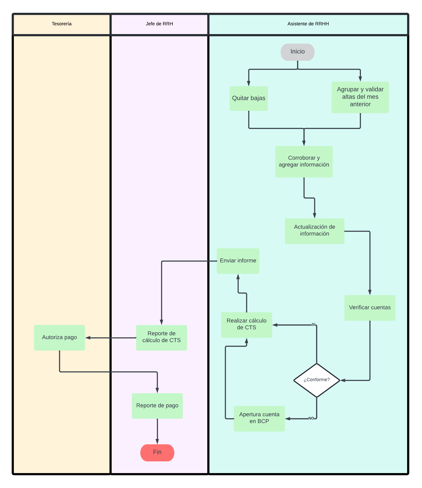

# Procedimiento de Administración de beneficios y compensaciones
## Descripción

Implica la gestión integral de los beneficios ofrecidos a los empleados, así como el manejo de la información relacionada con salarios y compensaciones adicionales. Esto incluye el registro y la actualización de beneficios como planes de pensiones, vacaciones y otros incentivos proporcionados por la empresa. Además, implica la gestión precisa de datos salariales, incluyendo aumentos, bonificaciones y otros incentivos, asegurando que se apliquen de manera justa y transparente.

## Flujograma
### Link: 

**[Administración de beneficios y compensaciones](https://lucid.app/lucidchart/3ca431d4-57d2-470a-9e1a-120c10f85bc8/edit?viewport_loc=2414%2C-534%2C3283%2C1472%2C0_0&invitationId=inv_468d1cd6-435f-4a6c-9c66-4a9a987ec2fc)**

#### Imagen 1: Flujo de Planilla 

#### Imagen 2: Flujo de CTS

#### Imagen 3: Flujo de Gratificación

## Descripción de los proceso del flujograma Planilla AS-IS

| Orden |               Paso               |                                                                                             Descripción                                                                                            | Encargado           |
|:-----:|:--------------------------------:|:--------------------------------------------------------------------------------------------------------------------------------------------------------------------------------------------------:|---------------------|
|   1   | Elección de sistema de pensiones | En caso de que el empleado no cuente con un sistema de pensiones se le brindará unos folletos con información para que elija el más adecuado en un plazo máximo de 10 días.                        | Asistente de RRHH   |
|   2   | Registro AFP                     | El empleado elige un sistema de pensiones. Se registra al empleado en la Administradora de Fondos de Pensiones (AFP) seleccionada. Se realizan los trámites necesarios para completar el registro  | Asistente de RRHH   |
|   3   | Registro portal SUNAT            | Si el empleado ya cuenta con un sistema de pensiones, se registrará al empleado en la SUNAT. Actualización de información personal y laboral del empleado en la SUNAT.                             | Asistente de RRHH   |
|   4   | Contrato laboral                 | Preparar y formalizar el contrato laboral del empleado. Redacción del contrato, la especificación de los términos y condiciones laborales y la obtención de la firma del empleado y del empleador. | Asistente de RRHH   |
|   5   | Entrega de reglamentos           | Entrega al empleado los reglamentos internos de la empresa como los reglamentos de conducta, políticas de recursos humanos, políticas de seguridad laboral, entre otros.                           | Asistente de RRHH   |
|   6   | Conformidad de entrega           | El empleado firma un documento de conformidad de entrega. El empleado ha recibido y comprendido los reglamentos internos de la empresa.                                                            | Personal contratado |
|   7   | Registro de sistema              | Registro del empleado al sistema interno de la empresa. Registro de datos personales, laborales y de beneficios al empleado.                                                                       | Asistente de RRHH   |

## Descripción de los procesos TO-BE

| Orden |                        Paso                       |                                                                                                                   Descripción                                                                                                                   | Encargado           |
|:-----:|:-------------------------------------------------:|:-----------------------------------------------------------------------------------------------------------------------------------------------------------------------------------------------------------------------------------------------:|---------------------|
|   1   | Determinar sistema de pensiones                   | El nuevo empleado recibe orientación y asesoramiento detallado sobre los distintos sistemas de pensiones disponibles.                                                                                                                           | Asistente de RRHH   |
|   2   | Registro de datos básicos                         | El asistente de recursos humanos recopila y registra los datos básicos del nuevo empleado, como información personal, contacto de emergencia y datos bancarios para el depósito de salario, en el sistema de gestión de recursos humanos.       | Asistente de RRHH   |
|   3   | Elaboración y firma del contrato laboral          | Se prepara el contrato laboral con los términos y condiciones acordados entre el empleado y la empresa. Además, se establece un proceso digital para la firma electrónica del contrato.                                                         | Asistente de RRHH   |
|   4   | Entrega y explicación de políticas y beneficios   | El asistente de recursos humanos proporciona al nuevo empleado una explicación detallada de las políticas de la empresa y los beneficios disponibles, asegurándose de que el empleado comprenda completamente sus derechos y responsabilidades. | Asistente de RRHH   |
|   5   | Confirmación de lectura y aceptación de políticas | El empleado lee y confirma su aceptación de las políticas y beneficios de la empresa a través de una plataforma digital, lo que permite un seguimiento transparente y una mejor comprensión de las expectativas de ambas partes.                | Personal contratado |
|   6   | Registro de sistemas externos                     | Registrar al empleado en el sistema de la empresa, el asistente de recursos humanos se encarga de inscribir al empleado en sistemas externos, como la AFP o SUNAT, para garantizar el cumplimiento legal y fiscal.                              | Asistente de RRHH   |

## Descripción de los proceso del flujograma CTS AS-IS

| Orden |                   Paso                   |                                                                                                                             Descripción                                                                                                                             | Encargado         |
|:-----:|:----------------------------------------:|:-------------------------------------------------------------------------------------------------------------------------------------------------------------------------------------------------------------------------------------------------------------------:|-------------------|
|   1   | Quitar bajas                             | El asistente de recursos humanos revisa la lista de empleados para eliminar a aquellos que hayan dejado la empresa antes del período de cálculo de la CTS. Esto asegura que solo los empleados activos sean considerados en el proceso.                             | Asistente de RRHH |
|   2   | Agrupar y validar antes del mes anterior | El asistente de recursos humanos agrupa la información de los empleados elegibles para recibir la CTS y valida que todos los datos estén completos y correctos antes del mes anterior al período de pago de la CTS.                                                 | Asistente de RRHH |
|   3   | Corroborar y agregar información         | Se verifica la información proporcionada por cada empleado para el cálculo de la CTS y se agregan detalles adicionales, como tiempo de servicio y remuneración correspondiente. Es importante asegurarse de que todos los datos sean precisos y estén actualizados. | Asistente de RRHH |
|   4   | Actualización de información             | Se actualizan los datos de los empleados en el sistema de recursos humanos, incluyendo cualquier cambio en la remuneración o tiempo de servicio que pueda afectar el cálculo de la CTS.                                                                             | Asistente de RRHH |
|   5   | Verificar cuentas                        | Antes de proceder con el cálculo de la CTS, se verifica que las cuentas de cada empleado estén correctamente registradas y actualizadas en el sistema.                                                                                                              | Asistente de RRHH |
|   6   | Apertura cuenta en el BCP                | En caso de que algún empleado no tenga una cuenta bancaria registrada para el depósito de la CTS, el asistente de recursos humanos se encarga de abrir una cuenta en el Banco de Crédito del Perú (BCP) u otra entidad bancaria designada.                          | Asistente de RRHH |
|   7   | Realizar cálculo de CTS                  | Una vez que se han completado todas las verificaciones y actualizaciones necesarias, el asistente de recursos humanos procede a realizar el cálculo de la CTS para cada empleado, utilizando la información recopilada.                                             | Asistente de RRHH |
|   8   | Enviar informe                           | Se genera un informe detallado con los cálculos de la CTS de cada empleado y se envía al jefe de recursos humanos para su revisión y aprobación.                                                                                                                    | Asistente de RRHH |
|   9   | Reporte de cálculo de CTS                | El jefe de recursos humanos revisa el informe de cálculo de la CTS y verifica su precisión antes de autorizar el pago.                                                                                                                                              | Jefe de RRHH      |
|   10  | Autorizo pago                            | Una vez que el jefe de recursos humanos ha revisado y aprobado el informe, se procede a autorizar el pago de la CTS.                                                                                                                                                | Tesorería         |
|   11  | Reporte de pago                          | Después de que se haya realizado el pago de la CTS, el jefe de recursos humanos genera un reporte que confirma la realización del pago y lo archiva para futuras referencias.                                                                                       | Jefe de RRHH      |

## Descripción de los proceso del flujograma Gratificación AS-IS