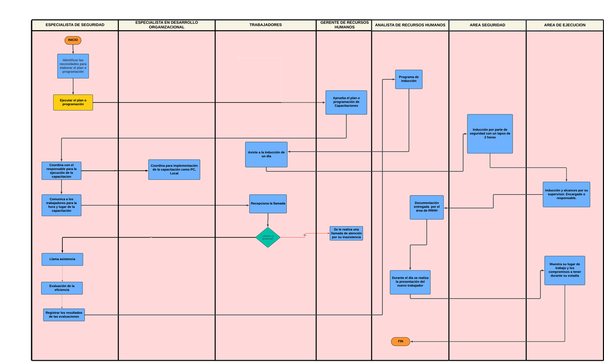

# Procedimiento de Capacitaciones
## Descripción

Según Chiavenato, la capacitación se define como la educación profesional para la adaptación del operario para el trabajo o puesto laboral. Este proceso se puede aplicar a todos los niveles de la empresa, y normalmente este proceso se delegan al jefe superior inmediato del puesto encargado. 

#### Figura 1: Flujo de un sistema de capacitacion 

  
Nota : Grafico del proceso de Capacitacion. Tomado de **Administración de Recursos Humanos** (p.325), por Chiavenato. 

## Flujograma
### Link: 

**[Capacitación de Personal](https://lucid.app/lucidchart/e20d016c-cdfc-44a1-ba47-ce56aacd429a/edit?invitationId=inv_281ab008-a02b-4aa9-a96a-fd2bdb0646ef&page=0_0#)**

### Imagen:

## Descripción de los procesos del flujograma AS-IS

| Orden | Paso                                                                     | Descripción                                                                                                                                                                                                                                     | Encargado                                 |
| ----- | ------------------------------------------------------------------------ | ----------------------------------------------------------------------------------------------------------------------------------------------------------------------------------------------------------------------------------------------- | ----------------------------------------- |
| 1     | Programa de inducción                                                    | Preparación previa del programa de inducción, que incluye la planificación de las actividades y la recopilación de materiales informativos necesarios para proporcionar una introducción completa a la empresa y sus políticas.                 | Coordinador de Recursos Humanos           |
| 2     | Asiste a la inducción de un día                                          | Se le proporciona información detallada sobre la empresa, políticas y procedimientos.                                                                                                                                                           | Trabajador                                |
| 3     | Inducción por parte de seguridad con un lapso de 2 horas                 | Sesión de inducción específica impartida por el departamento de seguridad, que aborda aspectos relacionados con la seguridad en el lugar de trabajo, procedimientos de emergencia, normas de seguridad y prevención de riesgos laborales.       | Especialista en Seguridad Laboral         |
| 4     | Inducción y alcances por su supervisor                                   | El supervisor directo del nuevo empleado proporciona una inducción personalizada, presentándole su equipo de trabajo, explicando sus funciones y responsabilidades específicas.                                                                 | Solicitante del personal                  |
| 5     | Documentación entregada por el área de RRHH                              | El departamento de recursos humanos entrega al nuevo empleado la documentación necesaria, como formularios de inscripción, políticas de la empresa, beneficios, información sobre la nómina, entre otros documentos relacionados con el empleo. | Asistente de RRHH                         |
| 6     | Durante el día se realiza la presentación del nuevo trabajador           | El nuevo empleado es presentado formalmente al equipo de trabajo durante una reunión o sesión designada, donde se le da la bienvenida y se le ofrece la oportunidad de presentarse.                                                             | Encargado de RRHH                         |
| 7     | Muestra su lugar de trabajo y los compromisos a tener durante su estadía | Se lleva al nuevo empleado a conocer su lugar de trabajo, mostrándole las instalaciones, equipos y recursos disponibles. Además, se detallan los compromisos y responsabilidades que se esperan durante su periodo de empleo.                   | Solicitante del personal                  |
| 8     | Identificar las necesidades para elaborar el plan o programación         | Identifica si es necesaria la capacitación del personal actual, dependiendo del área a capacitar, etc; se programa a los personales encargados de la capacitación, se define el proceso.                                                        | Gerente de RRHH                           |
| 9     | Ejecutar el plan o programación                                          | Se establece los recursos a usar y programarlos para la capacitación                                                                                                                                                                            | Gerente de RRHH                           |
| 10    | Aprueba el plan o programación de Capacitaciones                         | Da la autoridad para la ejecución del plan programado                                                                                                                                                                                           | Coordinador de Capacitación y Desarrollo  |
| 11    | Coordina con el responsable para la ejecución de la capacitación         | Se coordinan con los encargados programados de la capacitación.                                                                                                                                                                                 | Coordinador de Capacitación y Desarrollo  |
| 12    | Coordina para implementación de la capacitación como PC, Local           | Se coordina los recursos y el área necesaria para la capacitación                                                                                                                                                                               | Especialista en Desarrollo Organizacional |
| 13    | Comunica a los trabajadores para la hora y lugar de la capacitación      | Se da la hora y fecha para desarrollar la capacitación a los colaboradores a capacitar                                                                                                                                                          | Gerente de RRHH                           |
| 14    | Recepciona la llamada                                                    | Registro de asistencia para comprobar la asistencia o no del personal                                                                                                                                                                           | Trabajadores                              |
| 15    | Se le realiza una llamada de atención por su inasistencia                | Notifica la inasistencia con su respectiva amonestación                                                                                                                                                                                         | Supervisor de la Capacitación             |
| 16    | Llama asistencia                                                         | Registro de la asistencia                                                                                                                                                                                                                       | Supervisor de la Capacitación             |
| 17    | Evaluación de la eficiencia                                              | Evalúa a los colaboradores después del proceso de capacitación                                                                                                                                                                                  | Evaluador                                 |
| 18    | Registrar los resultados de las evaluaciones                             | Obtiene resultados de las evaluaciones de la eficiencia                                                                                                                                                                                         | Evaluador                                 |
## Descripción de los procesos TO-BE
| Orden | Paso                                                                     | Descripción                                                                                                                                                                                                                   | Encargado                                |
| ----- | ------------------------------------------------------------------------ | ----------------------------------------------------------------------------------------------------------------------------------------------------------------------------------------------------------------------------- | ---------------------------------------- |
| 1     | Programa de inducción                                                    | Planificación de las actividades y la recopilación de materiales informativos necesarios para proporcionar una introducción completa a la empresa y sus políticas.                                                            | Coordinador de Capacitación              |
| 2     | Solicitud de disponibilidad                                              | Se solicita la disponibilidad del empleado por medio de su intranet                                                                                                                                                           | Sistema                                  |
| 3     | Coordinación de fechas                                                   | Se evalúa las fechas disponibles de los nuevos trabajadores para encontrar una en común y se fija el día con la hora en la que se realizará                                                                                   | Coordinador de Capacitación              |
| 4     | Notificación de la inducción                                             | Se le avisa al nuevo empleado sobre el día y la hora en la que se realizará la inducción                                                                                                                                      | Sistema                                  |
| 5     | Asiste a la inducción de un día                                          | Se le proporciona información detallada sobre la empresa, políticas y procedimientos.                                                                                                                                         | Trabajador                               |
| 6     | Inducción por parte de seguridad con un lapso de 2 horas                 | Imparte una sesión de inducción específica , que aborda aspectos relacionados con la seguridad en el lugar de trabajo, procedimientos de emergencia, normas de seguridad y prevención de riesgos laborales.                   | Especialista de Seguridad                |
| 7     | Inducción y alcances por su supervisor                                   | Proporciona una inducción personalizada, presentándole su equipo de trabajo, explicando sus funciones y responsabilidades específicas.                                                                                        | Supervisor                               |
| 8     | Documentación entregada por el área de RRHH                              | Entrega al nuevo empleado la documentación necesaria, como formularios de inscripción, políticas de la empresa, beneficios, información sobre la nómina, entre otros documentos relacionados con el empleo.                   | Asistente de RRHH                        |
| 9     | Muestra su lugar de trabajo y los compromisos a tener durante su estadía | Se lleva al nuevo empleado a conocer su lugar de trabajo, mostrándole las instalaciones, equipos y recursos disponibles. Además, se detallan los compromisos y responsabilidades que se esperan durante su periodo de empleo. | Especialista de Seguridad                |
| 10    | Registro de solicitud en el intranet                                     | Subir campos relevantes(área a capacitar, cantidad de personal, que se va a capa capacitar) en los campos                                                                                                                     | Supervisor                               |
| 11    | Genera la programacion del programa de capacitación                      | El sistema busca disponibilidad de fechas, horas, etc, para la generacion del cronograma de la capacitación.                                                                                                                  | Sistema                                  |
| 12    | Aprueba el plan o programación de Capacitaciones                         | Da la autoridad para la ejecución del plan programado                                                                                                                                                                         | Coordinador de Capacitación y Desarrollo |
| 13    | Establece a los supervisores.                                            | sse coordina la disponibilidad de los supervisores para formar parte del programa                                                                                                                                             | Coordinador de Capacitación y Desarrollo |
| 14    | Registro de supervisores                                                 | Actualiza el registro de supervisores y encargados designado supervisor-sesion                                                                                                                                                | Coordinador de Capacitación y Desarrollo |
| 15    | Comunica a los trabajadores para la hora y lugar de la capacitación      | Sistema notifica  loss empleados su cronograma de capacitación                                                                                                                                                                | Sistema                                  |
| 16    | Registro de asistencia                                                   | Actualiza la asistencia del trabajador-sesión                                                                                                                                                                                 | Sistema                                  |
| 17    | Segimiento del trabajdor                                                 | Notifica faltas y asistencias del trabajador                                                                                                                                                                                  | Sistema                                  |
| 18    | Evaluación de la eficiencia                                              | Evalua al trabajador y registra su desenpeño                                                                                                                                                                                  | Evaluador                                |
| 19    | Registro del rendimiento                                                 | Actualiza el registro de desenpeño del trabajador                                                                                                                                                                             | Sistema                                  |
---
- ***[Volver a módulos](Modulos.md)***
- ***[Volver al inicio](../../../README.md)***