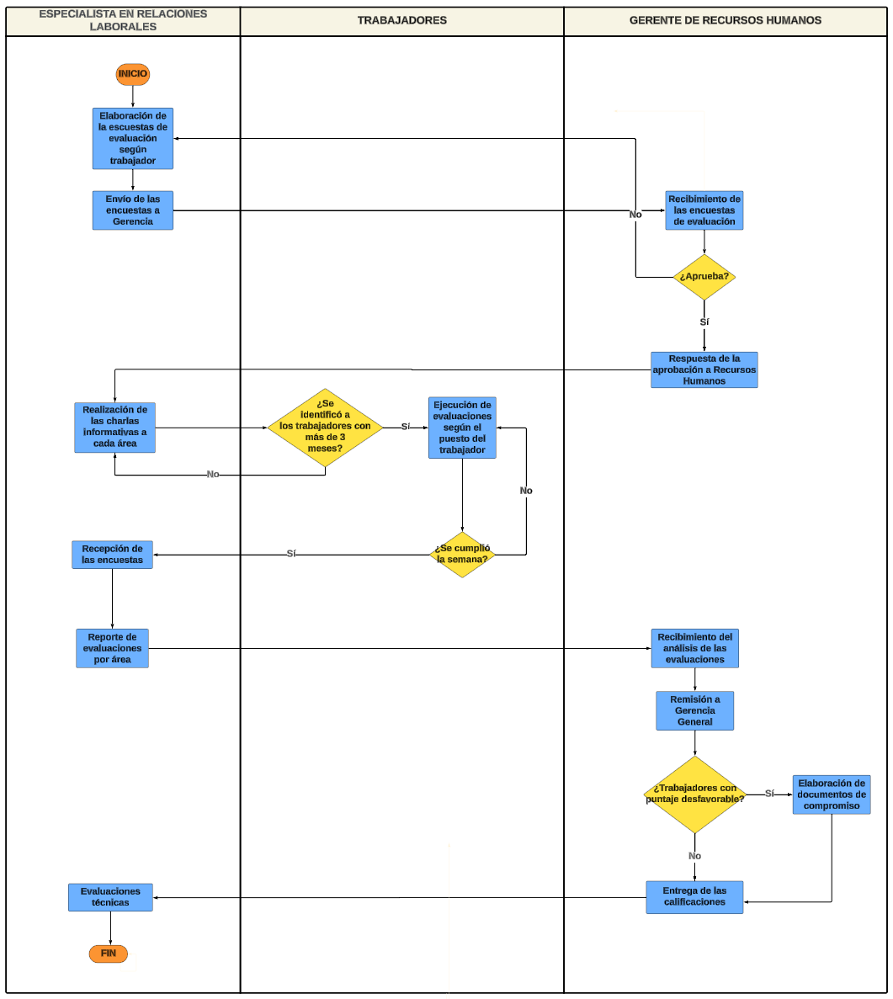

# Evaluación de Desempeño
Su objetivo principal es medir, analizar y evaluar el rendimiento laboral de los empleados dentro de una organización. Esta función implica la recopilación de información sobre el desempeño de cada empleado, la comparación de este desempeño con los estándares y expectativas establecidos, y la retroalimentación proporcionada tanto al empleado como a la organización en su conjunto.

## Flujograma
### Link: 
[Evaluación de Desempeño](https://lucid.app/lucidchart/98390b68-63b1-417a-b3f4-5a15a0d8bf1b/edit?viewport_loc=-1216%2C-143%2C4242%2C3357%2C0_0&invitationId=inv_0412ef85-1b61-4f99-9a9b-d18653591624)
### Imagen:

## Descripción de los procesos del flujograma AS-IS
| Orden |                           Paso                          |                                                     Descripción                                                    |               Encargado              |
|:-----:|:-------------------------------------------------------:|:------------------------------------------------------------------------------------------------------------------:|:------------------------------------:|
|   1   |          Elaboración de la ficha de evaluación          | Aquí se crean los formularios o fichas de evaluación que se utilizarán para evaluar el desempeño de los empleados. | Especialista en relaciones laborales |
|   2   | Envío de la ficha de evaluación del personal a Gerencia |                Una vez creadas las fichas, se envían a la gerencia para su aprobación y validación.                | Especialista en relaciones laborales |
|   3   |          Recibimiento de la ficha de evaluación         |                        Recepción de las fichas de evaluación del desempeño de los empleados                        |      Gerente de Recursos Humanos     |
|   4   |      Respuesta de la aprobación a Recursos Humanos      |          La gerencia envía su aprobación o comentarios sobre las fichas de evaluación a Recursos Humanos.          |      Gerente de Recursos Humanos     |
|   5   |          Coordinación de la fecha de evaluación         |                          Los especialistas coordinan la fecha y el proceso de evaluación.                          | Especialista en relaciones laborales |
|   6   |                Ejecución de Evaluaciones                |                         Se llevan a cabo las evaluaciones de desempeño según lo programado.                        |             Trabajadores             |
|   7   |              Recepción de las evaluaciones              |                     Una vez completadas, las evaluaciones son recibidas por los especialistas.                     | Especialista en relaciones laborales |
|   8   |    Análisis de evaluaciones para el envío a gerencia    |    Se analizan las evaluaciones realizadas para preparar informes o resúmenes que serán enviados a la gerencia.    | Especialista en relaciones laborales |
|   9   |        Análisis de las evaluaciones del personal        |                              Se analiza individualmente el desempeño de cada empleado.                             |      Gerente de Recursos Humanos     |
|   10  |               Entrega de las evaluaciones               |                           Se entregan los resultados de las evaluaciones a los empleados.                          |      Gerente de Recursos Humanos     |
|   11  |            Archivamiento de las evaluaciones            |  Se archivan los documentos relacionados con las evaluaciones de desempeño para futuras referencias y seguimiento. | Especialista en relaciones laborales |
## Descripción de los procesos TO-BE
| SECUENCIA | ACTIVIDAD                                               | DESCRIPCIÓN                                                                                                                          | ENCARGADO                            |
|-----------|---------------------------------------------------------|--------------------------------------------------------------------------------------------------------------------------------------|--------------------------------------|
|         1 | Elaboración de la ficha de evaluación                   | Aquí se crean los formularios o fichas de evaluación que se utilizarán para evaluar el desempeño de los empleados.                   | Especialista en relaciones laborales |
|         2 | Envío de la ficha de evaluación del personal a Gerencia | Una vez creadas las fichas, se envían a la gerencia para su aprobación y validación.                                                 | Especialista en relaciones laborales |
|         3 | Recibimiento de la ficha de evaluación                  | Recepción de las fichas de evaluación del desempeño de los empleados                                                                 | Gerente de Recursos Humanos          |
|         4 | Respuesta de la aprobación a Recursos Humanos           | La gerencia envía su aprobación o comentarios sobre las fichas de evaluación a Recursos Humanos.                                     | Gerente de Recursos Humanos          |
|         5 | Coordinación de la fecha de evaluación                  | Los especialistas coordinan la fecha y el proceso de evaluación tamnado en cuenta las horas disponibles que aparecen en la intranet. | Especialista en Relaciones Laborales |
|         6 | Envío de Evaluaciones por inspectores                   | Se envía la ficha de evaluación a los supervisores de área                                                                           | Sistema                              |
|         7 | Completar la ficha de las evaluaciones por inspectores  | Llenar datos y observaciones del desempeño del personal a su mando.                                                                  | Supervisor                           |
|         8 | Añadir datos extra a la ficha de cada trabajador        | Rellenar datos como cantidad de faltas, tardanzas, horas extra, etc. a la ficha de cada trabajador                                   | Sistema                              |
|         9 | Análisis de las evaluaciones del personal               | Se analiza individualmente el desempeño de cada empleado.                                                                            | Especialista en Relaciones Laborales |
|        10 | Entrega de las evaluaciones                             | Se suben los resultados de las evaluaciones a los empleados a su intranet.                                                           | Sistema                              |
|        11 | Archivamiento de las evaluaciones                       | Se archivan los documentos relacionados con las evaluaciones de desempeño para futuras referencias y seguimiento.                    | Sistema                              |
---
**[Volver a módulos](../Modulos.md)**