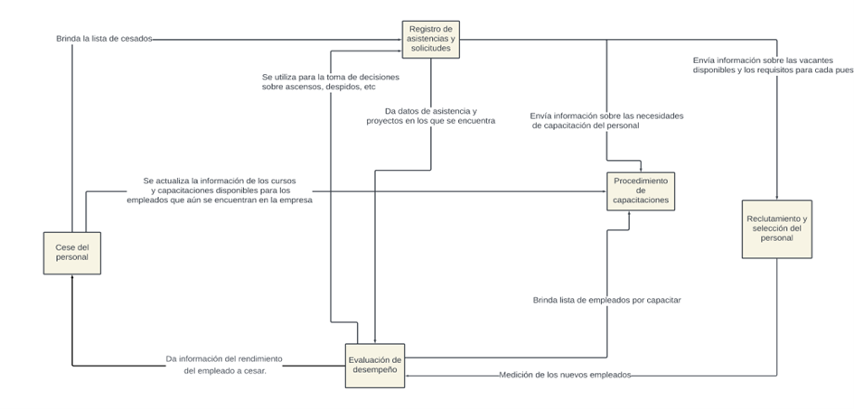

# Segundo Entregable
## Módulos
### Lista de módulos
| Módulo                                 | Descripción                                                                                                                                                                                                                                                                                                                                                                                      | Repositorio                                                                                                      |
| -------------------------------------- | ------------------------------------------------------------------------------------------------------------------------------------------------------------------------------------------------------------------------------------------------------------------------------------------------------------------------------------------------------------------------------------------------ | ---------------------------------------------------------------------------------------------------------------- |
| Registro de asistencias y solicitudes  | Se centra en todas las actividades relacionadas con la gestión de asistencias y solicitudes de los empleados dentro de la organización. Esto incluye la gestión de archivos de empleados, seguimiento de horarios, gestión de licencias, control de asistencias, entre otras tareas relacionadas con la documentación y el registro del personal.                                                | [Registro de asistencias y solicitudes](../Módulos/Flujogramas/Registro%20de%20asistencias%20y%20solicitudes.md) |
| Procedimiento de Capacitaciones        | Se encarga de planificar, organizar y gestionar todas las actividades relacionadas con la formación y el desarrollo de los empleados. Esto implica identificar las necesidades de capacitación, diseñar programas de formación, coordinar la logística de los eventos de capacitación, evaluar el impacto de las capacitaciones y mantener registros de la formación recibida por cada empleado. | [Procedimiento de Capacitaciones](Flujogramas/Capacitaciones.md)                                                 |
| Cese de Personal                       | Aborda todos los procesos relacionados con la salida de los empleados de la organización, ya sea por renuncia voluntaria, despido o retiro. Esto incluye la gestión de trámites administrativos de desvinculación, el cálculo de prestaciones laborales, la elaboración de documentos de finiquito y la realización de entrevistas de salida para recopilar retroalimentación.                   | [Cese de Personal](Flujogramas/Cese.md)                                                                          |
| Evaluación de Desempeño                | Se enfoca en evaluar el rendimiento y la contribución de los empleados a la organización. Esto implica establecer criterios de evaluación, realizar revisiones periódicas del desempeño, proporcionar retroalimentación a los empleados, identificar áreas de mejora y reconocer el buen desempeño.                                                                                              | [Evaluación de Desempeño](Flujogramas/Evaluacion.md)                                                             |
| Reclutamiento y Selección del Personal | Se centra en identificar, atraer y seleccionar candidatos calificados para cubrir las vacantes dentro de la organización. Esto implica definir perfiles de puesto, publicar ofertas de trabajo, llevar a cabo procesos de selección, entrevistar candidatos, realizar pruebas de aptitud y evaluar la idoneidad de los postulantes para el puesto vacante.                                       | [Reclutamiento y Selección del Personal](Flujogramas/Reclutamiento.md)                                           |
### Interacción entre módulos
[Link de la relación entre módulos en lucid](https://lucid.app/lucidchart/f789952a-5cb6-4a1c-b704-839fd0ca8759/edit?viewport_loc=-4076%2C-1121%2C8359%2C3914%2C0_0&invitationId=inv_1459c13d-38c1-416c-a0b5-27328bf1f036)

---
***[Volver al inicio](../../../README.md)***