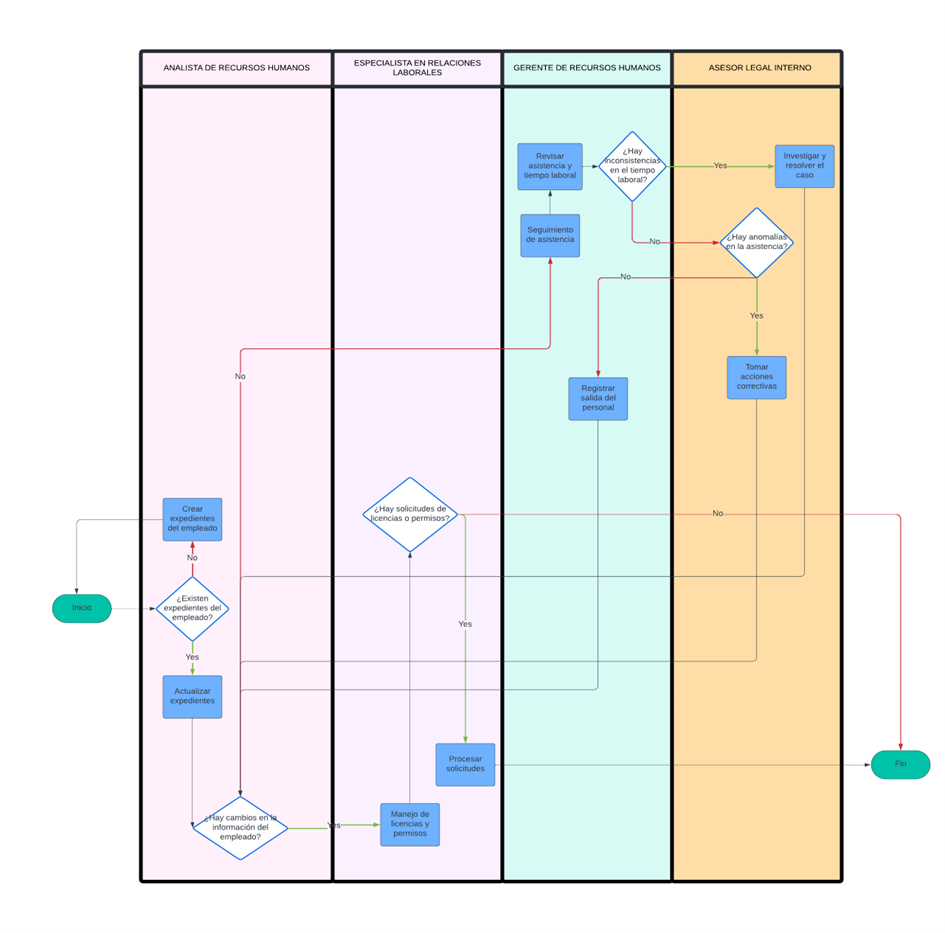

# Registro de asistencias y solicitudes
## Descripción
Se centra en todas las actividades relacionadas con la gestión de asistencias y solicitudes de los empleados dentro de la organización. Esto incluye la gestión de archivos de empleados, seguimiento de horarios, gestión de licencias, control de asistencias, entre otras tareas relacionadas con la documentación y el registro del personal.  
## Flujograma
### Link: 
[Registro de asistencias y solicitudes](https://lucid.app/lucidchart/d933f78a-25e9-44ef-8a27-9d6dddb523c0/edit?beaconFlowId=54375012260CBC41&invitationId=inv_ad1861d7-813c-41aa-a8d0-fbc7baf287ac&page=0_0#)
### Imagen:

## Descripción de los procesos del flujograma AS-IS
| Orden | Paso                                 | Descripción                                                                                                | Encargado                            |
| ----- | ------------------------------------ | ---------------------------------------------------------------------------------------------------------- | ------------------------------------ |
| 1     | Ver el expediente de empleados       | Un punto de decisión para verificar si ya hay expedientes creados para los empleados.                      | Analista de recursos humanos         |
| 2     | Crear expedientes                    | La acción de crear un nuevo expediente para un empleado si no existe uno previamente.                      | Analista de recursos humanos         |
| 3     | Actualizar expedientes               | La acción de actualizar la información en un expediente existente                                          | Analista de recursos humanos         |
| 4     | Mantener expedientes                 | La acción de mantener la información en un expediente existente                                            | Analista de recursos humanos         |
| 5     | Manejo de licencias y permisos       | Este paso implica el proceso de administrar todas las solicitudes de licencias y permisos de los empleados | Especialista en relaciones laborales |
| 6     | Solicitud de licencias o permisos    | Un punto de decisión para identificar si hay solicitudes pendientes de licencias o permisos                | Especialista en relaciones laborales |
| 7     | Procesar solicitudes                 | La acción de revisar y aprobar o rechazar las solicitudes de licencias o permisos                          | Especialista en relaciones Laborales |
| 8     | Seguimiento de asistencia            | La tarea de monitorear y registrar la asistencia y el tiempo laboral de los empleados                      | Gerente de Recursos Humanos          |
| 9     | Inconsistencias en el tiempo laboral | Un punto de decisión para identificar discrepancias en los registros de tiempo laboral                     | Gerente de Recursos Humanos          |
| 10    | Investigar y resolver                | La acción de investigar y corregir las inconsistencias encontradas en el tiempo laboral.                   | Asesor legal interno                 |
| 11    | Registro de salida del personal      | La documentación del fin de la jornada laboral o la salida de un empleado de la empresa                    | Gerente de Recursos Humanos          |
| 12    | Tomar acciones correctivas           | La acción de tomar medidas necesarias en respuesta a anomalías en la asistencia                            | Departamento legal interno           |
| 13    | Revisar asistencia y tiempo laboral  | La revisión regular de la asistencia y el tiempo laboral para asegurar la precisión                        | Gerente de recursos humanos          |
| 14    | Anomalías en la asistencia           | Un punto de decisión para detectar cualquier irregularidad en la asistencia de los empleados               | Asesor legal interno                 |
## Descripción de los procesos TO-BE
| SECUENCIA | ACTIVIDAD                      | DESCRIPCIÓN                                                                                                                                                   | ENCARGADO                            |
| --------- | ------------------------------ | ------------------------------------------------------------------------------------------------------------------------------------------------------------- | ------------------------------------ |
| 1         | Actualizar expedientes         | La acción de actualizar la información en un expediente existente                                                                                             | Analista de recursos humanos         |
| 2         | Reviso de licencias y permisos | Revisar las licencias solicitadas por medio del intranet                                                                                                      | Especialista en relaciones laborales |
| 3         | Procesar solicitudes           | Aprobar o rechazar las solicitudes de licencias o permisos                                                                                                    | Especialista en relaciones Laborales |
| 4         | Seguimiento de asistencia      | La tarea de monitorear la asistencia y el tiempo laboral de los empleados registrada por el reloj de control de asistencia con huella dactilar en la intranet | Sistema                              |
| 5         | Actualizar ficha de evaluación | Actualizar el campo de inasistencias en la ficha personal de evaluación de desempeño                                                                          | Sistema                              |
| 6         | Tomar acciones correctivas     | La acción de tomar medidas necesarias en respuesta a anomalías en la asistencia                                                                               | Departamento legal interno           |
---
**[Volver a módulos](../Modulos.md)**