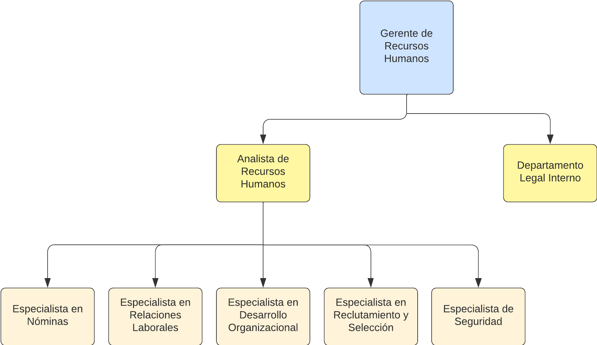

# Segundo Entregable
## Módulos
### Lista de módulos
| Módulo                                 | Descripción                                                                                                                                                                                                                                                                                                                                                                                      | Repositorio                     |
|----------------------------------------|--------------------------------------------------------------------------------------------------------------------------------------------------------------------------------------------------------------------------------------------------------------------------------------------------------------------------------------------------------------------------------------------------|---------------------------------|
| Administración del Personal            | Se centra en todas las actividades relacionadas con la gestión administrativa de los empleados dentro de la organización. Esto incluye la gestión de archivos de empleados, seguimiento de horarios, gestión de licencias, control de asistencias, entre otras tareas relacionadas con la documentación y el registro del personal                                                               | [Administración del Personal](Flujogramas/Administracion.md) |
| Procedimiento de Capacitaciones        | Se encarga de planificar, organizar y gestionar todas las actividades relacionadas con la formación y el desarrollo de los empleados. Esto implica identificar las necesidades de capacitación, diseñar programas de formación, coordinar la logística de los eventos de capacitación, evaluar el impacto de las capacitaciones y mantener registros de la formación recibida por cada empleado. | [Procedimiento de Capacitacione](Flujogramas/Capacitaciones.md) |
| Cese de Personal                       | Aborda todos los procesos relacionados con la salida de los empleados de la organización, ya sea por renuncia voluntaria, despido o retiro. Esto incluye la gestión de trámites administrativos de desvinculación, el cálculo de prestaciones laborales, la elaboración de documentos de finiquito y la realización de entrevistas de salida para recopilar retroalimentación.                   | [Cese de Personal](Flujogramas/Cese.md)           |
| Evaluación de Desempeño                | Se enfoca en evaluar el rendimiento y la contribución de los empleados a la organización. Esto implica establecer criterios de evaluación, realizar revisiones periódicas del desempeño, proporcionar retroalimentación a los empleados, identificar áreas de mejora y reconocer el buen desempeño.                                                                                              | [Evaluación de Desempeño](Flujogramas/Evaluacion.md)     |
| Inducción del Personal                 | Se encarga de facilitar la integración de los nuevos empleados a la organización. Esto incluye proporcionar información sobre la empresa, su cultura organizacional, políticas y procedimientos, así como asignar recursos y acompañamiento durante el proceso de adaptación.                                                                                                                    | [Inducción del Personal](Flujogramas/Induccion.md)      |
| Reclutamiento y Selección del Personal | Se centra en identificar, atraer y seleccionar candidatos calificados para cubrir las vacantes dentro de la organización. Esto implica definir perfiles de puesto, publicar ofertas de trabajo, llevar a cabo procesos de selección, entrevistar candidatos, realizar pruebas de aptitud y evaluar la idoneidad de los postulantes para el puesto vacante.                                       | [Reclutamiento y Selección del Personal](Flujogramas/Reclutamiento.md)  |
### Interacción entre módulos
[Link de la relación entre módulos en lucid](https://lucid.app/lucidchart/f789952a-5cb6-4a1c-b704-839fd0ca8759/edit?viewport_loc=-4076%2C-1121%2C8359%2C3914%2C0_0&invitationId=inv_1459c13d-38c1-416c-a0b5-27328bf1f036)

## Roles Identificados dentro del Área de Talento Humano

| Jerarquía | Rol                                       | Descripción                                                                                                                                                                                                                                                                                                                                                                                                                                                | Módulos en los que interactúa                                                                           |
|-----------|-------------------------------------------|------------------------------------------------------------------------------------------------------------------------------------------------------------------------------------------------------------------------------------------------------------------------------------------------------------------------------------------------------------------------------------------------------------------------------------------------------------|---------------------------------------------------------------------------------------------------------|
| 1         | Gerente de Recursos Humanos               | Es el líder del departamento de recursos humanos y tiene la responsabilidad de diseñar y ejecutar la estrategia de gestión del talento humano de la empresa. Esto implica establecer políticas y procedimientos de recursos humanos, liderar iniciativas de desarrollo organizacional, gestionar el desempeño de los empleados, y colaborar con otros departamentos para garantizar la alineación de los recursos humanos con los objetivos empresariales. | Administración del Personal, Procedimiento de Capacitaciones, Cese de Personal, Evaluación de Desempeño |
| 2         | Analista de Recursos Humanos              | Este rol se encarga de llevar a cabo diversas tareas administrativas dentro del departamento de recursos humanos, como el mantenimiento de registros de empleados, la gestión de la documentación laboral, la coordinación de procesos de reclutamiento y selección, y la elaboración de informes y reportes relacionados con la gestión del talento humano.                                                                                               | Administración del Personal, Inducción del Personal, Reclutamiento y Selección de Personal              |
| 2         | Asesor Legal Interno                | Este abogado se encarga de asesorar al área de recursos humanos en cuestiones legales relacionadas con el empleo, como el cumplimiento de las leyes laborales, la elaboración de contratos de trabajo, la gestión de conflictos laborales y la representación de la empresa en procedimientos legales relacionados con el empleo.                                                                                                                     | Administración del Personal, Cese de Personal                                                           |
| 3         | Especialista en Nóminas                   | Es responsable de procesar y administrar la nómina de los empleados de la empresa. Esto implica calcular salarios, deducciones y beneficios, asegurarse de que se cumplan todas las obligaciones fiscales y legales relacionadas con la nómina, y garantizar la precisión y puntualidad en el pago de los salarios.                                                                                                                                        | Administración del Personal                                                                             |
| 3         | Especialista en Relaciones Laborales      | Este rol se centra en gestionar las relaciones entre la empresa y sus empleados, así como en resolver conflictos laborales y promover un ambiente laboral armonioso. El especialista en relaciones laborales se encarga de interpretar y aplicar las leyes laborales, negociar acuerdos colectivos, mediar en disputas laborales y promover la comunicación efectiva entre la dirección y los trabajadores.                                                | Administración del Personal, Cese de Personal, Evaluación de Desempeño                                  |
| 3         | Especialista en Desarrollo Organizacional | Se enfoca en diseñar e implementar programas y estrategias destinadas a mejorar el desempeño organizacional y promover el crecimiento y desarrollo de los empleados. Esto puede incluir iniciativas de capacitación y desarrollo, gestión del cambio organizacional, promoción de la cultura corporativa y evaluación del clima laboral.                                                                                                                   | Procedimiento de Capacitaciones                                                                         |
| 3         | Especialista en Reclutamiento y Selección | Se dedica a identificar, atraer y seleccionar talento para cubrir las vacantes dentro de la empresa. Esto implica desarrollar estrategias de reclutamiento, publicar ofertas de trabajo, buscar candidatos en diferentes fuentes, llevar a cabo procesos de selección, entrevistar candidatos y evaluar su idoneidad para el puesto.                                                                                                                       | Reclutamiento y Selección de Personal                                                                   |
| 3         | Especialista de Seguridad                 | Se encarga de la seguridad laboral, como la inspección de instalaciones, la identificación y mitigación de riesgos, y la implementación de políticas y procedimientos de seguridad, este especialista también asume la responsabilidad de capacitar a los nuevos miembros del equipo.                                                                                                                                                                      | Procedimiento de Capacitaciones, Inducción del Personal                                                 |
---
- [Glosario de términos](Glosario.md)
- [Volver a los entregables](../entregables.md)
- **[Volver al inicio](../../README.md)**