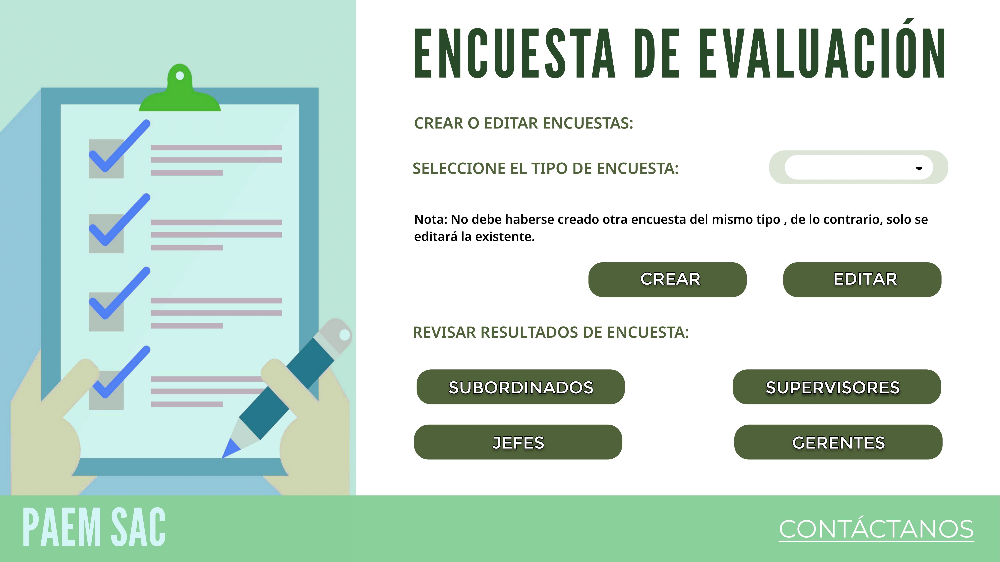
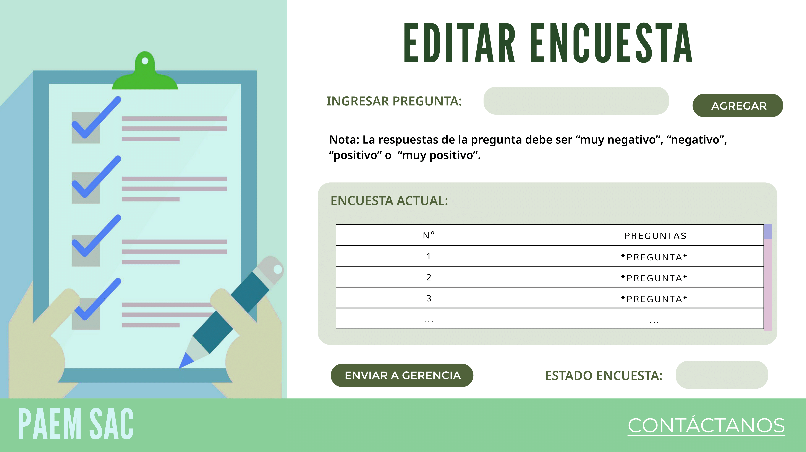
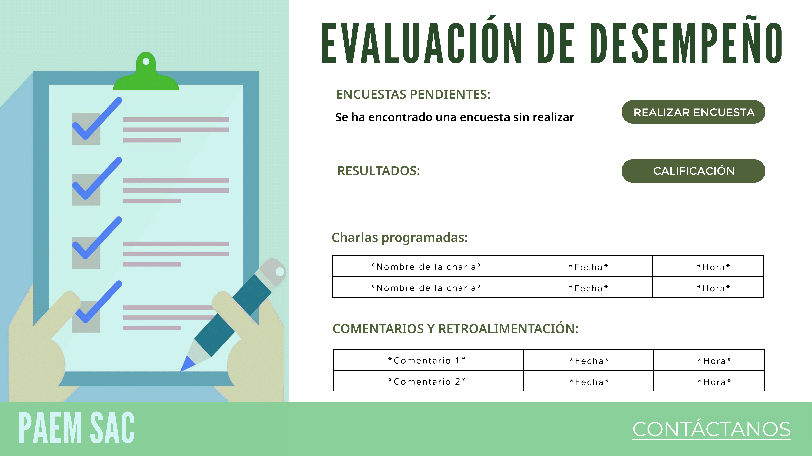
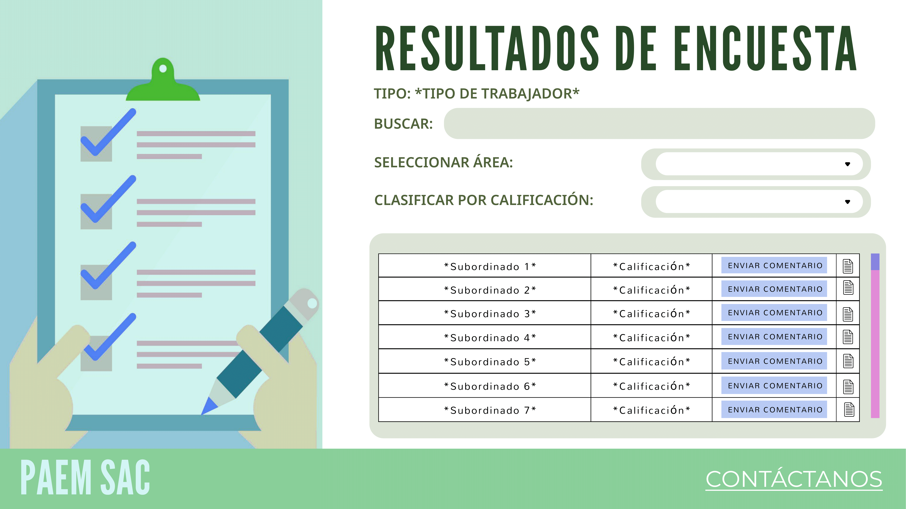
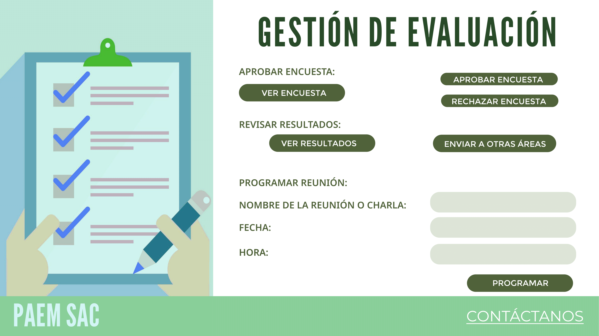

# Avances del Front-end
Separamos las distintas vistas dependiendo de la persona que va a usar la aplicación
## Para externos
### Postulación

## Para trabajadores en general
### Solicitar licencia médica

### Presentar carta de renuncia

## Especialista en Relaciones Laborales
### Cesar trabajador

## Especialista en Reclutamiento y Selección
### Contratación de Personal

## Analista de Recursos Humanos
### Actualizar datos

### Evaluación de Desempeño

