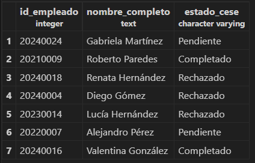
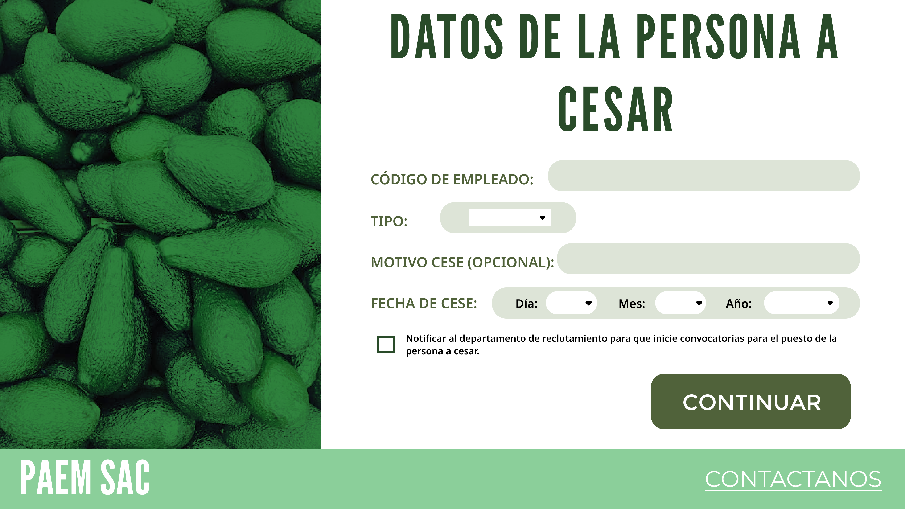
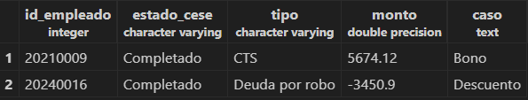
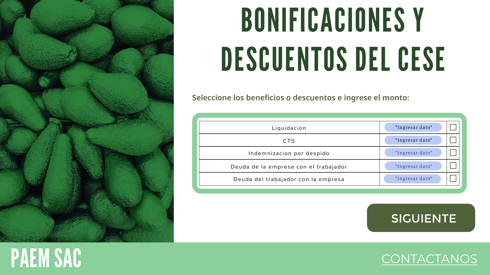
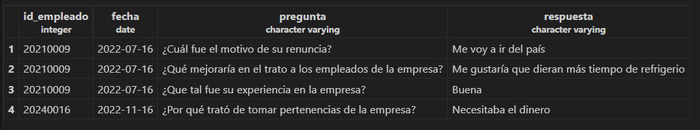
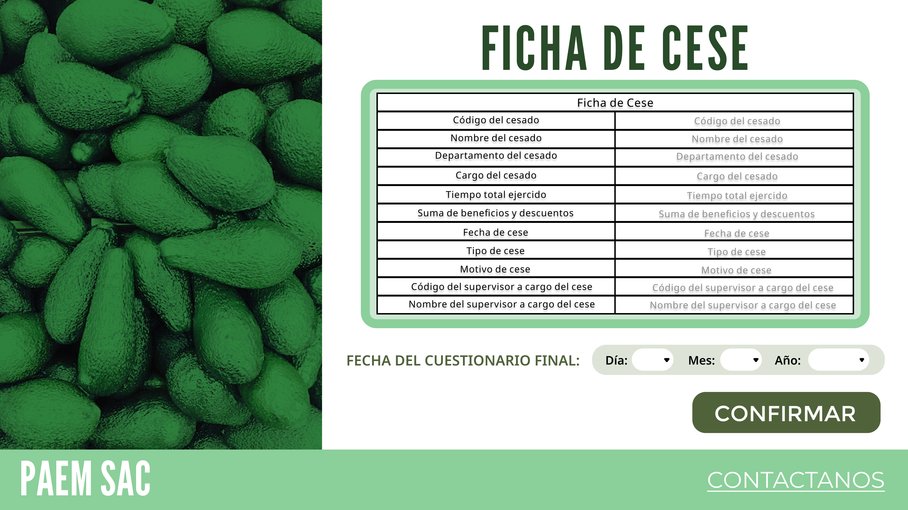
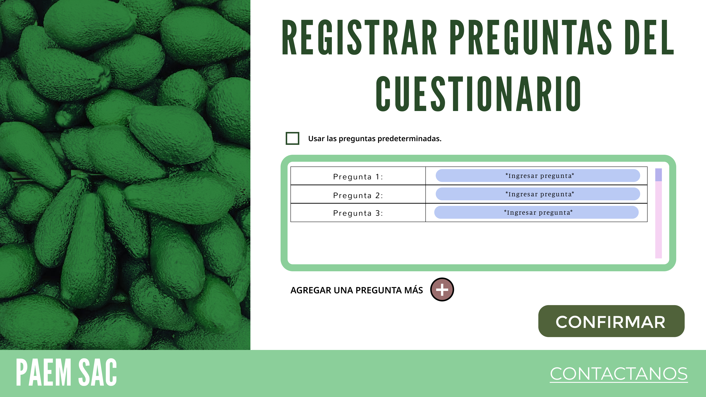
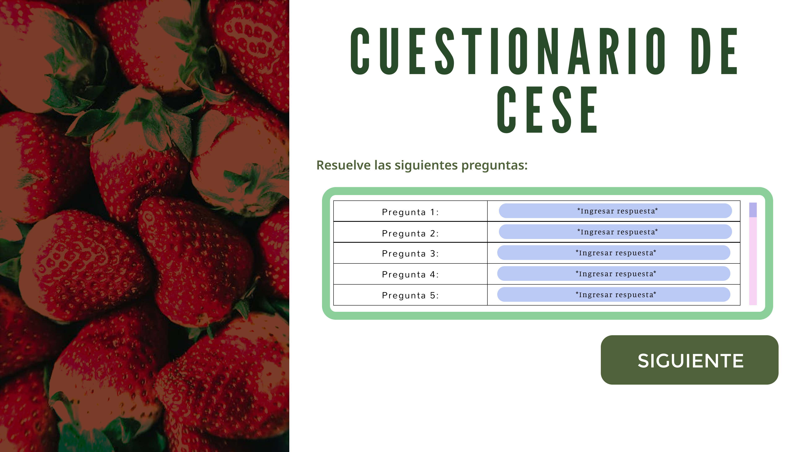

# SELECTS PREDEFINIDOS

## Módulo: Evaluación de desempeño
### Listar todos los empleados y sus respectivos departamentos y cargos:
	SELECT E.Nombre_Empleado, E.Apellido_Empleado, D.Nombre_Departamento, C.Nombre AS Cargo
	FROM Empleado E
	INNER JOIN Departamento D ON E.ID_Departamento = D.ID_Departamento
	INNER JOIN Cargo C ON E.ID_Cargo = C.ID_Cargo;
	
### Ver los cuestionarios enviados por los especialistas de relaciones laborales y el estado de aprobación:
	SELECT CE.ID_Cuestionario, Cu.Tipo_cuestionario,CE.ID_Especialista,E.Nombre_empleado AS nombre_especialista, E.apellido_empleado AS apellido_especialista,CE.Fecha_Creacion, CE.Hora_Creacion, CE.Fecha_Envio_Gerencia, CE.Hora_Envio_Gerencia, CG.Estado_aprobacion
	FROM Cuestionario_Especialista CE inner join Especialista_relaciones_laborales Es on CE.id_especialista=Es.id_especialista inner join Empleado E on E.id_empleado=Es.id_empleado 
	inner join Cuestionario_gerente_rr_hh CG on CG.id_cuestionario=CE.id_cuestionario inner join Cuestionario Cu on Cu.id_cuestionario=CE.ID_cuestionario;

### Mostrar el id_cuestionario, tipo de cuestionario, id_pregunta y los enunciados de las preguntas
	Select Cu.Id_cuestionario,Cu.Tipo_Cuestionario,Pe.id_pregunta,Pe.Enunciado_Pregunta from Cuestionario Cu inner join Pregunta_Cuestionario PE on Cu.id_cuestionario=Pe.id_cuestionario;
	
	
 ### Mostrar los cuestionarios completados por los empleados y sus respuestas:
	SELECT CE.ID_Empleado, CE.ID_Cuestionario, CE.ID_Pregunta, CE.Respuesta, CE.Fecha_Rellenado, CE.Hora_Rellenado
	FROM Cuestionario_Empleado CE;
	
### Obtener empleados, tipo de empleado y sus respuestas a las preguntas del cuestionario:
	Select E.id_empleado, E.Nombre_Empleado,E.Apellido_Empleado, Cu.tipo_Cuestionario, Pe.Enunciado_Pregunta, CE.Respuesta, CE.Fecha_Rellenado, CE.Hora_rellenado from Empleado E 
	inner join Cuestionario_Empleado CE ON E.id_empleado=CE.Id_empleado inner join Cuestionario Cu on CE.ID_cuestionario=Cu.Id_Cuestionario inner join
	pregunta_cuestionario Pe on Cu.id_cuestionario=Pe.id_cuestionario;
	
### Obtener empleados, cargo, tipo de empleado y sus respuestas a las preguntas del cuestionario:
	Select E.Nombre_Empleado,E.Apellido_Empleado, Ca.Nombre as Cargo_Empleado, Cu.tipo_Cuestionario, Pe.Enunciado_Pregunta, CE.Respuesta, CE.Fecha_Rellenado, CE.Hora_rellenado from Empleado E 
	inner join Cuestionario_Empleado CE ON E.id_empleado=CE.Id_empleado inner join Cuestionario Cu on CE.ID_cuestionario=Cu.Id_Cuestionario inner join
	pregunta_cuestionario Pe on Cu.id_cuestionario=Pe.id_cuestionario inner join Cargo Ca on E.id_cargo=Ca.id_cargo;
	
### Listar los reportes de los empleados y sus calificaciones:
	SELECT R.ID_Reporte, E.Nombre_Empleado, E.Apellido_Empleado, R.Calificacion_Empleado, R.Fecha_Ingreso_Empleado
	FROM Reporte R
	INNER JOIN Empleado E ON R.ID_Empleado = E.ID_Empleado;
	
### Obtener retroalimentación proporcionada a los empleados:
	SELECT R.ID_Retroalimentacion, Re.Id_reporte, E.Nombre_Empleado, E.Apellido_Empleado, R.Enunciado_Retroalimentacion, R.Fecha_Retroalimentacion, R.Hora_Retroalimentacion
	FROM Retroalimentacion R
	INNER JOIN Empleado E ON R.ID_Empleado = E.ID_Empleado
	INNER JOIN Reporte Re on Re.id_reporte=R.id_reporte;
	
### Obtener las reuniones:
	SELECT ID_Reunion, Asunto_Reunion, ID_Especialista, ID_Gerente, Fecha_Reunion, Hora_Reunion FROM Reunion;

## Módulo: Reclutamiento y selección de personal
### Select para obtener el nombre del empleado a cargo de la entrevista
	SELECT e.ID_Entrevista, e.Fecha_Eva, e.Hora_entrevista, e.Resp_Eva, e.Resultado_eva, e.ID_Solicitud, e.ID_Evaluacion, e.ID_Empleado, 
	       em.Nombre_Empleado, em.Apellido_Empleado
	FROM Entrevista e
	INNER JOIN Empleado em ON e.ID_Empleado = em.ID_Empleado;

### Seleccionar nombre de candidatos con sus solicitudes de empleo y estado de solicitud:
	SELECT c.Nombre_cand, c.Apell_cand, se.Est_solicitud, se.Vacante_aplicada
	FROM Candidato c
	INNER JOIN Solicitud_Empleo se ON c.ID_cand = se.ID_cand;

### Seleccionar id de candidatos con sus solicitudes de empleo y estado de solicitud:
	SELECT v.ID_Vac, d.Nombre_departamento, c.Nombre, p.Conocimiento_Req
	FROM Vacante v
	INNER JOIN Departamento d ON v.ID_Departamento = d.ID_Departamento
	INNER JOIN Cargo c ON v.ID_Cargo = c.ID_Cargo
	INNER JOIN Perfil p ON v.ID_Perfil = p.ID_Perfil;

## Módulo: Registro de asistencias y solicitudes
### Obtener la lista de asistencias de un empleado en particular:
    SELECT a.ID_Asistencia, a.Estado, a.Observacion, a.Fecha, a.Hora_entrada, a.Hora_salida
	FROM Asistencia a
	INNER JOIN Empleado e ON a.ID_Empleado = e.ID_Empleado
	WHERE e.ID_Empleado = <<ID del empleado>>; 
### Obtener la lista de solicitudes de permiso pendientes de aprobación:
    SELECT p.ID_Permiso, p.Tipo, p.Motivo, p.Duracion
	FROM Permiso p
	WHERE p.Estado = 'Pendiente';
### Obtener la lista de licencias aprobadas para un supervisor en particular:
    SELECT l.ID_Licencia, l.Tipo, l.Estado, l.Fecha_inicio, l.Fecha_fin
	FROM Licencia l
	INNER JOIN Supervisor s ON l.ID_Supervisor = s.ID_Supervisor
 	WHERE s.ID_Supervisor = <<ID del supervisor>> AND l.Estado = 'Aprobado';
 
## Módulo: Capacitación de Personal

 ### Select para obtener el nombre de los instructores
	SELECT Instructor.ID_Instructor, Empleado.Nombre_Empleado, Empleado.Apellido_Empleado
	FROM Instructor
	INNER JOIN Empleado ON Empleado.ID_Empleado = Instructor.ID_Empleado;

### Select para obtener la asistencia de los empleados en la Sesión 1 
	SELECT Empleado.Nombre_Empleado,Empleado.Apellido_Empleado, Empleado_Sesion.Asistencia
	FROM Empleado 
	INNER JOIN Empleado_Sesion ON Empleado.ID_Empleado = Empleado_Sesion.ID_Empleado
	WHERE Empleado_Sesion.Asistencia='Asistio' AND Empleado_Sesion.ID_Sesion= 1;

### Select para identificar todos los resultados del programa capacitador 1, donde la evaluación de las sesiones hayan sido  satisfactorias
	SELECT Evaluacion_Sesion.ID_Sesion,Evaluacion_Sesion.ID_Evaluacion
 	FROM Evaluacion_Sesion 
	INNER JOIN Sesion ON Sesion.ID_Sesion=Evaluacion_Sesion.ID_Sesion
	WHERE Sesion.ID_Programa_C=1 AND Evaluacion_Sesion.Resultado='Satisfactorio' ;

## Módulo: Cese de personal
### Registrar el cese:

	SELECT 
		E.id_empleado as ID_Empleado,
		E.nombre_empleado ||' '|| apellido_empleado as Nombre_Completo,
		C.estadocese as Estado_Cese
	FROM empleado as E
	INNER JOIN cese as C ON E.id_empleado=C.id_empleado;

### Registrar los beneficios y descuentos:

	SELECT 
		C.id_empleado as ID_Empleado,
		C.estadocese as Estado_Cese,
		B.tipo as Tipo,
		SUM(B.monto) as Monto,
		CASE
				WHEN SUM(B.monto) < 0 THEN 'Descuento'
				WHEN SUM(B.monto) > 0 THEN 'Bono'
				ELSE 'No hay'
			END AS CASO
	FROM beneficios_cese as B
	INNER JOIN cese as C ON B.id_cese=C.id_cese
	GROUP BY C.id_empleado, C.estadocese, B.tipo

### Mostrar la ficha del cese

	SELECT 
		C.id_empleado as ID_Empleado,
		S.fecha_cuestionario as Fecha,
		P.pregunta_salida as Pregunta,
		P.respuesta_salida as Respuesta
	FROM cuestionario_salida as S
	INNER JOIN cese as C ON S.id_cese=C.id_cese
	INNER JOIN pregunta_salida as P ON S.id_cuestionario = P.id_cuestionario

### Registrar preguntas para la persona a cesar:

	SELECT 
		C.id_empleado as ID_Empleado,
		S.fecha_cuestionario as Fecha,
		P.pregunta_salida as Pregunta,
		P.respuesta_salida as Respuesta
	FROM cuestionario_salida as S
	INNER JOIN cese as C ON S.id_cese=C.id_cese
	INNER JOIN pregunta_salida as P ON S.id_cuestionario = P.id_cuestionario

### Resolver cuestionario:

	SELECT 
		C.id_empleado as ID_Empleado,
		S.fecha_cuestionario as Fecha,
		P.pregunta_salida as Pregunta,
		P.respuesta_salida as Respuesta
	FROM cuestionario_salida as S
	INNER JOIN cese as C ON S.id_cese=C.id_cese
	INNER JOIN pregunta_salida as P ON S.id_cuestionario = P.id_cuestionario

