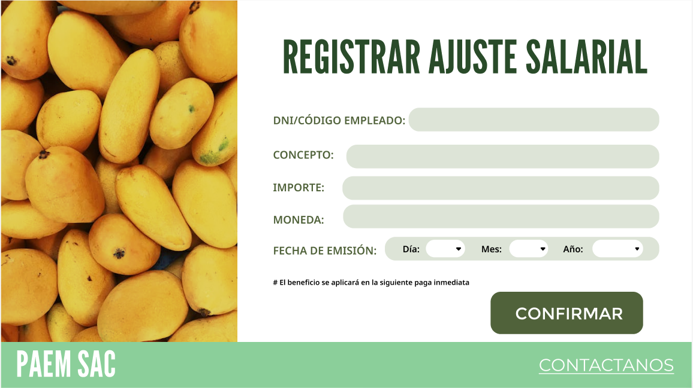
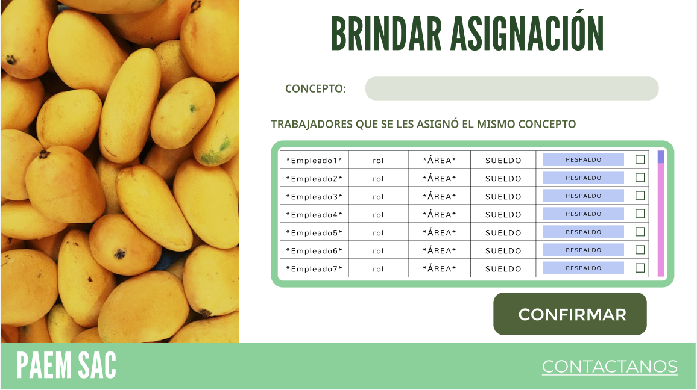

## Requisitos adaptados para Administración de beneficios y compensaciones:

1. **Registro y Actualización de Beneficios o Retenciones:**
   - El sistema debe permitir el registro y actualización de los beneficios o retenciones a los empleados, como planes de pensiones, vacaciones y otros incentivos o descuentos  por parte de la empresa.
   - Se debe garantizar la precisión y transparencia en el registro de información relacionada con los beneficios.

2. **Gestión de Datos Salariales:**
   - El sistema debe gestionar datos salariales, incluyendo aumentos, bonificaciones y otros incentivos, asegurando que se apliquen de manera justa y transparente.
   - Debe permitir el registro y seguimiento de la historia salarial de los empleados de manera precisa y segura.

3. **Programación y Gestión de Pagos:**
   - Debe ser capaz de programar y gestionar los pagos relacionados con beneficios y compensaciones de forma eficiente y oportuna.
   - Se deben establecer alertas y recordatorios automáticos para garantizar que los pagos se realicen dentro de los plazos establecidos.

4. **Integración con Entidades Externas:**
   - El sistema debe integrarse con entidades externas, como Administradoras de Fondos de Pensiones (AFP) y la Superintendencia Nacional de Administración Tributaria (SUNAT), para garantizar el cumplimiento legal y fiscal.
   - Debe facilitar el registro y actualización de información en estas entidades de manera transparente y eficaz.

5. **Generación de Informes y Reportes:**
   - Debe ser capaz de generar informes detallados sobre los beneficios y compensaciones otorgados a los empleados.
   - Se debe permitir la exportación de informes en formatos compatibles para su revisión y análisis por parte de los encargados de la toma de decisiones.

6. **Seguridad y Confidencialidad:**
   - El sistema debe garantizar la seguridad y confidencialidad de la información relacionada con los beneficios y compensaciones de los empleados.
   - Se deben implementar medidas de seguridad para proteger los datos sensibles de los empleados y prevenir accesos no autorizados.

7. **Seguimiento y Auditoría:**
   - Debe proporcionar herramientas para el seguimiento y auditoría de los cambios realizados en los beneficios y compensaciones de los empleados.
   - Se deben mantener registros de todas las acciones realizadas en el sistema para garantizar la transparencia y la responsabilidad.

## Caso de uso 2 : Modificar información de un empleado

|         Objetivo         | Modificar la información de un empleado en el sistema de Recursos Humanos                                                                                  |
| :----------------------: | ---------------------------------------------------------------------------------------------------------------------------------------------------------- |
|       Descripción        | El responsable de Recursos Humanos modifica la información de un empleado en el sistema, como cambio de dirección, estado civil, cargo o unidad de negocio |
|          Actor           | 
 Asistente de recursos humanos                                                                                                         |
|       Precondición       | 
El empleado existe en el sistema de Recursos Humanos y la información actualizada del empleado está disponible.                          |
| 
  Paso | 
  Acción 
                                                                                                                            |
|            1             | El responsable de Recursos Humanos ingresa al módulo de Administración del Personal                                                                        |
|            2             | Busca el empleado cuya información necesita ser actualizada.                                                                                               |
|            3             | Selecciona la opción "Modificar información"                                                                                                               |
|            4             | Modifica los campos que sean necesarios                                                                                                                    |
|            5             | Revisa y valida la información actualizada                                                                                                                 |
|            6             | Guardar los cambios                                                                                                                                        |
### Prototipo

## Caso de uso 20: Registro y Actualización de Ajuste Salarial

| **Objetivo** | Permitir a los administradores registrar y actualizar el ajuste salarial de los empleados, así como garantizar la precisión y transparencia en la gestión de esta información. |
|:------------:|:-----------------------------------------------------------------------------------------------------------------------------------------------------------------------------|
|  Descripción | Los administradores pueden ingresar nuevos remuneraciones o descuentos por la empresa, como planes de pensiones, vacaciones pagadas, bonificaciones y retenciones, así como actualizar la información existente cuando sea necesario. Además, se deben registrar los cambios de remuneraciones o descuentos para cada empleado de manera individual. |
|     Actor    | Administrador de Recursos Humanos                                                                                                                                            |
| Precondición | El administrador ha iniciado sesión en el sistema de gestión de ajuste salarial.                                                                                |
|    
  Paso | 
  Acción 
      |                                                                                                                                                                             |
|       1      | El administrador accede al módulo de registro de beneficios y compensaciones.                                                                                               |
|       2      | Selecciona la opción para ingresar un nuevo concepto o actualizar uno existente.                                                                                            |
|       3      | Completa los detalles del concepto, como nombre, importe, moneda y fecha de emisión.                                                                                 |
|       4      | Asigna el concepto a los empleados correspondientes o actualiza la asignación según sea necesario.                                                                          |
|       5      | Confirma los cambios y guarda la información en el sistema.                                                                                                                  |
### Prototipo:

## Caso de uso 21: Programación y Gestión de Pagos

| **Objetivo** | Facilitar la programación y gestión de los pagos relacionados con los beneficios y compensaciones de los empleados, garantizando su realización de manera oportuna y eficiente. |
|:------------:|:---------------------------------------------------------------------------------------------------------------------------------------------------------------------------|
|  Descripción | Los administradores pueden programar y gestionar los pagos relacionados con los beneficios y compensaciones de los empleados, como salarios, bonificaciones y planes de pensiones. Además, se deben establecer alertas y recordatorios automáticos para garantizar que los pagos se realicen dentro de los plazos establecidos. |
|     Actor    | Administrador de Recursos Humanos                                                                                                                                          |
| Precondición | El administrador ha iniciado sesión en el sistema de gestión de beneficios y compensaciones.                                                                              |
|     
  Paso | 
  Acción 
    |                                                                                                                                                                           |
|       1      | El administrador accede al módulo de programación y gestión de pagos.                                                                                                      |
|       2      | Selecciona la opción para programar un nuevo pago o gestionar uno existente.                                                                                                |
|       3      | Ingresa los detalles del pago, incluyendo el monto, el período del pago y la moneda en la que se le pagará.                                                                                  |
|       4      | Establece alertas y recordatorios automáticos para garantizar la realización del pago dentro del plazo establecido.                                                          |
|       5      | Confirma la programación o gestión del pago y guarda la información en el sistema.                                                                                         |
### Prototipo

