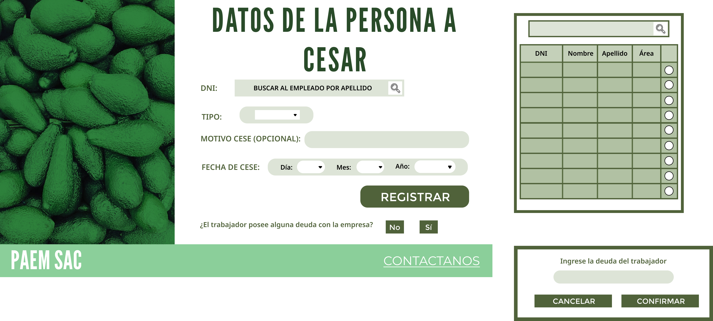

## Requisitos para el Cese de Personal:

1. **Registro de Cese:**
   - El sistema debe permitir el registro del cese de un empleado, incluyendo la fecha de fin de contrato, el tipo del cese y cualquier información relevante.
   - Debe ser posible registrar diferentes tipos de cese, como renuncia voluntaria, despido o retiro.

2. **Documentación de Finiquito:**
   - El sistema debe generar automáticamente los documentos de finiquito y liquidación correspondientes al cese de un empleado.
   - Deben incluirse detalles como indemnizaciones, prestaciones laborales, vacaciones no disfrutadas y cualquier otro pago pendiente.

3. **Entrevistas de Salida:**
   - Debe facilitarse la realización de entrevistas de salida con los empleados que cesan, con el fin de recopilar retroalimentación sobre su experiencia laboral y las razones de su salida.
   - El sistema debe registrar y almacenar las respuestas obtenidas durante estas entrevistas para su posterior análisis y mejora continua.

4. **Notificación a Departamentos Relevantes:**
   - El sistema debe dar la opción de notificar automáticamente a los departamentos relevantes, como Recursos Humanos, Nómina y Administración, sobre el cese de un empleado.
   - Deben actualizarse los registros internos y procedimientos correspondientes para reflejar el cambio en el estado del empleado.

5. **Seguridad y Confidencialidad:**
   - Se deben implementar medidas de seguridad robustas para proteger la información confidencial relacionada con el cese de los empleados.
   - Solo los usuarios autorizados deben tener acceso a los datos del cese, garantizando la privacidad y confidencialidad de la información.

6. **Historial de Ceses:**
   - El sistema debe mantener un historial completo de todos los ceses de empleados, incluyendo detalles como fechas, motivos y trámites realizados.
   - Debe ser posible acceder a esta información para consultas futuras y análisis de tendencias.

7. . **Seguimiento de Indicadores:**
   - Debe ser posible realizar un seguimiento de indicadores relacionados con los ceses de personal, como el tiempo promedio de permanencia en la empresa y la frecuencia de ceses por departamento o área.
   - Estos indicadores pueden ayudar a identificar patrones y tendencias que requieran atención especial.

## Caso de uso 1 : Registrar cese de personal

|         Objetivo         | Registrar el cese de un empleado en el sistema por parte de su supervisor                                                                                                 |
| :----------------------: | ---------------------------------------------------------------------------------------------------------------------------------------------------------------------------- |
|       Descripción        | El supervisor registra el cese de un empleado en el sistema, incluyendo el código del empleado, la fecha de fin de contrato y motivo del cese|
|          Actor           | 
	Supervisor                                                                                                                           |
|       Precondición       | 
 El empleado ha sido notificado de su cese                                                                       |
| 
  Paso | 
  Acción 
                                                                                                                                              |
|            1             | El supervisor de área ingresa al módulo de Cese de Personal en su intranet                                                                                                     |
|            2             | Selecciona la opción "Registrar cese de personal".                                                                                                                           |
|            3             | Completa el formulario con la información del cese con el DNI del empleado a cesar (dato que podrá conseguir usando la lupa e insertando el apellido del empleado), tipo de cese, motivo del cese (opcional), fecha en la que aplicará el cese y pulsa el botón "REGISTRAR".                                                                                                    |
|            4             | Luego, selecciona alguna opción para la pregunta "¿El trabajador posee alguna deuda con la empresa? Si la respuesta es positiva selecciona el botón "SÍ" e ingresa el dato de dicha deuda, si es negativa simplemente presiona "NO"                                                     |
|            5             | Revisa y valida la información ingresada.                                                                                                                                    |
|            6             | Proponer preguntas para el cese o seleccionar las predeterminadas.                                                                                                                                    |
|            7             | Confirma los cambios.                                                                                                    
#### Prototipo

## Caso de uso 2 : Responder cuestionario de salida

|         Objetivo         | Resolver el cuestionario de salida planteado por el supervisor ingresa a su cuestionario de cese                                                                                               |
| :----------------------: | ---------------------------------------------------------------------------------------------------------------------------------------------------------------------------- |
|       Descripción        | El empleado cesado responde las preguntas que le dejó el supervisor que lo cesó |
|          Actor           | 
	Empleado                                                                                                                           |
|       Precondición       | 
 Se registró exitosamente el cese de personal                                                                       |
| 
  Paso | 
  Acción 
                                                                                                                                              |
|            1             | El empleado entra al cuestionario de cese.                                                                                                    |
|            2             | Resuelve las preguntas del cese.                                                                                                                           |
|            3             | Confirma los cambios.                                                                                                    |
                                                                                                
#### Prototipo

