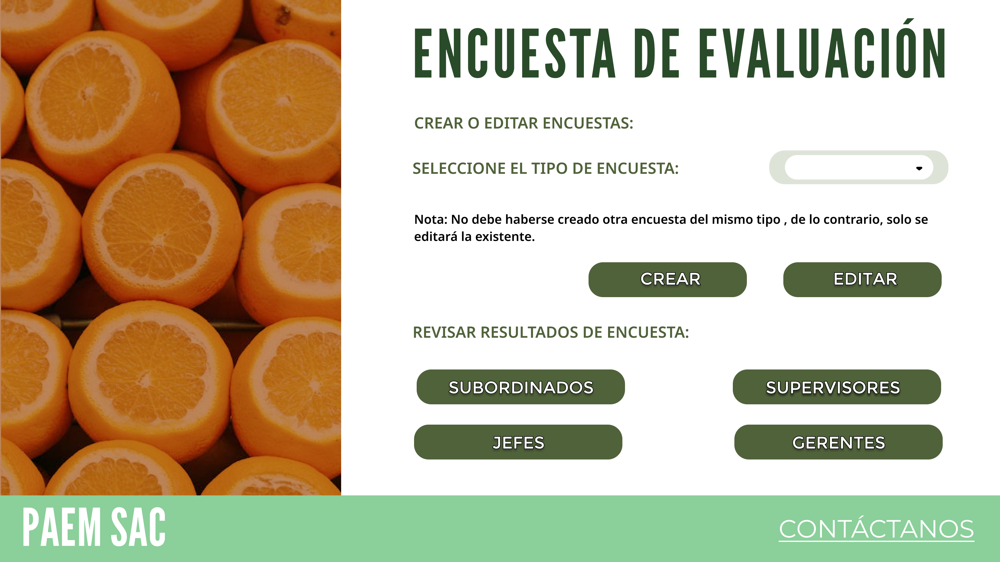
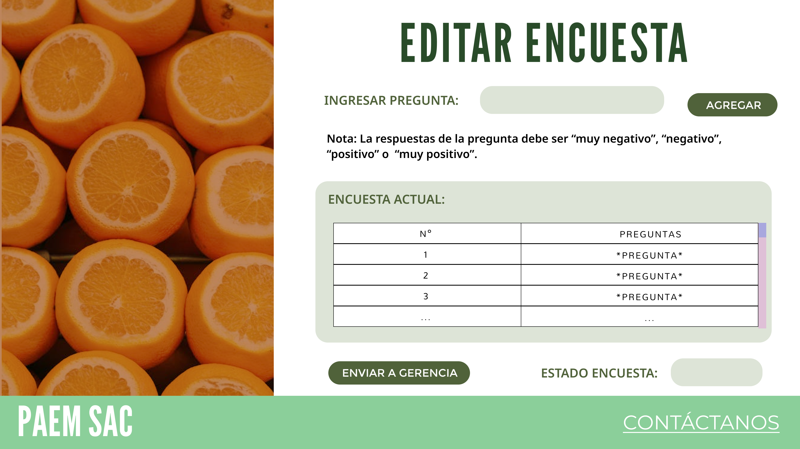
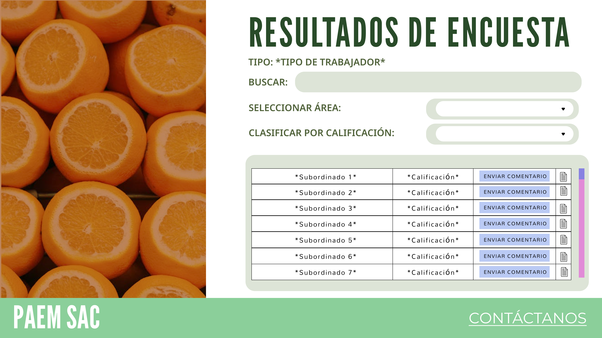

## Requisitos de Evaluación de Desempeño:

1. **Registro de Evaluaciones:**
   - El sistema debe permitir a los supervisores o jefes de departamento registrar las evaluaciones de desempeño de los empleados.
   - Se deben definir criterios de evaluación y competencias a evaluar para cada empleado.
   - Debe ser posible registrar las calificaciones y comentarios correspondientes a cada criterio de evaluación.

2. **Programación de Evaluaciones:**
   - El sistema debe facilitar la programación de evaluaciones de desempeño de forma periódica (por ejemplo, anual, semestral).
   - Debe enviar recordatorios automáticos a los supervisores y empleados para completar las evaluaciones en las fechas establecidas.

3. **Acceso a Evaluaciones Anteriores:**
   - Los empleados y supervisores deben poder acceder a las evaluaciones de desempeño anteriores para realizar comparaciones y seguimiento del progreso.

4. **Generación de Informes:**
   - El sistema debe ser capaz de generar informes detallados sobre el desempeño de los empleados, incluyendo calificaciones, comentarios, tendencias y áreas de mejora.
   - Debe ser posible exportar los informes en formatos compatibles (por ejemplo, PDF, Excel) para su revisión y análisis.

5. **Feedback y Planes de Mejora:**
   - El sistema debe permitir a los supervisores proporcionar feedback a los empleados basado en los resultados de las evaluaciones.
   - Debe ser posible establecer planes de mejora individualizados para aquellos empleados que necesiten desarrollar habilidades específicas o mejorar su rendimiento.

6. **Integración con Objetivos y Desarrollo:**
   - Debe existir integración con otros módulos del sistema, como el establecimiento de objetivos individuales y el desarrollo profesional, para alinear la evaluación de desempeño con los planes de crecimiento y desarrollo de los empleados.

7. **Confidencialidad y Seguridad:**
   - El sistema debe garantizar la confidencialidad de las evaluaciones de desempeño, permitiendo el acceso solo a los usuarios autorizados.
   - Debe implementar medidas de seguridad para proteger la información sensible de los empleados.

8. **Seguimiento y Retroalimentación Continua:**
   - El sistema debe facilitar el seguimiento continuo del desempeño de los empleados y la retroalimentación regular por parte de los supervisores.
   - Deben establecerse mecanismos para revisar y actualizar las evaluaciones de manera periódica, según sea necesario.

## Requisitos la Evaluación de Desempeño:

## Caso de uso 1 : Creación de la encuesta
| **Objetivo** |             **Permitir a los especialistas en relaciones laborales crear y revisar encuestas para distintos tipos de empleados.**             |
|:------------:|:---------------------------------------------------------------------------------------------------------------------------------------------:|
|  Descripción | Los especialistas pueden crear encuestas dirigidas a subordinados, supervisores, jefes y gerentes, así como revisar las encuestas ya creadas. |
|     Actor    |                                                      Especialista en relaciones laborales                                                     |
| Precondición |           El especialista ha iniciado sesión en el sistema de Recursos Humanos y tiene acceso a la función de creación de encuestas.          |
|     Paso     |                                                                     Acción                                                                    |
|       1      |                                               Iniciar sesión en el sistema de Recursos Humanos.                                               |
|       2      |                                                  Acceder al módulo de creación de encuestas.                                                  |
|       3      |                            Seleccionar el tipo de encuesta a crear (subordinados, supervisores, jefes o gerentes).                            |

#### Prototipo

## Caso de uso 2: Editar encuesta
| **Objetivo** |                                                                                         **Permitir a los especialistas en Relaciones laborales editar una encuesta existente.**                                                                                        |
|:------------:|:----------------------------------------------------------------------------------------------------------------------------------------------------------------------------------------------------------------------------------------------------------------------:|
|  Descripción | Los especialistas pueden ingresar preguntas con respuestas predefinidas ("muy negativo", "negativo", "positivo", "muy positivo"), ver las preguntas actuales de la encuesta, determinar si puede ser enviada a gerencia y verificar su estado de aprobación o rechazo. |
|     Actor    |                                                                                                                  Especialista en Relaciones laborales                                                                                                                  |
| Precondición |                                                                        El especialista ha iniciado sesión en el sistema de Recursos Humanos y tiene acceso a la función de edición de encuestas.                                                                       |
|     Paso     |                                                                                                                                 Acción                                                                                                                                 |
|       1      |                                                                                                         Seleccionar la encuesta existente que se desea editar.                                                                                                         |
|       2      |                                                                                                  Modificar las preguntas y opciones de respuesta según sea necesario.                                                                                                  |
|       3      |                                                                                            Verificar si la encuesta puede ser enviada a gerencia para revisión y aprobación.                                                                                           |
|       4      |                                                                                                 Revisar el estado actual de aprobación o rechazo por parte de gerencia.                                                                                                |

#### Prototipo

## Caso de uso 3: Revisar notificaciones pendientes
| **Objetivo** |                                            **Permitir a los trabajadores revisar las encuestas pendientes, calificaciones, charlas programadas y retroalimentación relacionada.**                                           |
|:------------:|:---------------------------------------------------------------------------------------------------------------------------------------------------------------------------------------------------------------------------:|
|  Descripción | Los trabajadores pueden acceder a las encuestas pendientes por completar, ver las calificaciones de las encuestas completadas, consultar las charlas programadas y revisar los comentarios o retroalimentaciones recibidas. |
|     Actor    |                                                                                                          Trabajador                                                                                                         |
| Precondición |                                                            El trabajador ha iniciado sesión en el sistema de Recursos Humanos y tiene notificaciones pendientes.                                                            |
|     Paso     |                                                                                                            Acción                                                                                                           |
|       1      |                                                                                      Acceder a la sección de notificaciones pendientes.                                                                                     |
|       2      |                                                                                      Visualizar las encuestas pendientes por completar.                                                                                     |
|       3      |                                                                                  Consultar las calificaciones de las encuestas completadas.                                                                                 |
|       4      |                                                                              Verificar las charlas programadas relacionadas con las encuestas.                                                                              |
|       5      |                                                                Revisar los comentarios o retroalimentaciones recibidas a partir de las encuestas completadas.                                                               |

#### Prototipo

## Caso de uso 4: Revisión de las encuestas
| **Objetivo** |               **Permitir a la Gerencia de Recursos Humanos revisar los resultados de las encuestas por área, calificación y tipo de trabajador.**               |
|:------------:|:---------------------------------------------------------------------------------------------------------------------------------------------------------------:|
|  Descripción | La gerencia puede visualizar los resultados de las encuestas, segmentados por área, calificación y tipo de trabajador, para analizar el desempeño del personal. |
|     Actor    |                                                                   Gerencia de Recursos Humanos                                                                  |
| Precondición |                      La gerencia ha iniciado sesión en el sistema de Recursos Humanos y tiene acceso a la función de revisión de encuestas.                     |
|     Paso     |                                                                              Acción                                                                             |
|       1      |                                                          Acceder a la sección de revisión de encuestas.                                                         |
|       2      |                                         Seleccionar los parámetros de búsqueda (área, calificación, tipo de trabajador).                                        |
|       3      |                                          Visualizar los resultados de las encuestas según los parámetros seleccionados.                                         |
|       4      |                                          Analizar el desempeño del personal basado en los resultados de las encuestas.                                          |

#### Prototipo

## Caso de uso 5: Aprobar encuestas y programar reuniones
| **Objetivo** |             **Permitir aprobar o rechazar las encuestas, revisar los resultados y programar reuniones o charlas según sea necesario.**             |
|:------------:|:------------------------------------------------------------------------------------------------------------------------------------------------------------------------------------:|
|  Descripción | La gerencia puede aprobar o rechazar las encuestas, así como revisar los resultados de las mismas. Además, pueden programar reuniones o charlas basadas en los resultados obtenidos. |
|     Actor    |                                                                             Gerencia de Recursos Humanos o Especialistas en Relaciones Laborales                                      |
| Precondición |                               La gerencia ha iniciado sesión en el sistema de Recursos Humanos y tiene acceso a la función de aprobación de encuestas.                               |
|     Paso     |                                                                                        Acción                                                                                        |
|       1      |                                                                   Acceder a la sección de aprobación de encuestas.                                                                   |
|       2      |                                                           Revisar los resultados de las encuestas pendientes de aprobación.                                                          |
|       3      |                                                                  Aprobar o rechazar las encuestas según corresponda.                                                                 |
|       4      |                                                       Programar reuniones o charlas basadas en los resultados de las encuestas.                                                      |

#### Prototipo

