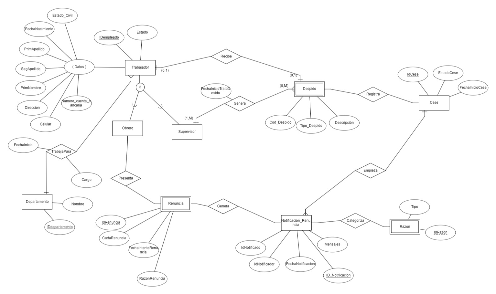
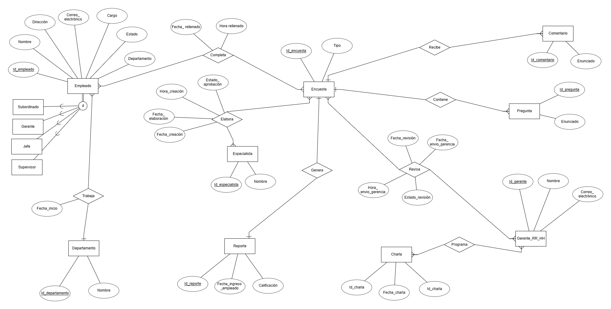
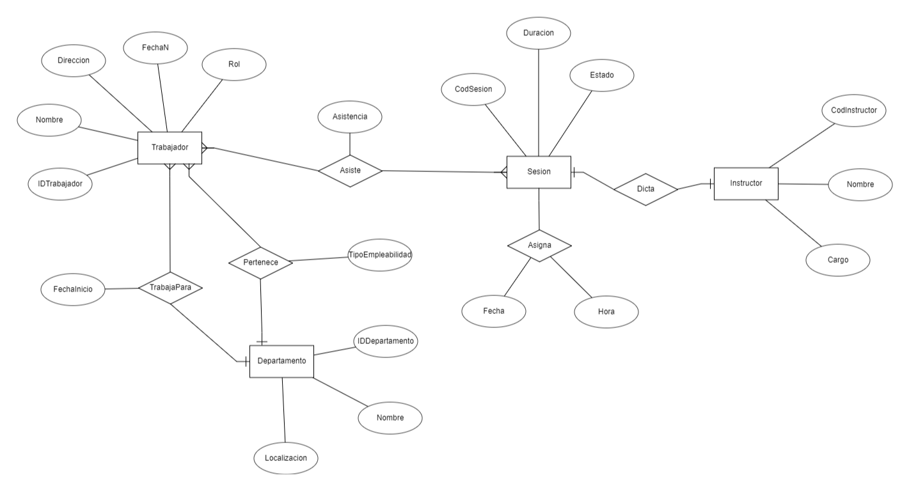
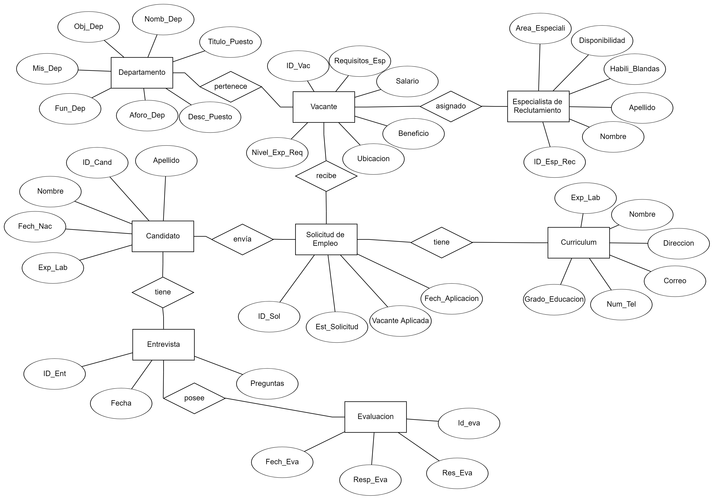

# Modelos Entidad-Relación
## Administración del Personal

## Procedimiento de Capacitaciones

## Cese de Personal

## Evaluación de Desempeño

## Induccion del Personal

## Reclutamiento y Selección del Personal

---
***[Volver al inicio](../../../README.md)***
