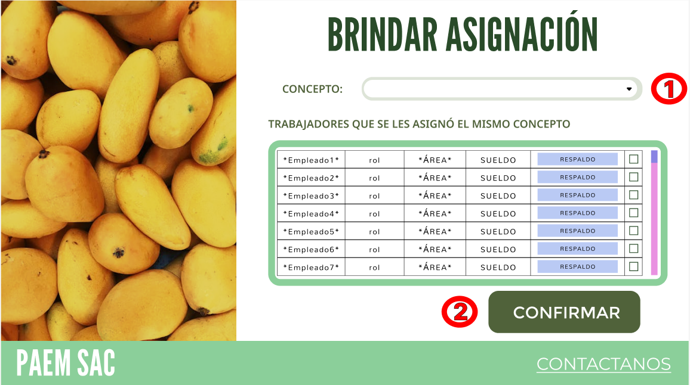

# Sentencias SQL para el prototipo del módulo Nomina

## 1. Actualizar información de un empleado

| Código requerimiento | R-0002 |
|:--------------------:|:-----:|
|    Código interfaz   | I-007 |
|    Imagen interfaz   |       |

#### Acción 1:
Botón 'Actualizar un dato': El asistente de RRHH. actualizará un dato del empleado.

    @Id_empleado = (SELECT id_empleado FROM empleado ORDER BY id_empleado DESC LIMIT 1)+1

## 2. Registrar actualización de información de un empleado

| Código requerimiento | R-0002 |
|:--------------------:|:-----:|
|    Código interfaz   | I-008 |
|    Imagen interfaz   |       |

#### Acción 2:
Carga de página: Se llenará la lista de datos del empleado.

    SELECT 
        e.Nombre_Empleado AS nombre,
        e.Apellido_Empleado AS apellido,
        d.Nombre_Departamento AS departamento,
        e.Estado_Civil AS estado_civil,
        e.Cant_Hijos AS cantidad_de_hijos,
        e.Direccion AS direccion,
        c.Nombre AS puesto
    FROM 
        Empleado e
    LEFT JOIN 
        Departamento d ON e.ID_Departamento = d.ID_Departamento
    LEFT JOIN 
        Cargo c ON e.ID_Cargo = c.ID_Cargo
    WHERE 
        e.DNI LIKE <1>;

#### Acción 3:
Botón 'Confirmar': para insertar las modificaciones de datos del empleado.

    UPDATE Empleado
        SET 
            Nombre_Empleado = p_Nombre_Empleado,
            Apellido_Empleado = p_Apellido_Empleado,
            Telefono = p_Telefono,
            Direccion = p_Direccion,
            Correo = p_Correo,
            Estado_Civil = p_Estado_Civil,
            Cant_Hijos = p_Cant_Hijos,
            ID_Departamento = p_ID_Departamento,
            ID_Cargo = p_ID_Cargo
        WHERE DNI = <2>;

## 3. Registro y actualización de ajuste salarial de un empleado

| Código requerimiento | R-0020 |
|:--------------------:|:-----:|
|    Código interfaz   | I-009 |
|    Imagen interfaz   |       |

#### Acción 4:
Botón 'Modificar el pago de algún empleado': El asistente de RRHH. actualizará las asignaciones salariasles que pueda presentar un empleado.

    @Id_empleado = (SELECT id_empleado FROM empleado ORDER BY id_empleado DESC LIMIT 1)+1

## 4. Registro y actualización de ajuste salarial de un empleado

| Código requerimiento | R-0020 |
|:--------------------:|:-----:|
|    Código interfaz   | I-010 |
|    Imagen interfaz   |       |

#### Acción 5:
Botón 'Confirmar': para insertar las asignaciones salariales del empleado.

    INSERT INTO Modificacion (id_modificacion, tipo_modificacion, monto_modificacion, moneda, fecha_emision)
    VALUES (
        @Id_modificacion,
        @Tipo_modificacion,
        @Monto_modificacion,
        @Moneda,
        @Fecha_emision
    );

## 5. Asignación de concepto a empleados

| Código requerimiento | R-0020 |
|:--------------------:|:-----:|
|    Código interfaz   | I-011 |
|    Imagen interfaz   |       |

#### Acción 6:
Botón 'Confirmar': para aplicar la asignar de acuerdo a concepto en los empleados.

    SELECT 
        e.Nombre_Empleado AS nombre,
        e.Apellido_Empleado AS apellido,
        e.DNI,
        c.Nombre AS rol,
        d.Nombre_Departamento AS departamento,
        s.Monto_Salario_Bruto AS monto_salario_bruto
    FROM 
        Empleado e
    LEFT JOIN 
        Departamento d ON e.ID_Departamento = d.ID_Departamento
    LEFT JOIN 
        Cargo c ON e.ID_Cargo = c.ID_Cargo
    LEFT JOIN
        Sueldo s ON e.ID_Empleado = s.ID_Empleado
    LEFT JOIN
        Pago_Total pt ON s.ID_Sueldo = pt.ID_Sueldo
    LEFT JOIN
        Modificacion m ON pt.ID_Modificacion = m.ID_Modificacion
    WHERE 
        m.Tipo_Modificacion LIKE '%Tipo de Modificación%';

## 6. Programar y gestión de pagos

| Código requerimiento | R-0021 |
|:--------------------:|:-----:|
|    Código interfaz   | I-012 |
|    Imagen interfaz   |       |

#### Acción 7:
Botón 'Confirmar': se agregará un registro del pago asignado al empleado.

    INSERT INTO Pago_Total (ID_Pago_Total, Monto_Pagar, Periodo_Pago, Moneda)
    VALUES (
        @Id_pago_total,
        @Monto_pagar,
        @Periodo_pago,
        @Moneda
    );
