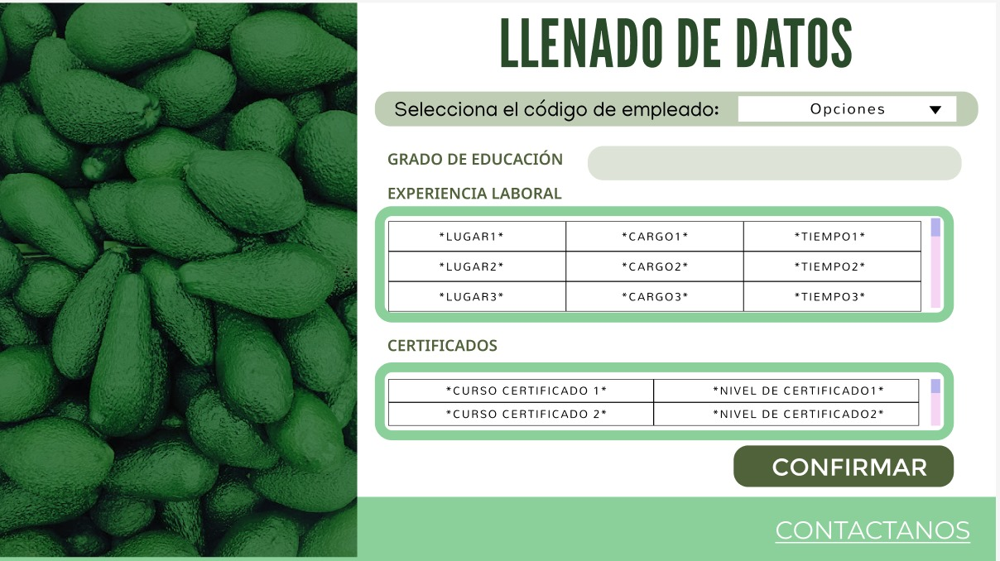
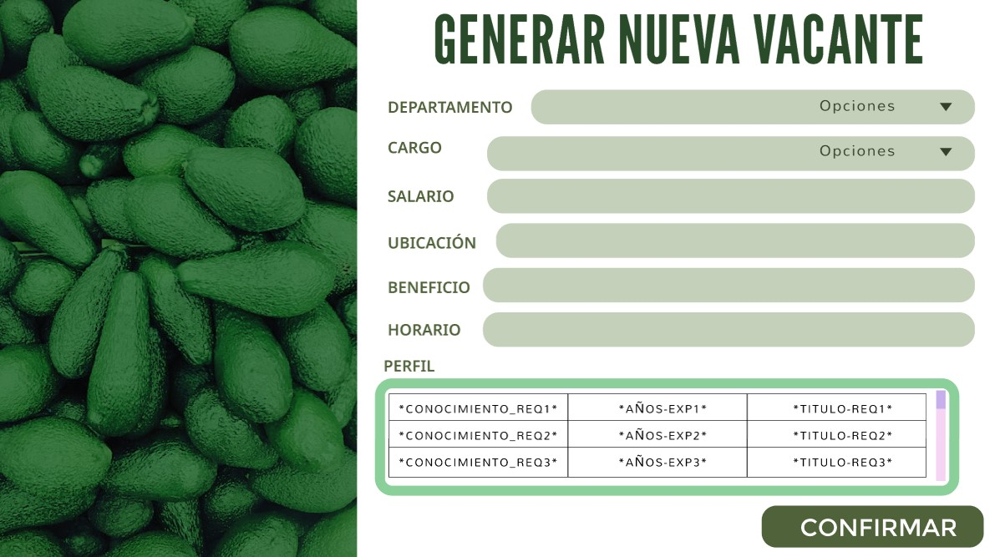
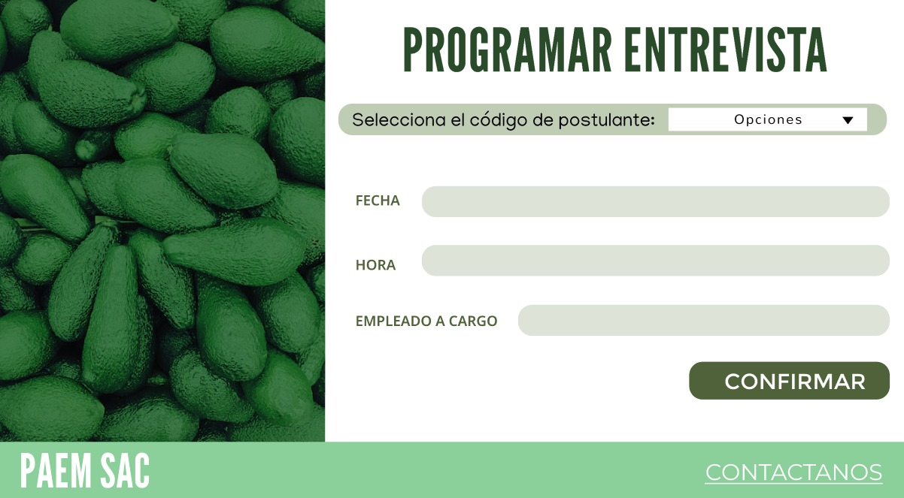
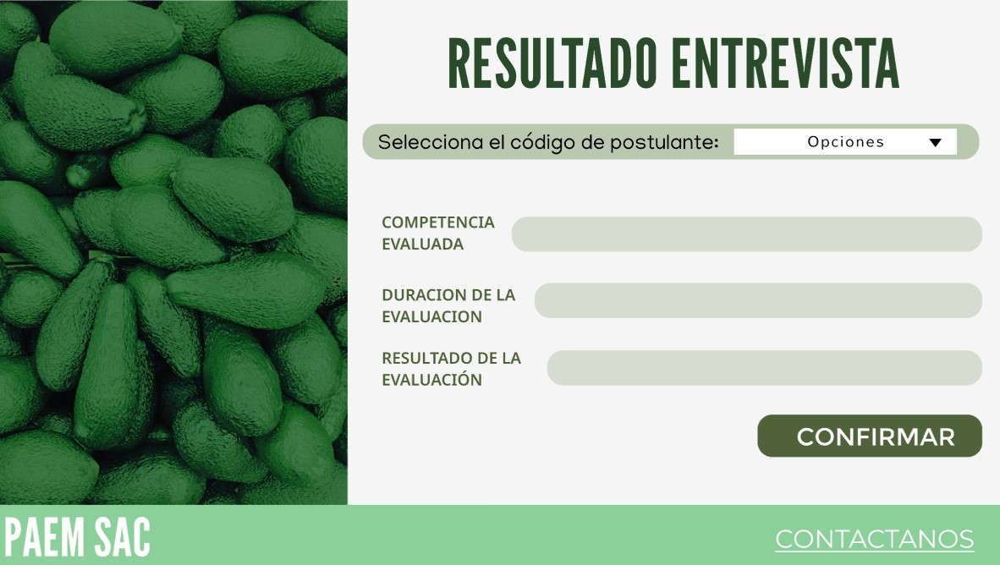

# Querys para registrar acciones
## Primer caso de uso (Llenado de datos)

### El postulante ingresa a la página de postulaciones

    DO $$
    DECLARE
        NuevoID_cand INT;
        NuevoID_curriculum INT;
        NuevoID_certificado INT;
        NuevoID_experiencia INT;
        curso_certificado VARCHAR(255) := 'Curso de Certificación'; -- Asigna el valor real según la entrada del usuario
        nivel_certificado VARCHAR(255) := 'Avanzado'; -- Asigna el valor real según la entrada del usuario
        nombre_lugar VARCHAR(255) := 'Empresa XYZ'; -- Asigna el valor real según la entrada del usuario
        cargo_ejercido VARCHAR(255) := 'Gerente de Proyectos'; -- Asigna el valor real según la entrada del usuario
        tiempo_ejercido VARCHAR(50) := '2 años'; -- Asigna el valor real según la entrada del usuario
        grado_educacion VARCHAR(255) := 'Licenciatura en Administración'; -- Asigna el valor real según la entrada del usuario
    BEGIN
        -- Obtener el próximo ID_cand
        SELECT COALESCE(MAX(id_cand), 0) + 1 INTO NuevoID_cand FROM Candidato;

        -- Obtener el próximo ID_curriculum
        SELECT COALESCE(MAX(id_curriculum), 0) + 1 INTO NuevoID_curriculum FROM Curriculum;

        -- Obtener el próximo ID_certificado
        SELECT COALESCE(MAX(id_certificado), 0) + 1 INTO NuevoID_certificado FROM Certificados;

        -- Obtener el próximo ID_experiencia
        SELECT COALESCE(MAX(id_experiencia), 0) + 1 INTO NuevoID_experiencia FROM Experiencia_Laboral;

        -- Insertar datos en Certificados
        INSERT INTO Certificados (ID_certificado, Curso_certificado, Nivel_certificado)
        VALUES (NuevoID_certificado, curso_certificado, nivel_certificado);

        -- Insertar datos en Experiencia_Laboral
        INSERT INTO Experiencia_Laboral (id_experiencia, nombre_lugar, cargo_ejercido, tiempo_ejercido)
        VALUES (NuevoID_experiencia, nombre_lugar, cargo_ejercido, tiempo_ejercido);

        -- Insertar datos en Curriculum
        INSERT INTO Curriculum (id_curriculum, grado_educacion, id_experiencia, id_certificado)
        VALUES (NuevoID_curriculum, grado_educacion, NuevoID_experiencia, NuevoID_certificado);

        -- Insertar el nuevo registro en Candidato
        INSERT INTO Candidato (id_cand, nombre_cand, apell_cand, fecha_nac_cand, direccion_cand, correo_cand, num_telefono, id_curriculum)
        VALUES (NuevoID_cand, 'Pedro', 'Suarez', '1991-08-16', 'Calle 123, Ciudad', 'pedro.suarez@hotmail.com', '999777888', NuevoID_curriculum);
    END $$;
## Segundo caso de uso (Seleccionado de horario y puesto)

### El postulante selecciona el puesto que desea y horario que desea 

    DO $$
    DECLARE
        NuevoID_solicitud VARCHAR(8);
        Fecha_aplicacion DATE := CURRENT_DATE; -- Fecha actual de la aplicación
        ID_Vacante VARCHAR(8) := '00200001'; -- Este valor debería ser proporcionado por el usuario a través de la interfaz de usuario
        Horario_disponible VARCHAR := 'Horario Ejemplo'; -- Este valor debería ser proporcionado por el usuario
        NuevoID_cand INT := 121; -- Este valor debería ser proporcionado por el usuario a través de la interfaz de usuario
    BEGIN
        -- Obtener el próximo ID_solicitud
        SELECT LPAD(CAST(COALESCE(MAX(CAST(ID_solicitud AS INT)), 0) + 1 AS VARCHAR), 8, '0') INTO NuevoID_solicitud FROM Solicitud_Empleo;

        -- Insertar el nuevo registro en Solicitud_Empleo
        INSERT INTO Solicitud_Empleo (ID_solicitud, ID_Vacante, Est_solicitud, Horario_disponible, Fecha_aplicacion, ID_cand)
        VALUES (NuevoID_solicitud, ID_Vacante, 'Pendiente', Horario_disponible, Fecha_aplicacion, NuevoID_cand);
    END $$;

## Tercer caso de uso (Preselección de candidato)

### Se obtiene la lista de candidatos postulados a una vacante específica.
    
    SELECT se.ID_solicitud, c.ID_cand, c.Nombre_cand, c.Apell_cand, se.Horario_disponible, se.Est_solicitud
    FROM Solicitud_Empleo se
    JOIN Candidato c ON se.ID_cand = c.ID_cand
    WHERE se.ID_Vacante = '00200001' -- Este valor debería ser proporcionado por el usuario a través de la interfaz de usuario
    AND se.Est_solicitud = 'Pendiente' or se.Est_solicitud='En proceso';

### Después de que el asistente marque los candidatos que cumplen con los requisitos, se actualiza el estado de la solicitud a 'Preseleccionado'.

    UPDATE Solicitud_Empleo
    SET Est_solicitud = 'Preseleccionado'
    WHERE ID_solicitud IN ('00240021', '00240001'); -- Estos valores deberían ser proporcionados por el usuario

## Cuarto caso de uso (Selección Final)

### Declaración de variables y sanitización de entrada

    DO $$
    DECLARE
        v_ID_Vacante VARCHAR(8) := '00200001'; -- Este valor debería ser proporcionado por el usuario a través de la interfaz de usuario
        rec RECORD;
    BEGIN
        -- Obtener la lista de candidatos preseleccionados para la vacante seleccionada
        FOR rec IN
            SELECT se.ID_solicitud, c.ID_cand, c.Nombre_cand, c.Apell_cand, se.Horario_disponible, se.Est_solicitud
            FROM Solicitud_Empleo se
            JOIN Candidato c ON se.ID_cand = c.ID_cand
            WHERE se.ID_Vacante = v_ID_Vacante
            AND se.Est_solicitud = 'Preseleccionado'
        LOOP
            -- Aquí puedes hacer algo con cada registro almacenado en la variable rec
            RAISE NOTICE 'ID_solicitud: %, ID_cand: %, Nombre_cand: %, Apell_cand: %, Horario_disponible: %, Est_solicitud: %',
                rec.ID_solicitud, rec.ID_cand, rec.Nombre_cand, rec.Apell_cand, rec.Horario_disponible, rec.Est_solicitud;
        END LOOP;
    END $$;

### Utilizamos transacciones para asegurar la consistencia de los datos y STRING_SPLIT para manejar múltiples IDs de solicitudes de empleo seleccionadas.

### Declaración de variables y sanitización de entrada

    DO $$
    DECLARE
        ID_Solicitud1 VARCHAR(8) := '00240021'; -- Este valor debería ser proporcionado por el usuario a través de la interfaz de usuario
    BEGIN
        -- Actualizar el estado del candidato seleccionado
        UPDATE Solicitud_Empleo
        SET Est_solicitud = 'Seleccionado'
        WHERE ID_solicitud = ID_Solicitud1;

        -- Notificar a los candidatos no seleccionados
        UPDATE Solicitud_Empleo
        SET Est_solicitud = 'No Seleccionado'
        WHERE ID_solicitud IN (
            SELECT ID_solicitud
            FROM Solicitud_Empleo
            WHERE ID_Vacante = (SELECT ID_Vacante FROM Solicitud_Empleo WHERE ID_solicitud = ID_Solicitud1)
            AND Est_solicitud = 'Preseleccionado'
            AND ID_solicitud != ID_Solicitud1
        );

    EXCEPTION WHEN OTHERS THEN
        -- Manejo de errores (log, mensajes, etc.)
        RAISE NOTICE 'Error occurred during the update. Transaction rolled back. %', SQLERRM;
        RAISE;
    END $$;

## Quinto caso de uso (Llenado de datos)

### Insertar Datos del Curriculum
    
    DO $$
    DECLARE
        ID_Curriculum1 INT := 121; -- Este valor debería ser proporcionado por el usuario a través de la interfaz de usuario
        ID_Certificado1 INT := 321; -- Este valor debería ser proporcionado por el usuario a través de la interfaz de usuario
        ID_Experiencia1 INT := 221; -- Este valor debería ser proporcionado por el usuario a través de la interfaz de usuario
        curso_certificado1 VARCHAR(255) := 'Curso de Certificación'; -- Asigna el valor real según la entrada del usuario
        nivel_certificado1 VARCHAR(255) := 'Avanzado'; -- Asigna el valor real según la entrada del usuario
        nombre_lugar1 VARCHAR(255) := 'Empresa XYZ'; -- Asigna el valor real según la entrada del usuario
        cargo_ejercido1 VARCHAR(255) := 'Gerente de Proyectos'; -- Asigna el valor real según la entrada del usuario
        tiempo_ejercido1 VARCHAR(50) := '2 años'; -- Asigna el valor real según la entrada del usuario
        grado_educacion1 VARCHAR(255) := 'Licenciatura en Química'; -- Asigna el valor real según la entrada del usuario
    BEGIN
        BEGIN
            -- Actualizar datos en Certificados
            UPDATE Certificados
            SET Curso_certificado = curso_certificado1,
                Nivel_certificado = nivel_certificado1
            WHERE ID_certificado = ID_Certificado1;

            -- Actualizar datos en Experiencia_Laboral
            UPDATE Experiencia_Laboral
            SET nombre_lugar = nombre_lugar1,
                cargo_ejercido = cargo_ejercido1,
                tiempo_ejercido = tiempo_ejercido1
            WHERE id_experiencia = ID_Experiencia1;

            -- Actualizar datos en Curriculum
            UPDATE Curriculum
            SET grado_educacion = grado_educacion1,
                id_experiencia = ID_Experiencia1,
                id_certificado = ID_Certificado1
            WHERE id_curriculum = ID_Curriculum1;

        EXCEPTION
            WHEN OTHERS THEN
                -- Manejo de errores (log, mensajes, etc.)
                RAISE NOTICE 'Error occurred during the update. Transaction rolled back. %', SQLERRM;
                RAISE;
        END;
    END $$;

## Sexto caso de uso (Selección Final)

### Insertar Datos del Perfil

    DO $$
    DECLARE 
        ID_Perfil1 INT;
        Conocimiento_Req VARCHAR(255) := 'Conocimiento en SQL y gestión de proyectos'; -- Este valor debería ser proporcionado por el usuario a través de la interfaz de usuario
        Años_Exp INT := 5; -- Este valor debería ser proporcionado por el usuario a través de la interfaz de usuario
        Titulo_Requerido VARCHAR(255) := 'Licenciatura en Ingeniería de Sistemas'; -- Este valor debería ser proporcionado por el usuario a través de la interfaz de usuario
    BEGIN
        -- Insertar datos del perfil
        SELECT COALESCE(MAX(id_perfil), 0) + 1 INTO ID_Perfil1 FROM Perfil;

        INSERT INTO Perfil (id_perfil, Conocimiento_Req, Años_Exp, Titulo_Requerido)
        VALUES (ID_Perfil1, Conocimiento_Req, Años_Exp, Titulo_Requerido);

    EXCEPTION
        WHEN OTHERS THEN
            -- Manejo de errores (log, mensajes, etc.)
            RAISE NOTICE 'Error occurred during the update. Transaction rolled back. %', SQLERRM;
            RAISE;
    END $$;
### Paso 2: Insertar Datos de la Vacante

    DO $$
    DECLARE 
        ID_Vac1 VARCHAR(8);
        ID_Departamento INT := 1; -- Este valor debería ser proporcionado por el usuario a través de la interfaz de usuario
        ID_Cargo INT := 1; -- Este valor debería ser proporcionado por el usuario a través de la interfaz de usuario
        ID_Perfil INT := 21; -- Este valor debería ser el ID del perfil recién creado
        Ubicacion VARCHAR(255) := 'Oficina Central'; -- Este valor debería ser proporcionado por el usuario a través de la interfaz de usuario
        Beneficio VARCHAR(255) := 'Seguro médico, Bonos por desempeño'; -- Este valor debería ser proporcionado por el usuario a través de la interfaz de usuario
        Salario DECIMAL(8, 2) := 3000.00; -- Este valor debería ser proporcionado por el usuario a través de la interfaz de usuario
        Horario VARCHAR(255) := 'Lunes a Viernes, 9:00 AM a 6:00 PM'; -- Este valor debería ser proporcionado por el usuario a través de la interfaz de usuario
    BEGIN
        -- Generar ID único para la vacante asegurando que no supere los 5 dígitos numéricos
        ID_Vac1 := '002' || LPAD((SELECT COALESCE(MAX(CAST(SUBSTRING(ID_Vac, 4) AS INTEGER)), 0) + 1 FROM Vacante)::TEXT, 5, '0');
        
        -- Iniciar una transacción implícita
        BEGIN
            -- Insertar datos de la vacante
            INSERT INTO Vacante (ID_Vac, ID_Departamento, ID_Cargo, ID_Perfil, Ubicacion, Beneficio, Salario, Horario)
            VALUES (ID_Vac1, ID_Departamento, ID_Cargo, ID_Perfil, Ubicacion, Beneficio, Salario, Horario);

            -- Confirmar la transacción implícita
        EXCEPTION
            WHEN OTHERS THEN
                -- Manejo de errores (log, mensajes, etc.)
                RAISE NOTICE 'Error occurred during the insertion. Transaction rolled back. %', SQLERRM;
                RAISE;
        END;
    END $$;

## Séptimo caso de uso (Programar entrevista)

### Validar y Obtener IDs Requeridos

DO $$
    DECLARE 
        ID_EntrevistaP INT;
        id_evaluacionP INT;
        ID_solicitud VARCHAR(8) := '00240021'; -- Este valor debería ser proporcionado por el usuario a través de la interfaz de usuario
        Fecha_Eva DATE := '2024-06-15'; -- Este valor debería ser proporcionado por el usuario a través de la interfaz de usuario
        Hora_entrevista TIME := '10:00'; -- Este valor debería ser proporcionado por el usuario a través de la interfaz de usuario
        ID_Emplea INT;
        DNIP VARCHAR(8) := '12345678'; -- Este valor debería ser proporcionado por el usuario a través de la interfaz de usuario
    BEGIN
        -- Obtener el ID del empleado a partir del DNI
        SELECT ID_Empleado INTO ID_Emplea FROM Empleado WHERE DNI = DNIP;

        -- Generar ID único para la entrevista
        SELECT COALESCE(MAX(ID_Entrevista), 0) + 1 INTO ID_EntrevistaP FROM Entrevista;

        -- Generar ID único para la evaluación
        SELECT COALESCE(MAX(id_evaluacion), 0) + 1 INTO id_evaluacionP FROM Evaluacion;

        -- Iniciar una transacción
        BEGIN
            -- Insertar datos de la evaluación
            INSERT INTO Evaluacion (id_evaluacion, competencias_evaluadas, result_evaluacion, duracion_evaluacion, estado_evaluacion)
            VALUES (id_evaluacionP, 'Pendiente', 'Pendiente', 0, 'Pendiente');

            -- Insertar datos de la entrevista
            INSERT INTO Entrevista (ID_Entrevista, Fecha_Eva, Hora_entrevista, ID_solicitud, ID_Evaluacion, ID_Empleado)
            VALUES (ID_EntrevistaP, Fecha_Eva, Hora_entrevista, ID_solicitud, id_evaluacionP, ID_Emplea);

        EXCEPTION
            WHEN OTHERS THEN
                -- Manejo de errores (log, mensajes, etc.)
                RAISE NOTICE 'Error occurred during the insertion. Transaction rolled back. %', SQLERRM;
                ROLLBACK;
        END;
    END $$;

## Octavo caso de uso (Selección Final)

### Validar y Obtener IDs Requeridos

    DO $$
    DECLARE 
        ID_EvaluacionP INT := 21; -- Este valor debería ser proporcionado por el usuario a través de la interfaz de usuario
        Competencias_EvaluadasP VARCHAR(255) := 'Competencia 1, Competencia 2'; -- Este valor debería ser proporcionado por el usuario a través de la interfaz de usuario
        Duracion_EvaluacionP INT := 60; -- Este valor debería ser proporcionado por el usuario a través de la interfaz de usuario
        Result_EvaluacionP VARCHAR(255) := 'Aprobado'; -- Este valor debería ser proporcionado por el usuario a través de la interfaz de usuario
    BEGIN
        -- Iniciar una transacción
        BEGIN
            -- Actualizar datos de la evaluación
            UPDATE Evaluacion 
            SET Competencias_Evaluadas = Competencias_EvaluadasP,
                Duracion_Evaluacion = Duracion_EvaluacionP,
                Result_Evaluacion = Result_EvaluacionP,
                Estado_Evaluacion = 'Completado'
            WHERE ID_Evaluacion = ID_EvaluacionP;

        EXCEPTION
            WHEN OTHERS THEN
                -- Deshacer la transacción en caso de error
                ROLLBACK;

                -- Manejo de errores (log, mensajes, etc.)
                RAISE NOTICE 'Error occurred during the update. Transaction rolled back. %', SQLERRM;
        END;
    END $$;