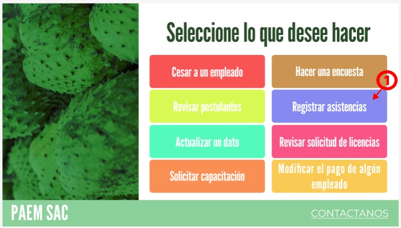
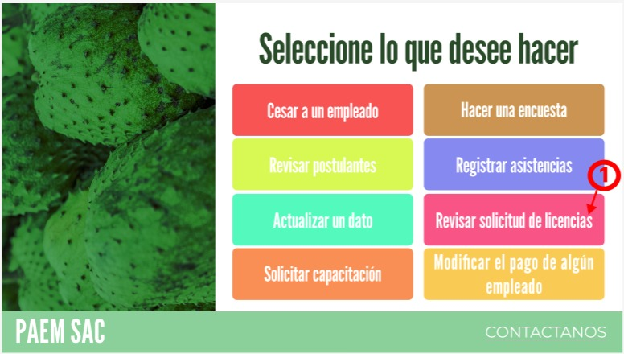
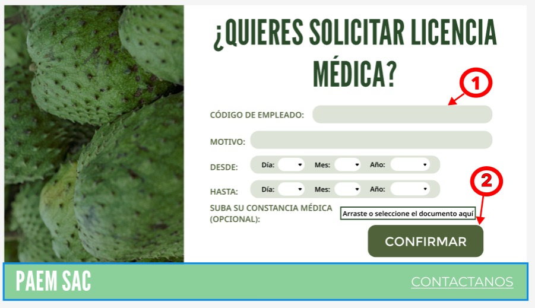
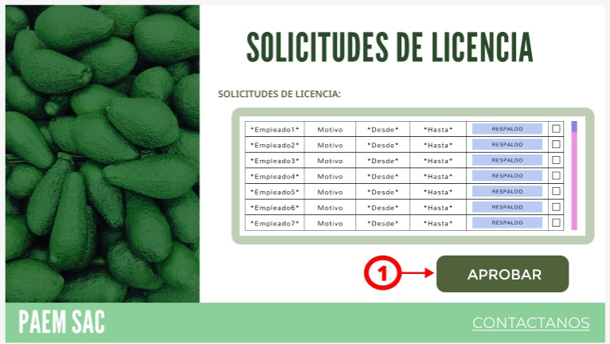
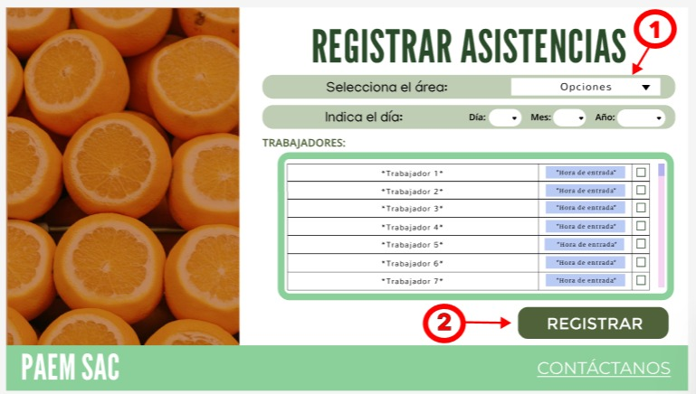
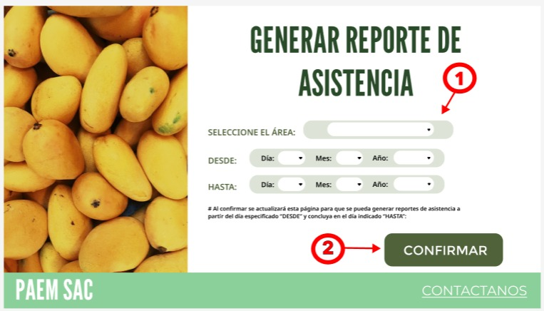

# Querys para registrar acciones

## Para el supervisor

### Primera pantalla opcional:

#### Acción opcional 1.1:
Se elige la opción de registrar asistencias del personal en la intranet del supervisor:

	@Id_asistencia = (SELECT id_asistencia FROM asistencia ORDER BY id_asistencia DESC LIMIT 1)

### Segunda pantalla opcional:

#### Acción opcional 1.2:
Se elige la opción de revisar solicitudes de licencias del personal en la intranet del supervisor:

	@Id_licencia = (SELECT id_licencia FROM licencia ORDER BY id_licencia DESC LIMIT 1)

## R-016 / Caso de Uso 16: Gestión de solicitudes de ausencia

### Acción 1: Búsqueda del empleado por su código (En la barra de códigos)
Si el empleado escribe su código, digamos '20220003' y le da a buscar se ejecuta:

	SELECT 
		E.ID_Empleado, 
		D.nombre_departamento,
	FROM empleado as E
	INNER JOIN departamento AS D ON E.id_departamento=D.id_departamento
	WHERE E.ID_Empleado= '%20220003%'

### Acción 2: Solicitar licencia médica
El empleado con id @emp ya identificó su código de empleado, ya redactó el motivo de su solicitud de licencia, aclaró las fechas de inicio y de fin y adjuntó su constancia médica.

Si el empleado le da al botón 'CONFIRMAR':

	IF (SELECT id_licencia FROM licencia ORDER BY id_licencia DESC LIMIT 1)+1 = @Id_Licencia ( 
		INSERT INTO licencia (id_licencia, tipo, estado, fecha_inicio, fecha_fin, id_empleado, id_supervisor)
		VALUES (
				(SELECT id_licencia FROM licencia ORDER BY id_licencia DESC LIMIT 1)+1,
				@Tipo,
				@Fecha_I,
                @Fecha_F,
				@Emp,
				(SELECT id_empleado FROM empleado WHERE CODIGO = @CODIGO)
			);
	)
	ELSE (
		UPDATE Licencia
		SET 	tipo = @Tipo,
				fecha_inicio = @Fecha_I,
                fecha_fin = @Fecha_F,
				id_empleado = (SELECT id_empleado FROM empleado WHERE CODIGO = @CODIGO)
		WHERE id_licencia=@Id_licencia
	);

## R-017 / Caso de Uso 17: Aprobación de solicitudes de ausencia

### Acción única:

    -- Aceptar una licencia
    UPDATE Licencia
    SET estado = 'Aprobado'
    WHERE id_licencia = #id_lic# AND estado = 'Pendiente';

    -- Rechazar una licencia  
    UPDATE Licencia
    SET estado = 'Rechazado'
    WHERE id_licencia = #id_lic# AND estado = 'Pendiente';

## R-015 / Caso de Uso 15: Registro de asistencias diarias

### Acción 1: Seleccionar área de donde se va a registrar la asistencia

    SELECT Id_Departamento, Nombre_Departamento FROM Departamento;

### Acción 2: Registrar asistencia

    UPDATE Asistencia
    SET Asistencia = 'Asistió'
    WHERE ID_Asistencia IN (@ID_asistencia) AND ID_Empleado IN (@ID_Empleado1,@ID_Empleado2,@ID_Empleado3);

    UPDATE Asistencia
    SET Asistencia = 'Faltó'
    WHERE ID_Asistencia IN (@ID_sesion) AND ID_Empleado IN (@ID_Empleado1,@ID_Empleado2,@ID_Empleado3);

## R-018 / Caso de Uso 18: Reporte de asistencia

### Acción 1: Elegir las especificaciones para el reporte de asistencias:

    SELECT Id_Departamento, Nombre_Departamento FROM Departamento;

### Acción 2: Generar el reporte de asistencia

    SELECT
        A.Id_Asistencia,
        A.Estado,
        A.Observacion,
        A.Fecha,
        A.Hora_entrada,
        A.Hora_salida,
        E.Nombre_Empleado,
        D.Nombre_Departamento,
        C.Nombre 
    FROM Asistencia A
    INNER JOIN Empleado E ON A.id_empleado = E.id_empleado
    INNER JOIN Departamento D ON E.id_departamento = D.id_departamento
    INNER JOIN Cargo C ON E.id_cargo = C.id_cargo
    WHERE A.fecha BETWEEN '2020-01-01' AND '2020-12-31'
    ORDER BY A.fecha DESC, A.hora_entrada DESC;
 