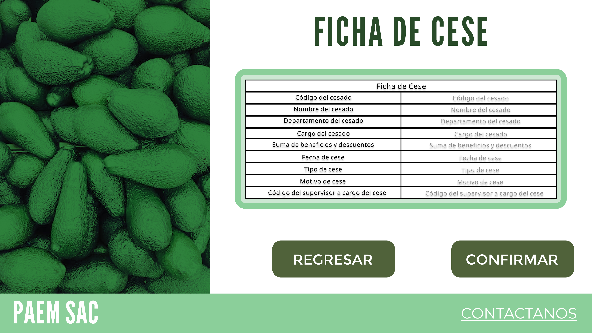

# Querys para registrar acciones

## Primera pantalla:

### El supervisor ingresa a la pantalla del cese:
Primero guardamos el nuevo identificador del cese:
	@Id_cese = (SELECT id_cese FROM cese ORDER BY id_cese DESC LIMIT 1)

### Búsqueda de empleados (Seleccionando la lupa):
Si el empleado escribe un texto, digamos 'INGRESO' y le da a buscar se ejecuta:

	SELECT 
		E.DNI, 
		E.nombre_empleado as NOMBRE,
		E.apellido_empleado as APELLIDO,
		D.nombre_departamento,
	FROM empleado as E
	INNER JOIN departamento AS D ON E.id_departamento=D.id_departamento
	WHERE E.apellido_empleado= '%INGRESO%'

### Registrar el cese:
El supervisor con id @Sup ya identificó al empleado a cesar con su DNI como @DNI, ya seleccionó el tipo de cese @Tipo, ingresó (opcionalmente) el motivo del cese @Motivo y aclaró la fecha del cese @Fecha.

Si el supervisor le da al botón 'REGISTRAR':

	IF (SELECT id_cese FROM cese ORDER BY id_cese DESC LIMIT 1)+1 = @Id_Cese ( 
		INSERT INTO cese (id_cese, tipo_cese, motivo_cese, fecha_inicio_cese, id_supervisor, id_empleado)
		VALUES (
				(SELECT id_cese FROM cese ORDER BY id_cese DESC LIMIT 1)+1,
				@Tipo,
				@Motivo,
				@Fecha,
				@Sup,
				(SELECT id_empleado FROM empleado WHERE DNI = @DNI)
			);
	)
	ELSE (
		UPDATE Cese
		SET 	tipo_cese = @Tipo,
				motivo_cese = @Motivo,
				fecha_inicio_cese = @Fecha,
				id_empleado = (SELECT id_empleado FROM empleado WHERE DNI = @DNI)
		WHERE id_cese=@Id_cese
	);

### Ingresar deudas del empleado con la empresa (Seleccionando el botón 'SI'):
Si el supervisor selecciona la opción sí en la pregunta '¿El trabajador posee alguna deuda con la empresa?' y escribe un valor @Deuda

	IF (SELECT id_beneficios FROM beneficios_cese WHERE id_cese = @Id_cese) EXISTS ( 
		UPDATE id_beneficios
		SET monto = -1*@Deud
		WHERE id_beneficios = (SELECT id_beneficios FROM beneficios_cese WHERE id_cese = @Id_cese ORDER BY id_beneficios ASC LIMIT 1)
	)
	ELSE (
		INSERT INTO beneficios_cese (id_beneficios, id_tipo, monto, id_Cese)
		VALUES (
			(SELECT id_beneficios FROM beneficios_cese
			ORDER BY id_beneficios DESC
			LIMIT 1)+1,
			5, 
			-1*@Deud, 
			@Id_cese
		);
	);

### El supervisor selecciona la opción 'NO' o seleccionando 'CONFIRMAR'(Pantalla de carga)

	INSERT INTO beneficios_cese (id_beneficios, id_tipo, monto, id_Cese)
		VALUES
			((SELECT id_beneficios FROM beneficios_cese
			ORDER BY id_beneficios DESC
			LIMIT 1)+1,
			1, 
			(
				(SELECT Monto_pagar FROM Pago_Total as P 
				INNER JOIN Nomina as N ON P.ID_Pago_Total=N.ID_Pago_Total 
				WHERE N.id_empleado=(SELECT id_empleado FROM empleado WHERE DNI = @DNI))
			+
				(SELECT Monto_modificacion FROM Modificacion as M 
				INNER JOIN Pago_Total as P ON P.ID_Modificacion=M.id_Modificacion 
				INNER JOIN Nomina as N ON P.ID_Pago_Total=N.ID_Pago_Total
				WHERE N.id_empleado=(SELECT id_empleado FROM empleado WHERE DNI = @DNI) AND M.tipo_modificacion='Gratificacion')
			)/6*(MONTH(SELECT Fecha_Ingreso FROM Empleados WHERE DNI=@DNI)-MONTH(SELECT fecha_inicio_cese FROM cese WHERE Id_cese=@Id_cese)),
			@Id_cese);

### Visualizar la ficha de cese (La pantalla termina de cargar)

Con todos los datos guardados de las ejecuciones

	SELECT
		E.DNI,
		E.nombre_empleado ||' '|| 	E.apellido_empleado,
		D.nombre_departamento,
		CA.nombre,
		SUM(B.monto),
		C.fecha_inicio_cese,
		CASE
			WHEN C.tipo_cese = 'D' THEN 'Despido'
			WHEN C.tipo_cese = 'R' THEN 'Renuncia'
			WHEN C.tipo_cese = 'C' THEN 'Término de contrato'
			WHEN C.tipo_cese = 'J' THEN 'Jubilación'
			ELSE 'No especificado'
		END AS Tipo_Cese,
		C.motivo_cese,
		(SELECT DNI FROM empleado WHERE id_empleado = @Sup)
	FROM cese AS C
	INNER JOIN empleado AS E ON C.id_empleado = E.id_empleado
	INNER JOIN departamento AS D ON E.id_departamento = D.id_departamento
	INNER JOIN cargo AS CA ON E.id_cargo = CA.id_cargo
	INNER JOIN beneficios_cese AS B ON C.id_cese = B.id_cese
	WHERE C.id_cese = @Id_cese
	GROUP BY C.id_empleado, E.nombre_empleado, C.tipo_cese, D.nombre_departamento, CA.nombre, C.fecha_inicio_cese, C.motivo_cese, C.id_supervisor;

## Registrar preguntas para la persona a cesar:

### Si seleccionan la opción de 'Usar preguntas predeterminadas':
Guardamos el id_cuestionario como @Id_cese
	INSERT INTO pregunta_salida (id_pregunta, pregunta_salida, id_cuestionario)
		VALUES (
		((SELECT id_pregunta FROM pregunta_salida
			ORDER BY id_pregunta DESC
			LIMIT 1)+1,
		'¿Como describirías tu experiencia en tu empresa?',
		@Id_cese),
		((SELECT id_pregunta FROM pregunta_salida
			ORDER BY id_pregunta DESC
			LIMIT 1)+2,
		'¿Qué mejorarías en la empresa?',
		@Id_cese),
		((SELECT id_pregunta FROM pregunta_salida
			ORDER BY id_pregunta DESC
			LIMIT 1)+2,
		'¿Quéno te gusta de tu empresa?',
		@Id_cese)
	);

### Si ingresan sus propias preguntas:
Guardamos el id_cuestionario como @Id_cese y registrando la pregunta como @Pregunta
	INSERT INTO pregunta_salida (id_pregunta, pregunta_salida, id_cuestionario)
		VALUES (
			(SELECT id_pregunta FROM pregunta_salida
			ORDER BY id_pregunta DESC
			LIMIT 1)+1,
		@Id_pregunta,
		@Id_cese
	);

## Resolver cuestionario:

### Cargar el cuestionario

	SELECT pregunta_salida 
	FROM pregunta_salida
	WHERE id_cuestionario=@Id_cese

### Ingresar las respuestas a las preguntas

	INSERT INTO respuesta_salida (id_respuesta, respuesta_salida, id_pregunta)
		VALUES (
			(SELECT id_respuesta FROM respuesta_salida
			ORDER BY id_respuesta DESC
			LIMIT 1)+1,
			RESP , ID_P);
	

