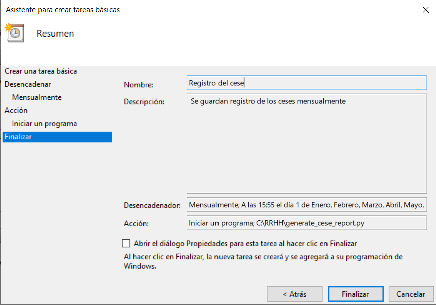

# Generación de Informes de Empleados Cesados

## Descripción
Este proceso de batch se encarga de generar un informe mensual de los empleados cesados, guardándolo en una carpeta de la máquina. El informe se genera en formato CSV.

## Importancia
- **Automatización**: Reduce la carga de trabajo manual.
- **Precisión**: Asegura la consistencia y precisión de los datos generados.
- **Disponibilidad**: Facilita el acceso a información relevante y actualizada.

## Código

### Script de Batch: `generate_cese_report.py`

```python
import os
import csv
from datetime import datetime, timedelta
from django.db import connection
from django.conf import settings

def generate_cese_report():
    # Definir el rango de los datos para el reporte
    today = datetime.today()
    first_day_of_month = today.replace(day=1)
    last_day_of_last_month = first_day_of_month - timedelta(days=1)
    first_day_of_last_month = last_day_of_last_month.replace(day=1)

    query = """
        SELECT E.DNI, E.nombre_empleado, E.apellido_empleado, D.nombre_departamento, C.fecha_inicio_cese, C.tipo_cese
        FROM cese AS C
        INNER JOIN empleado AS E ON C.id_empleado = E.id_empleado
        INNER JOIN departamento AS D ON E.id_departamento = D.id_departamento
        WHERE C.fecha_inicio_cese BETWEEN %s AND %s
    """

    with connection.cursor() as cursor:
        cursor.execute(query, [first_day_of_last_month, last_day_of_last_month])
        empleados_cesados = cursor.fetchall()

    # Definir la dirección de almacén del reporte
    report_file_path = os.path.join(settings.BASE_DIR, 'reports', f'cese_report_{last_day_of_last_month.strftime("%Y_%m")}.csv')

    # Creación de un directorio de almacén
    os.makedirs(os.path.dirname(report_file_path), exist_ok=True)

    # Escribir los datos en un archivo csv
    with open(report_file_path, mode='w', newline='', encoding='utf-8') as file:
        writer = csv.writer(file)
        writer.writerow(['DNI', 'Nombre', 'Apellido', 'Departamento', 'Fecha de Cese', 'Tipo de Cese'])
        for empleado in empleados_cesados:
            writer.writerow(empleado)

if __name__ == '__main__':
    generate_cese_report()
```

## Configuración de Tareas Programadas en Windows

1. Abrir el Programador de tareas.
2. Crear una tarea básica.
3. Programar la tarea para que se ejecute mensualmente.
4. Configurar la acción para ejecutar el script Python con el intérprete de Python.

## Demostración

