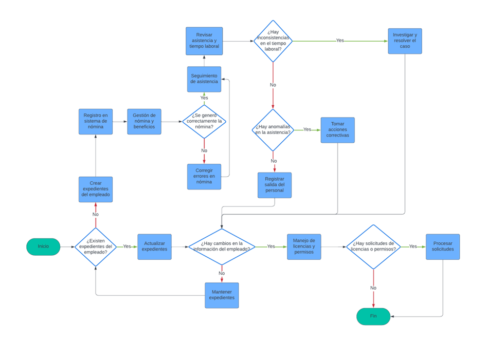

# Administración del Personal
## Descripción
La administración de Recursos Humanos (HRM) es una función vital dentro de una organización que se centra en la administración del capital humano para lograr las metas y objetivos generales. Implica una serie de procesos interconectados que están diseñados para maximizar el potencial de los empleados y crear un ambiente de trabajo positivo. Una herramienta eficaz que ayuda a visualizar y comprender estos procesos es el diagrama de flujo de procesos de gestión de recursos humanos.
## Flujograma
### Link: 
[Administación del personal](https://lucid.app/lucidchart/d933f78a-25e9-44ef-8a27-9d6dddb523c0/edit?beaconFlowId=54375012260CBC41&invitationId=inv_ad1861d7-813c-41aa-a8d0-fbc7baf287ac&page=0_0#)
### Imagen:

## Descripción de los procesos del flujograma
1. Conjunto de personales: Se refiere a la selección y agrupación de los candidatos adecuados para las vacantes disponibles en la empresa.

2. Recepción del personal: Es el proceso de dar la bienvenida y orientar a los nuevos empleados, familiarizándolos con las políticas y procedimientos de la empresa.

3. Aceptación: Implica la confirmación y el acuerdo del empleado con los términos y condiciones del empleo, incluyendo salario, horarios y responsabilidades.

4. Rechazo de personal(No): Rechazo de la solicitud del personal para trabajar en algún área detemrinada de la empresa.

5. Registro de entrada del personal (Si): Una vez ya aceptado al grupo de personales aptos para el trabajo, se procede a documentar la llegada de los nuevos empleados a su nuevo lugar de trabajo.

6. Identificación: Este paso implica reconocer y validar la identidad de los empleados, así como sus roles y posiciones dentro de la organización.

7. Organización del personal: Se trata de estructurar y asignar al personal en diferentes departamentos o equipos según sus habilidades y las necesidades de la empresa.

8. Distribución del personal: Involucra la asignación de tareas y responsabilidades a los empleados, asegurando que el trabajo se distribuya de manera eficiente y equitativa.

9. Fin: Fin del proceso. 