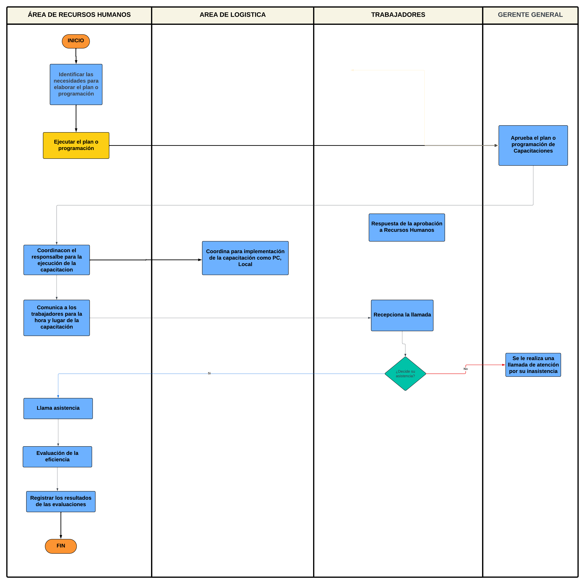

# Procedimiento de Capacitaciones
## Descripción

Según Chiavenato, la capacitación se define como la educación profesional para la adaptación del operario para el trabajo o puesto laboral. Este proceso se puede aplicar a todos los niveles de la empresa, y normalmente este proceso se delegan al jefe superior inmediato del puesto encargado. 

#### Figura 1: Flujo de un sistema de capacitacion 

  
Nota : Grafico del proceso de Capacitacion. Tomado de  *Administración de Recursos Humanos* (p.325), por Chiavenato 

## Flujograma
### Link: 

https://lucid.app/lucidchart/e20d016c-cdfc-44a1-ba47-ce56aacd429a/edit?viewport_loc=-2478%2C-1047%2C5713%2C2798%2C0_0&invitationId=inv_281ab008-a02b-4aa9-a96a-fd2bdb0646ef

### Imagen:

## Descripción de los procesos del flujograma
| Orden | Paso                                                                | Descripción                                                                                                                                                                              | Encargado                                 |
|-------|---------------------------------------------------------------------|------------------------------------------------------------------------------------------------------------------------------------------------------------------------------------------|-------------------------------------------|
| 1     | Identificar las necesidades para elaborar el plan o programación    | Identifica si es necesaria la capacitación del personal actual, dependiendo del área a capacitar, etc; se programa a los personales encargados de la capacitación, se define el proceso. | Gerente de RRHH                           |
| 2     | Ejecutar el plan o programación                                     | Se establece los recursos a usar y programarlos para la capacitación                                                                                                                     | Gerente de RRHH                           |
| 3     | Aprueba el plan o programación de Capacitaciones                    | Da la autoridad para la ejecución del plan programado                                                                                                                                    | Gerente General                           |
| 4     | Coordina con el responsable para la ejecución de la capacitación    | Se coordinan con los encargados programados de la capacitación.                                                                                                                          | Gerente de RRHH                           |
| 5     | Coordina para implementación de la capacitación como PC, Local      | Se coordina los recursos y el área necesaria para la capacitación                                                                                                                        | Especialista en Desarrollo Organizacional |
| 6     | Comunica a los trabajadores para la hora y lugar de la capacitación | Se da la hora y fecha para desarrollar la capacitación a los colaboradores a capacitar                                                                                                   | Gerente de RRHH                           |
| 7     | Recepciona la llamada                                               | Registro de asistencia para comprobar la asistencia o no del personal                                                                                                                    | Trabajadores                              |
| 8     | Se le realiza una llamada de atención por su inasistencia           | Notifica la inasistencia con su respectiva amonestación                                                                                                                                  | Gerente General                           |
| 9     | Llama asistencia                                                    | Registro de la asistencia                                                                                                                                                                | Gerente de RRHH                           |
| 10    | Evaluación de la eficiencia                                         | Evalúa a los colaboradores después del proceso de capacitación                                                                                                                           | Gerente de RRHH                           |
| 11    | Registrar los resultados de las evaluaciones                        | Obtiene resultados de las evaluaciones de la eficiencia                                                                                                                                  | Gerente de RRHH                           |
