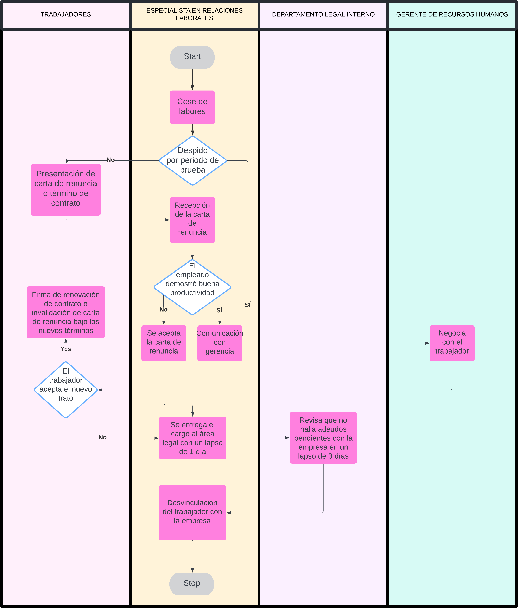

# Cese de Personal
## Descripción
Se encarga de gestionar todas las actividades relacionadas con la terminación del empleo de un individuo en la organización. Este proceso implica una serie de pasos y consideraciones importantes para garantizar que la separación del empleado se realice de manera adecuada y legal, así como para minimizar cualquier impacto negativo en el empleado y en la empresa. 
## Flujograma
### Link: 
[Flujograma en Lucidchart](https://lucid.app/lucidchart/b03ffae4-d01d-4bf9-a54f-d1a717722a7c/edit?viewport_loc=-541%2C-1452%2C2804%2C1313%2C0_0&invitationId=inv_bfd20018-5803-4c40-8262-87a5c2dbe910)
### Imagen:

## Descripción de los procesos del flujograma
| Orden | Paso                                                                                         | Descripción                                                                                                                                                                                                                                            | Encargado  |
|-------|----------------------------------------------------------------------------------------------|--------------------------------------------------------------------------------------------------------------------------------------------------------------------------------------------------------------------------------------------------------|------------|
| 1     | Cese de labores                                                                              | Se pausan las labores del empleado                                                                                                                                                                                                                     | Área de RH |
| 2     | Presentación de carta de renuncia o término de contrato                                      | El empleado presenta una carta formal comunicando su decisión de renunciar al puesto o notificando el término de su contrato laboral.                                                                                                                  | Trabajador |
| 3     | Recepción de la carta de renuncia                                                            | La empresa recibe la carta de renuncia del empleado.                                                                                                                                                                                                   | Área de RH |
| 4     | Se acepta la carta de renuncia                                                               | La empresa recibe y evalúa la carta de renuncia.                                                                                                                                                                                                       | Área de RH |
| 5     | Comunicación con gerencia                                                                    | Se informa a gerencia la decisión del trabajador                                                                                                                                                                                                       | Área de RH |
| 6     | Negociación con el trabajador                                                                | Se trata de llegar a un acuerdo con el trabajador para que no abandone la empresa                                                                                                                                                                      | Gerencia   |
| 7     | Firma de renovación de contrato o invalidación de carta de renuncia bajo los nuevos términos | Si se llega a un acuerdo, se pueden firmar nuevos términos de contrato o se invalida la carta de renuncia bajo los nuevos acuerdos establecidos.                                                                                                       | Área de RH |
| 8     | Se entrega el cargo al área legal con un lapso de 1 día                                      | El departamento encargado de los trámites legales de Recursos Humanos recibe la notificación del cese de empleo del empleado dentro de un día hábil.                                                                                                   | Área de RH |
| 9     | Revisión de adeudos pendientes con la empresa en un lapso de 3 días                          | El departamento encargado de los trámites legales de Recursos Humanos revisa si el empleado tiene algún adeudo pendiente con la empresa, como equipos no devueltos, pagos no liquidados, entre otros.                                                  | Área Legal |
| 10    | Desvinculación del trabajador con la empresa                                                 | Una vez completados todos los trámites y revisados los adeudos, se procede con la desvinculación formal del trabajador de la empresa. Esto puede incluir la cancelación de beneficios, la entrega de documentos finales y la desactivación de accesos. | Área de RH |