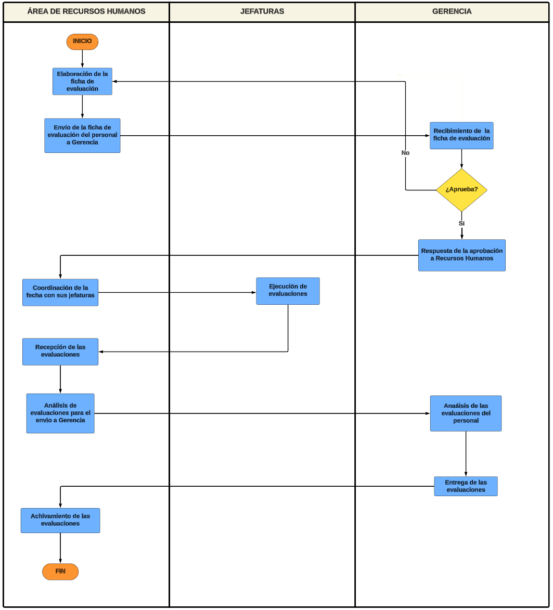

# Evaluación de Desempeño
Su objetivo principal es medir, analizar y evaluar el rendimiento laboral de los empleados dentro de una organización. Esta función implica la recopilación de información sobre el desempeño de cada empleado, la comparación de este desempeño con los estándares y expectativas establecidos, y la retroalimentación proporcionada tanto al empleado como a la organización en su conjunto.

## Flujograma
### Link: 
[Evaluación de Desempeño](https://lucid.app/lucidchart/98390b68-63b1-417a-b3f4-5a15a0d8bf1b/edit?viewport_loc=-1216%2C-143%2C4242%2C3357%2C0_0&invitationId=inv_0412ef85-1b61-4f99-9a9b-d18653591624)
### Imagen:

## Descripción de los procesos del flujograma
1. **Elaboración de la ficha de evaluación:** Aquí se crean los formularios o fichas de evaluación que se utilizarán para evaluar el desempeño de los empleados.

2. **Envío de la ficha de evaluación del personal a Gerencia:** Una vez creadas las fichas, se envían a la gerencia para su aprobación y validación.

3. **Respuesta de la aprobación a Recursos Humanos:** La gerencia envía su aprobación o comentarios sobre las fichas de evaluación a Recursos Humanos.

4. **Coordinación de la fecha con sus jefaturas:** Se coordina con los superiores directos de los empleados la fecha y el proceso de evaluación.

5. **Ejecución de Evaluaciones:** Se llevan a cabo las evaluaciones de desempeño según lo programado.

6. **Recepción de las evaluaciones:** Una vez completadas, las evaluaciones son recibidas por Recursos Humanos.

7. **Análisis de evaluaciones para el envío a gerencia:** Se analizan las evaluaciones realizadas para preparar informes o resúmenes que serán enviados a la gerencia.

8. **Análisis de las evaluaciones del personal:** Se analiza individualmente el desempeño de cada empleado.

9. **Entrega de las evaluaciones:** Se entregan los resultados de las evaluaciones a los empleados y a sus respectivos superiores.

10. **Archivamiento de las evaluaciones:** Se archivan los documentos relacionados con las evaluaciones de desempeño para futuras referencias y seguimiento.

