# Capítulo 10:  Versión Final de la Aplicación
## 10.1 Aplicación
Dirección de la carpeta del proyecto: [Proyecto](https://github.com/ChrisTw00/App_DBD)

## 10.2 Flujo de pantallas
# CASO 1 : Iniciar Sesion 
## FLUJO DE LAS VISTAS
| PASOS | ACCION  |
|----------|----------|
| 1 | En la **VISTA 1** el usuario ingresara su cuenta (usuario y contraseña)   |
| 2 | Apretara en el boton **Ingresar**, para validar los datos|
| 3.1 | Si la cuenta es validada y le pertenece a un **supervisor o superior** entonces le llevará a la pantalla de selección para supervisores |
| 3.2 | Si la cuenta es validada y le pertenece a un **empleado** entonces le llevará a la pantalla de selección para supervisores |
| 3.3 | Si la cuenta es validada y le pertenece a un **empleado cesado** entonces le llevará a la pantalla para resolver su cuestionario de salida |
## Vista 1: Logearse
### Descripcion 
Aquí el empleado podra ingresar los datos de su cuenta y podra validarlos para poder acceder al sistema.
### Captura de pantalla 

# CASO 2: Supervisor va a seleccionar lo que se desea hacer
## FLUJO DE LAS VISTAS
| PASOS | ACCION  |
|----------|----------|
| 1 | En la **VISTA 2** el supervisor seleccionará lo que desea hacer|
| 1.1 | Apretara en el boton **Cese de empleados** entonces le llevará a la pantalla de control del módulo de cese o **CASO 2.1**|
| 1.2 | Apretara en el boton **Reclutamiento y Selección de Personal** entonces le llevará a la pantalla de control del módulo de reclutamiento y selección de personal|
| 1.3 | Apretara en el boton **Evaluación de desempeño** entonces le llevará a la pantalla de control del módulo de evaluación de desempeño|
| 1.4 | Apretara en el boton **Capacitación** entonces le llevará a la pantalla de control del módulo de capacitación|
| 1.5 | Apretara en el boton **Asistencias** entonces le llevará a la pantalla de control del módulo de asistencias|
## Vista 2: Pantalla de selección de un supervisor o su superior
### Descripcion 
Esta es la vista que tendra el supervisor despues de ingresar en el inicio de sesion.
### Captura de pantalla 

### CASO 2.1: Entrar al módulo de "Cese de empleados"
| PASOS | ACCION  |
|----------|----------|
| 1 | En la **VISTA 3** el supervisor seleccionará lo que desea hacer dentro del cese de personal|
| 1.1 | Apretara en el boton **Cesar un empleado** entonces le llevará al proceso de cesar un empleado **CASO 2.1.1**|
| 1.2 | Apretara en el boton **Revisar el cese de un empleado**  entonces le llevará al proceso de revisar el cese de un empleado **CASO 2.1.2**|
| 1.3 | Apretara en el boton **Generar reporte de cese** entonces le llevará al proceso de generar un reporte de ceses**CASO 2.1.3**|
#### Vista 3: Pantalla de selección de cese
##### Descripcion 
Es la vista que tendrá el supervisor si pulsa el botón "Cesar a un empleado"
##### Captura de pantalla

#### CASO 2.1.1: Ingresar a la función de "Cesar un empleado"
| PASOS | ACCION  |
|----------|----------|
| 1 | En la **VISTA 4** el supervisor puede dejar en blanco la casilla de CÓDIGO o llenar el apellido del empleado a cesar, si lo deja en blanco le aparecerán todos los apellidos disponibles para cesar y si llena un apellido en específico le aparecerán los datos de todas las personas con ese apellido|
| 2 | Apretar el boton **Seleccionar** en el empleado que se desea cesar|
| 3 | Llenar los demás datos del cese y darle click a **Enviar** para redirigirse a la **VISTA 5**|
| 4 | Revisar los datos del cese y darle a **REGRESAR** si se quiere corregir un dato, lo que lo llevaría de nuevo a la **VISTA 4** o darle a **CONFIRMAR** para continuar con el proceso lo que lo redirigiría a la **VISTA 6**|
| 5 | En la **VISTA 6** si se le da click al botón **Usar preguntas predeterminadas** se guardarán en la base de datos preguntas por defecto, en cambio si se rellena el cambio de abajo se puede llenar preguntas propias y con el botón **+** se puede agregar más preguntas|
| 6 | Si se le da click al botón **CONFIRMAR** se guarda el proceso y se redirige a la **VISTA 7**|
| 7 | En la **VISTA 7** se confirma el proceso de cese con éxito y al darle click al botón **Volver a la pestaña de selección** se regresa a las opciones de supervisor de la **VISTA 2**|

##### Vista 4: Pantalla de selección de cese

##### Vista 5: Revisar detalles de cese

##### Vista 6: Insertar preguntas para el cuestionario de salida

##### Vista 7: Culminar el proceso de cese

#### CASO 2.1.2: Ingresar a la función de "Revisar el cese de un empleado"
| PASOS | ACCION  |
|----------|----------|
| 1 | En la **VISTA 8** el supervisor puede dejar en blanco la casilla de CÓDIGO o llenar el apellido del empleado cesado a revisar, si lo deja en blanco le aparecerán todos los apellidos de las personas cesadas y si llena un apellido en específico le aparecerán los datos de todas las personas cesadas con ese apellido|
| 2 | Apretar el boton **Seleccionar** en el empleado del que se desea revisar su cese|
| 3 | Al pulsar el botón seleccionar le aparecerán todos los datos del cese y las respuestas de ese cesado a las preguntas del formulario de salida|
| 4 | Al darle click a **REGRESAR** se redirigirá a la **VISTA 2**|

##### Vista 8: Pantalla de vista de datos de un cese

#### CASO 2.1.3: Ingresar a la función de "Generar reporte de cese"
| PASOS | ACCION  |
|----------|----------|
| 1 | En la **VISTA 9** el supervisor ingresa una fecha de inicio y una de final, luego de la click al botón **Generar reporte**|
| 2 | Al pulsar el botón, aparecerá una tabla donde se indique la cantidad de ceses de cada tipo en el periodo de tiempo y el total de ceses en dicho periodo |
| 3 | Al darle click a **REGRESAR** se redirigirá a la **VISTA 2**|

##### Vista 9: Pantalla de reporte de ceses

# CASO 3: Empleado activo va a seleccionar lo que se desea hacer
## FLUJO DE LAS VISTAS
| PASOS | ACCION  |
|----------|----------|
| 1 | En la **VISTA 2** el usuario responderá las preguntas que desee del cuestionario|
| 2 | Apretara en el boton **CONFIRMAR** para guardar los datos y esto lo llevará a la **VISTA 2**|
| 3 | Cuando seleccione el botón **Volver a la pestaña inicial** lo llevará al login automáticamente |
## Vista 2: Pantalla de inicio de empleado 
### Descripcion 
Esta es la vista que tendra el empleado despues de haber ingresado por el inicio de sesion
### Captura de pantalla 

# CASO 4: Empleado cesado o ex-empleado va a seleccionar lo que se desea hacer
## FLUJO DE LAS VISTAS
| PASOS | ACCION  |
|----------|----------|
| 1 | En la **VISTA 50** el usuario confirmará su participación en el cuestionario pulsando **Responder cuestionario** lo que lo llevará a la **VISTA 51**|
| 2 | Responderá las preguntas que se le plantearon y apretara en el boton **CONFIRMAR** para guardar los datos, a su vez, esto lo llevará a la **VISTA 52**|
| 3 | En dicha vista se confirmará que se han guardado los datos y al clickear en  **Volver a la pestaña inicial** lo llevará al login automáticamente |
## Vista 50: Pantalla para iniciar a resolver el cuestionario

## Vista 51: Pantalla para responder las preguntas del cuestionario

## Vista 52: Pantalla de confirmación de resolución de cuestionario

# CASO 5: Mostrar menú de Evaluación de Desempeño
## FLUJO DE LAS VISTAS
| PASOS | ACCION  |
|----------|----------|
| 1 | En la **VISTA 10** el usuario el usuario escoge la opción relacionada a Evaluación de Desempeño que desea escoger  |

## Vista 10: Pantalla del menú de evaluacion de desempeño
### Descripcion
Se muestran las diferentes opciones relacionadas a este módulo: crear cuestionario, editar cuestionario, aprobar cuestionario, responder cuestionario, revisar cuestionario, mis resultados, programar reunión y reuniones pendientes. 
### Captura de pantalla

# CASO 6: Crear un tipo de cuestionario para evaluación de desempeño
## FLUJO DE LAS VISTAS
| PASOS | ACCION  |
|----------|----------|
| 1 | En la **VISTA 11** el usuario el usuario ingresa su ID, el cual debe ser ser de un especialista en relaciones laborales  |
| 2 | Luego de ingresar el ID, deberá seleccionar unos de los tipos de cuestionario a crear (subordinados, supervisores, jefes o gerentes)|
| 3 | Presionar el botón 'crear'|
| 4 | Presionar el botón 'editar' si se quiere ir a la sección de editar los cuestionarios que han sido creados|

## Vista 11: Pantalla para crear un cuestionario
### Descripcion
Vista donde se podrá crear un tipo de cuestionario para la evaluación de desempeño.
### Captura de pantalla

# CASO 7: Editar un tipo de cuestionario para evaluación de desempeño
## FLUJO DE LAS VISTAS
| PASOS | ACCION  |
|----------|----------|
| 1 | En la **VISTA 12**, el especialista en relaciones laborales deberá seleccionar el tipo de cuestionario a editar|
| 2 | El tipo de cuestionario elegido llevará a una ventana específica donde podrá editar el tipo de cuestionario seleccionado|
| 3 | En caso de agregar una pregunta, deberá redactarla y presionar al botón 'agregar'|
| 4 | Se mostrarán todas las preguntas que han sido agregadas en una tabla|
| 5 | En caso de querer eliminar una pregunta, presionar el botón 'eliminar', ubicado en la parte derecha de cada pregunta|
| 6 | Se muestra el estado de envío y el estado de aprobación del cuestionario seleccionado|
| 7 | En caso de que el cuestionario esté terminado, presionar el botón 'enviar a gerencia' para su revisión  |

## Vista 12: Pantalla para seleccionar un tipo de cuestionario
### Descripcion
Vista para seleccionar un tipo de cuestionario que se quiere editar.
### Captura de pantalla

## Vista 13: Pantalla para  editar el cuestionario de tipo 'subordinados'
### Descripcion
Vista que permite editar el cuestionario de tipo 'subordinados'.
### Captura de pantalla

## Vista 14: Pantalla para  editar el cuestionario de tipo 'supervisores'
Vista que permite editar el cuestionario de tipo 'supervisores'.
### Descripcion
### Captura de pantalla

## Vista 15: Pantalla para  editar el cuestionario de tipo 'jefes'
### Descripcion
Vista que permite editar el cuestionario de tipo 'jefes'.
### Captura de pantalla

## Vista 16: Pantalla para  editar el cuestionario de tipo 'gerentes'
### Descripcion
Vista que permite editar el cuestionario de tipo 'gerentes'.
### Captura de pantalla

# CASO 8: Aprobar un tipo de cuestionario para evaluación de desempeño
## FLUJO DE LAS VISTAS
| PASOS | ACCION  |
|----------|----------|
| 1 | En la **VISTA 17**, el gerente deberá seleccionar el tipo de cuestionario a aprobar|
| 2 | El tipo de cuestionario elegido llevará a una ventana específica donde podrá aprobar el cuestionario|
| 3 | Se muestran las preguntas del cuestionario elegido|
| 4 | Se muestran el estado de envío y el estado de aprobación|
| 5 | El gerente puede elegir el estado de aprobación luego de evaluar el cuestionario|
| 6 | Para actualizar el estado de aprobación se debe presionar el botón 'enviar estado de aprobación'|

## Vista 17: Pantalla para seleccionar un tipo de cuestionario
### Descripcion
Vista para seleccionar un tipo de cuestionario que se quiere aprobar.
### Captura de pantalla

## Vista 18: Pantalla para  aprobar el cuestionario de tipo 'subordinados'
### Descripcion
Vista que permite aprobar el cuestionario de tipo 'subordinados'.
### Captura de pantalla

## Vista 19: Pantalla para  aprobar el cuestionario de tipo 'supervisores'
### Descripcion
Vista que permite aprobar el cuestionario de tipo 'supervisores'.
### Captura de pantalla

## Vista 20: Pantalla para  aprobar el cuestionario de tipo 'jefes'
### Descripcion
Vista que permite aprobar el cuestionario de tipo 'jefes'.
### Captura de pantalla

## Vista 21: Pantalla para  aprobar el cuestionario de tipo 'gerentes'
### Descripcion
Vista que permite aprobar el cuestionario de tipo 'gerentes'.
### Captura de pantalla

# CASO 9: Responder un tipo de cuestionario para evaluación de desempeño
## FLUJO DE LAS VISTAS
| PASOS | ACCION  |
|----------|----------|
| 1 | En la **VISTA 22**, el empleado deberá escoger el tipo de cuestionario a responder, dependiendo de su cargo|
| 2 | El empleado deberá ingresar su ID|
| 3 | Se mostrarán las preguntas del tipo de cuestionario elegido|
| 4 | Para cada pregunta habrá solo 4 tipos de respuestas a escoger: 'muy negativo', 'negativo', 'positivo' y 'muy positivo'|
| 5 | Luego de responder todas las preguntas, presionar el botón 'enviar respuestas'|

## Vista 22: Pantalla para seleccionar un tipo de cuestionario
### Descripcion
Vista para seleccionar un tipo de cuestionario que se quiere responder.
### Captura de pantalla

## Vista 23: Pantalla para  responder el cuestionario de tipo 'subordinados'
### Descripcion
Vista que permite aprobar el cuestionario de tipo 'subordinados'.
### Captura de pantalla

## Vista 24: Pantalla para  responder el cuestionario de tipo 'supervisores'
### Descripcion
Vista que permite aprobar el cuestionario de tipo 'supervisores'.
### Captura de pantalla

## Vista 25: Pantalla para  responder el cuestionario de tipo 'jefes'
### Descripcion
Vista que permite aprobar el cuestionario de tipo 'jefes'.
### Captura de pantalla

## Vista 26: Pantalla para  responder el cuestionario de tipo 'gerentes'
### Descripcion
Vista que permite aprobar el cuestionario de tipo 'gerentes'.
### Captura de pantalla

# CASO 10: Revisar y realizar reportes de los cuestionarios de evaluación de desempeño respondidos
## FLUJO DE LAS VISTAS
| PASOS | ACCION  |
|----------|----------|
| 1 | En la **VISTA 27**, el especialista en relaciones laborales podrá revisar la tabla donde se mostrarán los empleados que han respondido algún cuestionario|
| 2 | El empleado podrá filtrar los empleados por apellido, tipo o calificación|
| 3 | En caso de que haya cuestionarios no calificados, además de los tipos de calificación 'muy negativo', 'muy negativo', 'postivivo' y 'muy positivo', se podrá escoger la opción de calificación 'sin calificar'|
| 4 | A cada empleado se le podrá realizar un reporte, para ello se deberá presionar el botón 'realizar reporte'|
| 5 | El especialista en relaciones laborales deberá ingresar su ID, la calificación del empleado y la retroalimentación|
| 6 | Para terminar el reporte, se presionar el botón reporte|

## Vista 27: Pantalla para revisar los cuestionarios respondidos
### Descripcion
Vista para revisar qué empleados han respondido cuestionarios y poder filtrarlos por apellido, tipo y calificación.
### Captura de pantalla

## Vista 28: Pantalla para realizar reporte de algún empleado
### Descripcion
Vista para realizar el reporte del empleado seleccionado, el cual necesita de la ID del especialista en relaciones laborales, una calificación y retroalimentación.
### Captura de pantalla

# CASO 11: Revisar resultados de algún empleado en el cuestionario
## FLUJO DE LAS VISTAS
| PASOS | ACCION  |
|----------|----------|
| 1 | En la **VISTA 29**, se podrá buscar los resultados del cuestionario de un empleado|
| 2 | Se podrá buscar los resultados de un empleado a partir de su ID, DNI o apellido, en caso de este último, se mostrará una tabla de todos los empleados con ese apellido y luego se podrá escoger al que se buscaba|
| 3 | Se muestran los resultados del empleado buscado|

## Vista 29: Pantalla para buscar empleados
### Descripcion
Vista dónde se muestran las 3 formas de buscar los resultados de un empleado: ID, DNI y apellido.
### Captura de pantalla

## Vista 30: Pantalla para mostrar resultados
### Descripcion
Vista dónde se muestran los resultados de un empleado buscado.
### Captura de pantalla

## Vista 31: Pantalla para mostrar resultados por apellido
### Descripcion
Vista dónde se muestra la tabla de empleados del apellido buscado.
### Captura de pantalla

# CASO 12: Programar una reunión acerca de evaluación de desempeño
| PASOS | ACCION  |
|----------|----------|
| 1 | En la **VISTA 32**, el especialista en relaciones laborales o el gerente de Recursos Humanos, podrá programar una reunión relacionada al módulo de evaluación de desempeño|
| 2 | El especialista en relaciones laborales o el gerente de Recursos Humanos deberá ingresar su ID, asunto, fecha y hora de la reunión |
| 3 | Para programar la reunión, se presiona la botón 'programar|

## Vista 32: Pantalla para programar una reunión
### Descripcion
Vista donde el especialista en relaciones laborales o el gerente de Recursos Humanos podrá programar una reunión relacionada al módulo de evaluación de desempeño
### Captura de pantalla

# CASO 13: Mostrar reuniones pendientes sobre evaluación de desempeño
## FLUJO DE LAS VISTAS
| PASOS | ACCION  |
|----------|----------|
| 1 | En la **VISTA 33**, se podrá revisar las reuniones pendientes|

## Vista 33: Pantalla para mostrar reuniones
### Descripcion
Vista donde se muestran las reuniones programadas que están pendientes.
### Captura de pantalla

# CASO 14: Funciones de Capacitacion
## Vista 34: Pantalla para mostrar menu de funcionalidades de capacitacion
### Descripcion
### Captura de pantalla

# CASO 15: Programar Capacitacion
## Vista 35: Pantalla para generar una capacitación
### Descripcion
### Captura de pantalla

## Vista 36: Pantalla para generar sesiones de la capacitación
### Descripcion
### Captura de pantalla

# CASO 16: Matricular Empleados
## Vista 37: Pantalla para matricular empleados en un programa
### Descripcion
### Captura de pantalla

# CASO 17: Mostrar Empleados Matriculados
## Vista 38: Pantalla para mostrar empleados matriculados en un programa
### Descripcion
### Captura de pantalla

# CASO 18: Mostrar Registro de Capacitaciones
## Vista 39: Pantalla para mostrar las capacitaciones existentes.
### Captura de pantalla

# CASO 19: Mostrar Actulizar Asistencia
## Vista 39: Pantalla para modificar un estado de asistencia.
### Captura de pantalla

# Módulo de Reclutamiento y Selección de Personal

## CASO 1: Supervisor selecciona una opción dentro del módulo

### FLUJO DE LAS VISTAS

| PASOS | ACCIÓN  |
|----------|----------|
| 1 | En la **VISTA 40** el supervisor seleccionará lo que desea hacer dentro de Reclutamiento y Selección. |
| 1.1 | Apretará el botón **Registrar Postulante**, lo que lo llevará al proceso de registrar un postulante **CASO 40.1.1**. |
| 1.2 | Apretará el botón **Seleccionar Horario y Puesto**, lo que lo llevará al proceso de selección de horario y puesto **CASO 40.1.2**. |
| 1.3 | Apretará el botón **Preselección de Candidatos**, lo que lo llevará al proceso de preselección de candidatos **CASO 40.1.3**. |
| 1.4 | Apretará el botón **Programar Entrevista**, lo que lo llevará al proceso de programación de entrevistas **CASO 40.1.4**. |
| 1.5 | Apretará el botón **Actualizar Evaluación**, lo que lo llevará al proceso de actualización de evaluaciones **CASO 40.1.5**. |
| 1.6 | Apretará el botón **Selección Final**, lo que lo llevará al proceso de selección final de candidatos **CASO 40.1.6**. |
| 1.7 | Apretará el botón **Crear Vacante**, lo que lo llevará al proceso de creación de vacantes **CASO 40.1.7**. |
| 1.8 | Apretará el botón **Listar Postulantes**, lo que lo llevará a la lista de postulantes registrados **CASO 40.1.8**. |
| 1.9 | Apretará el botón **Listar Seleccionados Finales**, lo que lo llevará a la lista de candidatos seleccionados finales **CASO 40.1.9**. |
| 1.10 | Apretará el botón **Listar Vacantes**, lo que lo llevará a la lista de vacantes creadas **CASO 40.1.10**. |
| 1.11 | Apretará el botón **Listar Entrevistas**, lo que lo llevará a la lista de entrevistas programadas **CASO 40.1.11**. |
| 1.12 | Apretará el botón **Listar Evaluaciones**, lo que lo llevará a la lista de evaluaciones realizadas **CASO 40.1.12**. |
| 1.13 | Apretará el botón **Lista Empleados**, lo que lo llevará a la lista de empleados **CASO 40.1.13**. |

### Vista 40: Pantalla de selección de acciones dentro del módulo de Reclutamiento y Selección
#### Descripción
Esta es la vista que tendrá el supervisor después de ingresar al módulo de Reclutamiento y Selección.

#### Captura de pantalla
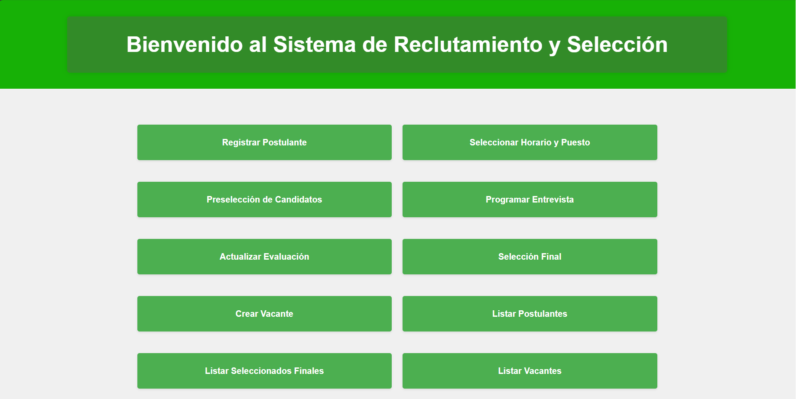

---

## CASO 40.1.1: Registrar Postulante

### FLUJO DE LAS VISTAS

| PASOS | ACCIÓN  |
|----------|----------|
| 1 | En la **VISTA 41** el supervisor ingresará los datos del postulante. |
| 2 | Apretará el botón **Registrar**, lo que validará y guardará los datos del postulante. |
| 3 | Se redirigirá a la **VISTA 42** para confirmar el registro exitoso. |

### Vista 41: Pantalla de registro de postulante
#### Descripción
Aquí el supervisor podrá ingresar los datos del postulante para registrarlo en el sistema.

#### Captura de pantalla
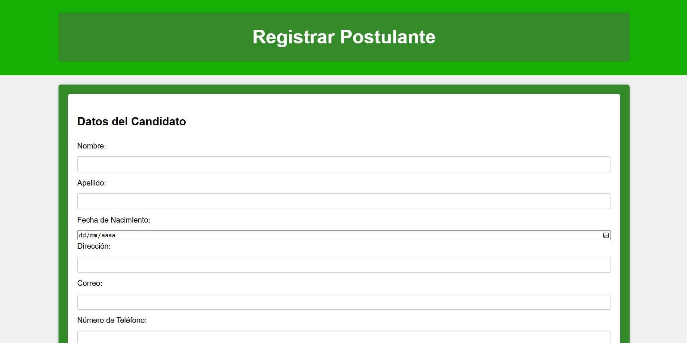
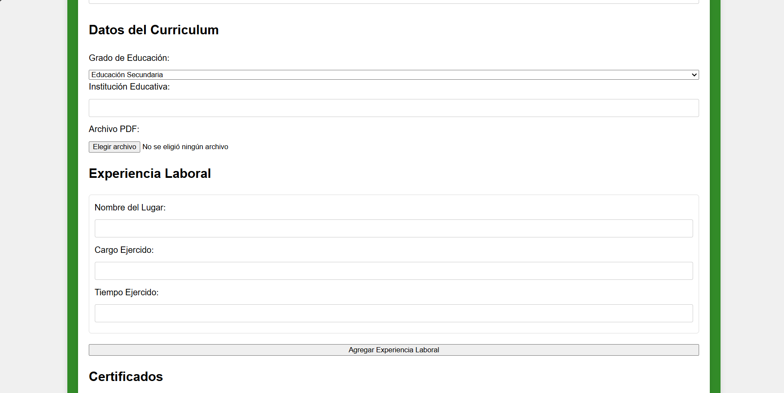
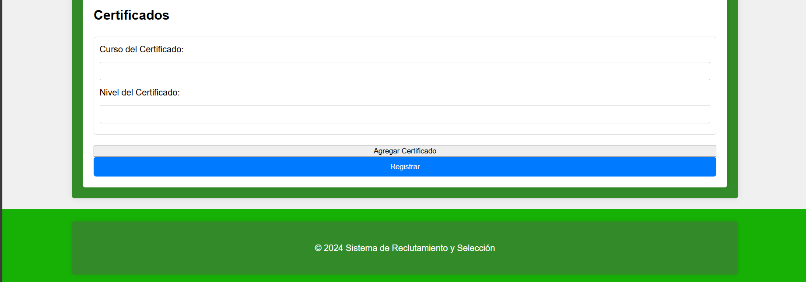

---

### Vista 42: Confirmación de registro de postulante
#### Descripción
Esta vista confirma que el postulante ha sido registrado exitosamente.

#### Captura de pantalla
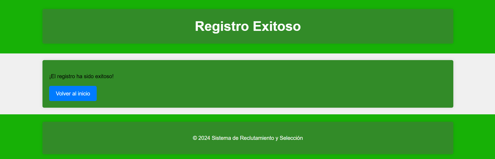

---

## CASO 40.1.2: Seleccionar Horario y Puesto

### FLUJO DE LAS VISTAS

| PASOS | ACCIÓN  |
|----------|----------|
| 1 | En la **VISTA 43** el supervisor seleccionará el horario y puesto para el postulante. |
| 2 | Apretará el botón **Asignar**, lo que guardará la selección. |
| 3 | Se redirigirá a la **VISTA 44** para confirmar la asignación. |

### Vista 43: Pantalla de selección de horario y puesto
#### Descripción
Aquí el supervisor podrá seleccionar el horario y puesto disponibles para el postulante.

#### Captura de pantalla
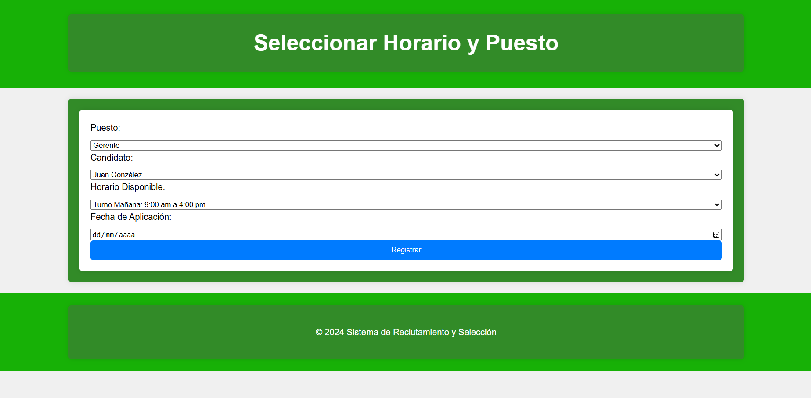

---

### Vista 44: Confirmación de asignación de horario y puesto
#### Descripción
Esta vista confirma que el horario y puesto han sido asignados exitosamente.

#### Captura de pantalla

---

## CASO 40.1.3: Preselección de Candidatos

### FLUJO DE LAS VISTAS

| PASOS | ACCIÓN  |
|----------|----------|
| 1 | En la **VISTA 45.1** el supervisor seleccionará la busqueda según puesto. |
| 2 | En la **VISTA 45.2** el supervisor revisará los datos de los candidatos a preseleccionar. |
| 3 | Apretará el botón **Preseleccionar** en los candidatos que cumplen con los requisitos. |
| 4 | Los candidatos seleccionados pasarán a la siguiente fase del proceso. |

### Vista 45.1: Pantalla de selección de candidatos según puesto
#### Descripción
Aquí el supervisor podrá seleccionar la opción de busqueda según puestos para obtener los candidatos que postularon al puesto.

#### Captura de pantalla
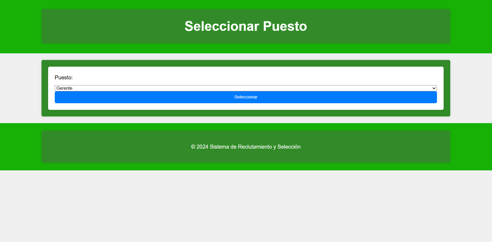
### Vista 45.2: Pantalla de preselección de candidatos
#### Descripción
Aquí el supervisor podrá revisar y preseleccionar a los candidatos que cumplen con los requisitos del puesto.

#### Captura de pantalla
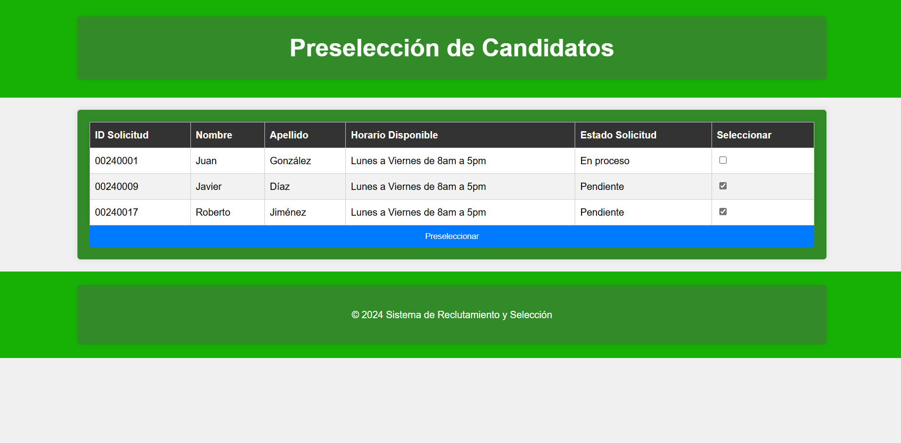
---

## CASO 40.1.4: Programar Entrevista

### FLUJO DE LAS VISTAS

| PASOS | ACCIÓN  |
|----------|----------|
| 1 | En la **VISTA 46** el supervisor ingresará los detalles de la entrevista. |
| 2 | Apretará el botón **Programar**, lo que guardará los detalles de la entrevista. |
| 3 | Se redirigirá a la **VISTA 47** para confirmar la programación exitosa. |

### Vista 46: Pantalla de programación de entrevista
#### Descripción
Aquí el supervisor podrá programar las entrevistas para los candidatos preseleccionados, la barra solo muestra exclusivamente a los candidatos preseleccionados.

#### Captura de pantalla
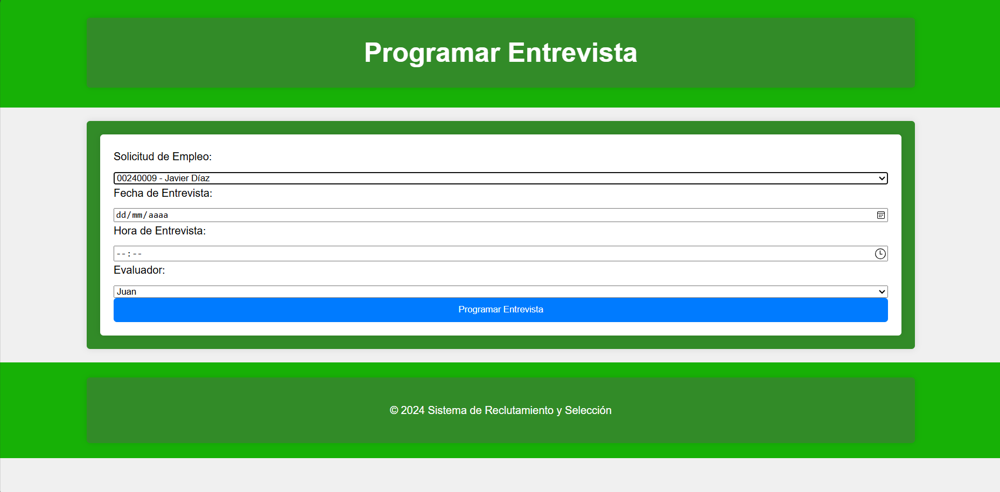

---

### Vista 47: Confirmación de programación de entrevista
#### Descripción
Esta vista confirma que la entrevista ha sido programada exitosamente.

#### Captura de pantalla

---

## CASO 40.1.5: Actualizar Evaluación

### FLUJO DE LAS VISTAS

| PASOS | ACCIÓN  |
|----------|----------|
| 1 | En la **VISTA 48** el supervisor actualizará los detalles de la evaluación de los candidatos. |
| 2 | Apretará el botón **Actualizar**, lo que guardará los cambios realizados. |
| 3 | Se redirigirá a la **VISTA 49** para confirmar la actualización exitosa. |

### Vista 48: Pantalla de actualización de evaluación
#### Descripción
Aquí el supervisor podrá actualizar los detalles de las evaluaciones de los candidatos.

#### Captura de pantalla
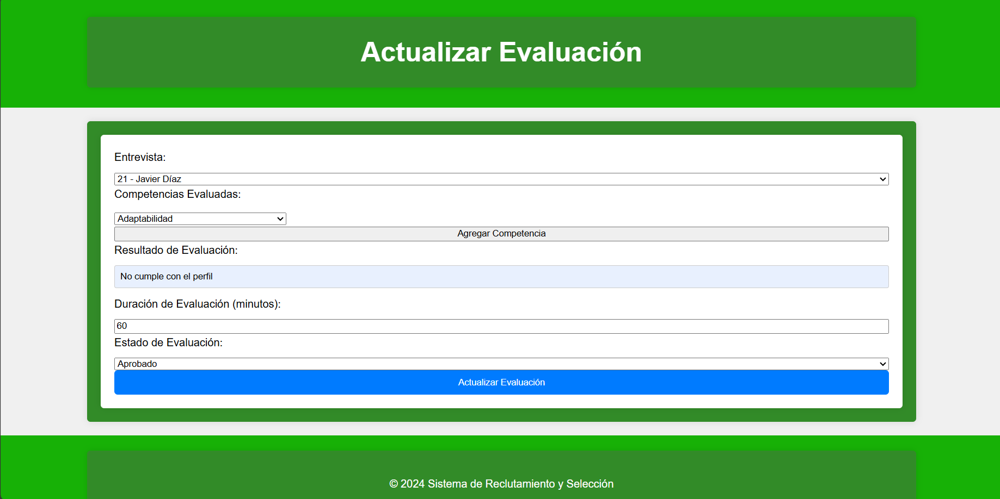

---

### Vista 49: Confirmación de actualización de evaluación
#### Descripción
Esta vista confirma que la evaluación ha sido actualizada exitosamente.

#### Captura de pantalla

---

## CASO 40.1.6: Selección Final

### FLUJO DE LAS VISTAS

| PASOS | ACCIÓN  |
|----------|----------|
| 1 | En la **VISTA 50** el supervisor revisará los datos de los candidatos seleccionados. |
| 2 | Apretará el botón **Seleccionar** en los candidatos que serán contratados. |
| 3 | Se redirigirá a la **VISTA 51** para confirmar la selección final. |

### Vista 50: Pantalla de selección final de candidatos
#### Descripción
Aquí el supervisor podrá revisar y seleccionar a los candidatos que serán contratados.

#### Captura de pantalla
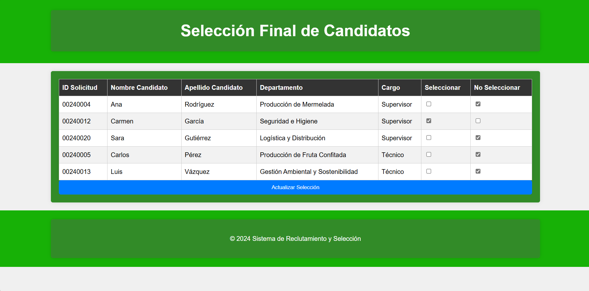

---

### Vista 51: Confirmación de selección final
#### Descripción
Esta vista confirma que los candidatos han sido seleccionados exitosamente.

#### Captura de pantalla

---

## CASO 40.1.7: Crear Vacante

### FLUJO DE LAS VISTAS

| PASOS | ACCIÓN  |
|----------|----------|
| 1 | En la **VISTA 52** el supervisor ingresará los detalles de la nueva vacante. |
| 2 | Apretará el botón **Crear**, lo que guardará los detalles de la vacante. |
| 3 | Se redirigirá a la **VISTA 53** para confirmar la creación exitosa. |

### Vista 52: Pantalla de creación de vacante
#### Descripción
Aquí el supervisor podrá ingresar los detalles para crear una nueva vacante en la empresa.

#### Captura de pantalla
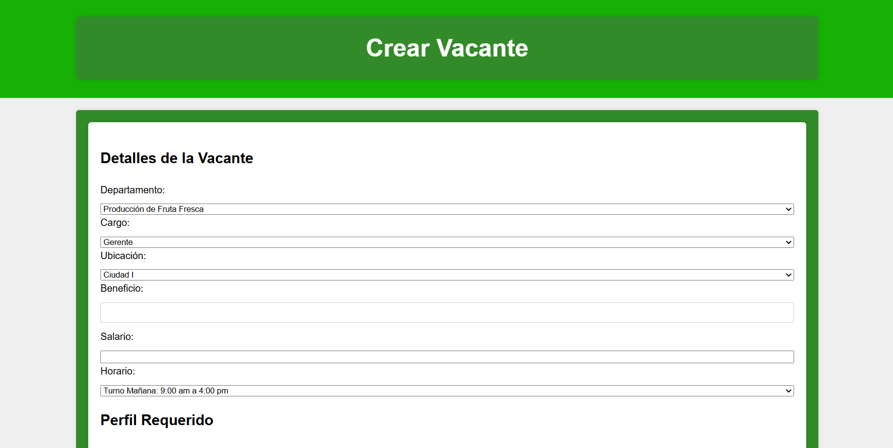
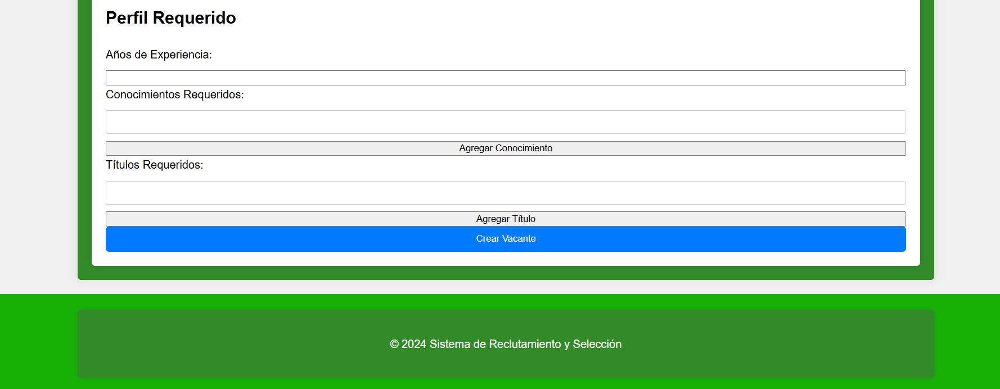
---

### Vista 53: Confirmación de creación de vacante
#### Descripción
Esta vista confirma que la vacante ha sido creada exitosamente.

#### Captura de pantalla

---

## CASO 40.1.8: Listar Postulantes

### FLUJO DE LAS VISTAS

| PASOS | ACCIÓN  |
|----------|----------|
| 1 | En la **VISTA 54.1** el supervisor podrá ver la lista de postulantes registrados. |
| 2 | Apretará el botón **Ver detalles** para revisar la información de un postulante en particular. |
| 1 | En la **VISTA 54.2** se observará la información del postulante. |
### Vista 54.1: Pantalla de lista de postulantes
#### Descripción
Aquí el supervisor podrá ver una lista de todos los postulantes registrados en el sistema.

#### Captura de pantalla
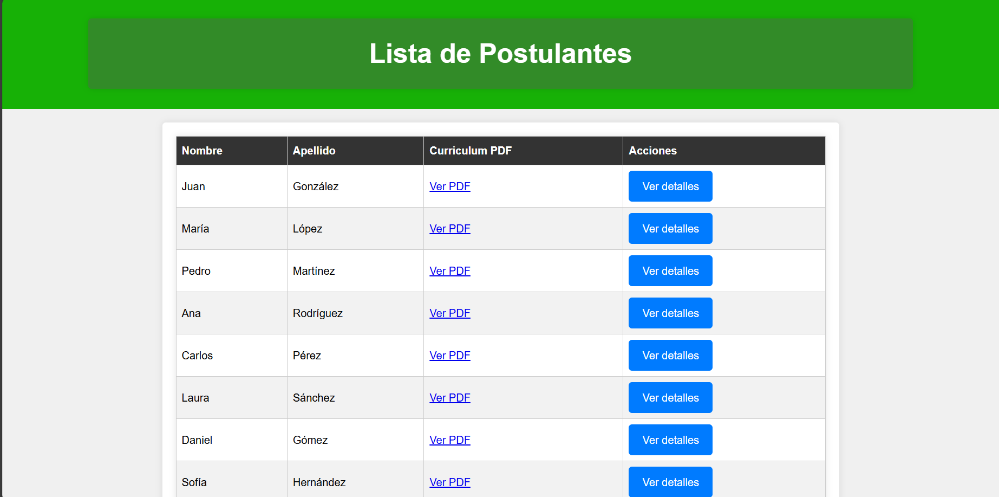
### Vista 54.2: Pantalla de detalle de postulantes
#### Descripción
Aquí el supervisor podrá los detalles de un postulante registrado en el sistema.

#### Captura de pantalla
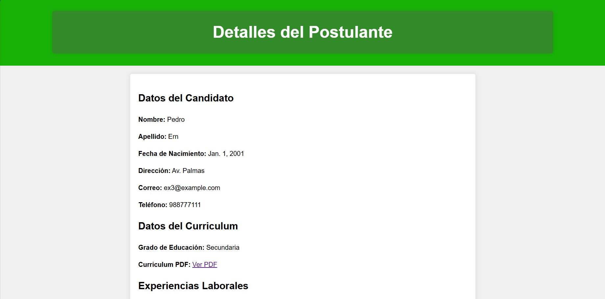
---

## CASO 40.1.9: Listar Seleccionados Finales

### FLUJO DE LAS VISTAS

| PASOS | ACCIÓN  |
|----------|----------|
| 1 | En la **VISTA 55** el supervisor podrá ver la lista de candidatos seleccionados finales. |

### Vista 55: Pantalla de lista de seleccionados finales
#### Descripción
Aquí el supervisor podrá ver una lista de todos los candidatos que han sido seleccionados para el puesto.

#### Captura de pantalla
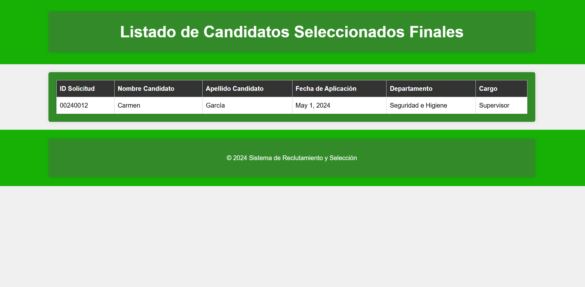

---

## CASO 40.1.10: Listar Vacantes

### FLUJO DE LAS VISTAS

| PASOS | ACCIÓN  |
|----------|----------|
| 1 | En la **VISTA 56** el supervisor podrá ver la lista de vacantes creadas. |

### Vista 56: Pantalla de lista de vacantes
#### Descripción
Aquí el supervisor podrá ver una lista de todas las vacantes creadas en el sistema.

#### Captura de pantalla
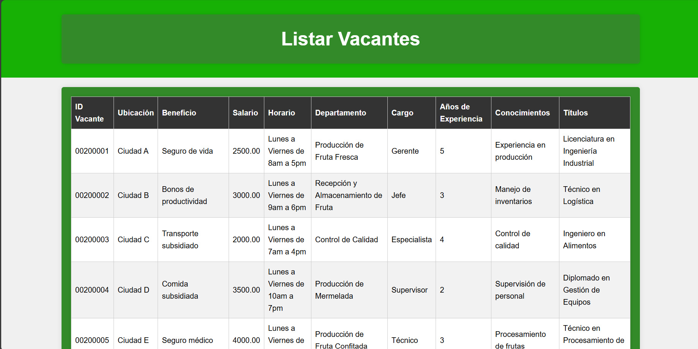

---

## CASO 40.1.11: Listar Entrevistas

### FLUJO DE LAS VISTAS

| PASOS | ACCIÓN  |
|----------|----------|
| 1 | En la **VISTA 57** el supervisor podrá ver la lista de entrevistas programadas. |

### Vista 57: Pantalla de lista de entrevistas
#### Descripción
Aquí el supervisor podrá ver una lista de todas las entrevistas programadas.

#### Captura de pantalla
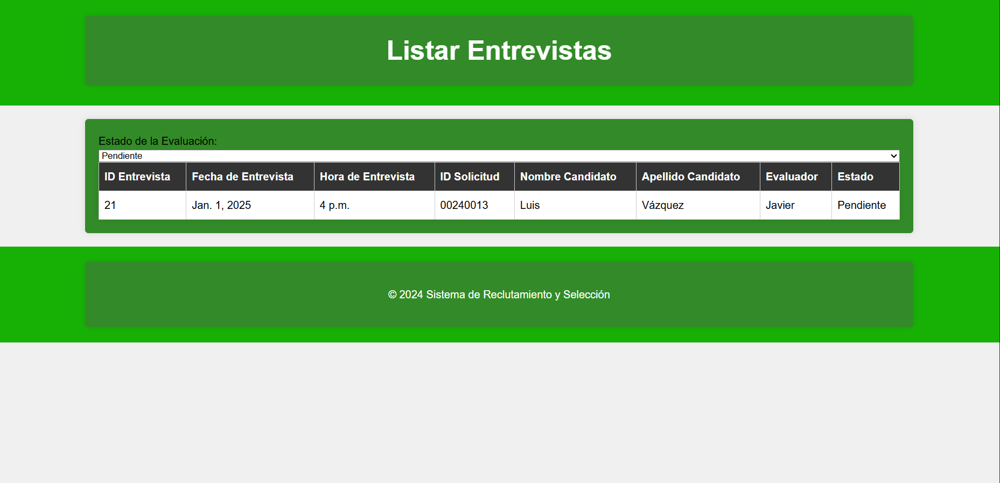

---

## CASO 40.1.12: Listar Evaluaciones

### FLUJO DE LAS VISTAS

| PASOS | ACCIÓN  |
|----------|----------|
| 1 | En la **VISTA 58** el supervisor podrá ver la lista de evaluaciones realizadas. |

### Vista 58: Pantalla de lista de evaluaciones
#### Descripción
Aquí el supervisor podrá ver una lista de todas las evaluaciones realizadas a los candidatos.

#### Captura de pantalla
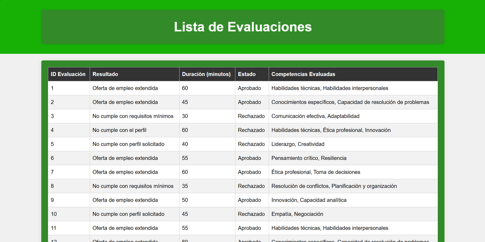

---
## CASO 40.1.13: Crear Empleado

### FLUJO DE LAS VISTAS

| PASOS | ACCIÓN  |
|----------|----------|
| 1 | En la **VISTA 59** el supervisor podrá crear un nuevo empleado basado en los candidatos seleccionados. |
| 2 | Apretará el botón **Crear Empleado** para registrar la información de un nuevo empleado si es que ha decidido trabajar con nosotros. |

### Vista 59: Pantalla de creación de empleado
#### Descripción
Aquí el supervisor podrá crear el candidato presionando el botón.

#### Captura de pantalla
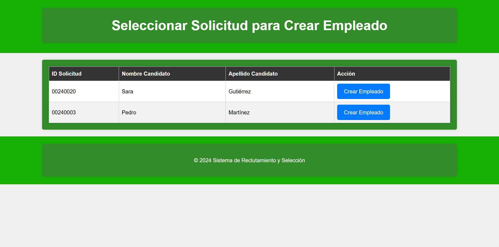

---

## CASO 40.1.14: Modificar Empleado

### FLUJO DE LAS VISTAS

| PASOS | ACCIÓN  |
|----------|----------|
| 1 | En la **VISTA 60** el supervisor podrá ver la lista de empleados. |
| 2 | Apretará el botón **Modificar** para actualizar la información de un empleado en particular. |
| 3 | En la vista 61 apretará el botón **Guardar Cambios** para actualizar la información de un empleado en particular. |
### Vista 60: Pantalla de lista de empleados
#### Descripción
Aquí el supervisor podrá ver una lista de todos los empleados registrados en el sistema.

#### Captura de pantalla
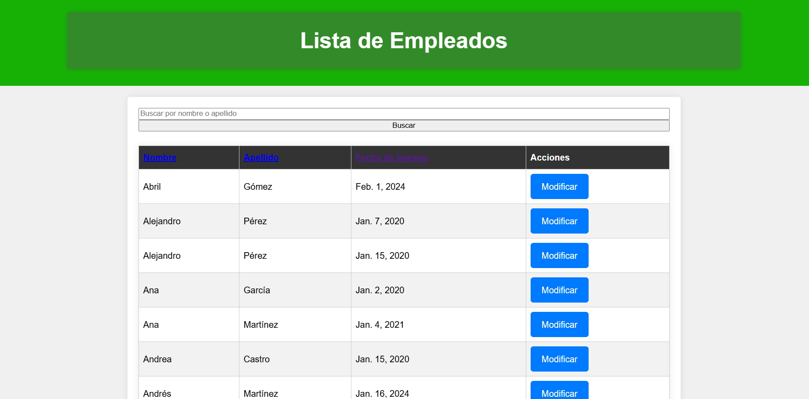

### Vista 61: Pantalla de modificación de empleado
#### Descripción
Aquí el supervisor podrá actualizar la información de un empleado existente.

#### Captura de pantalla
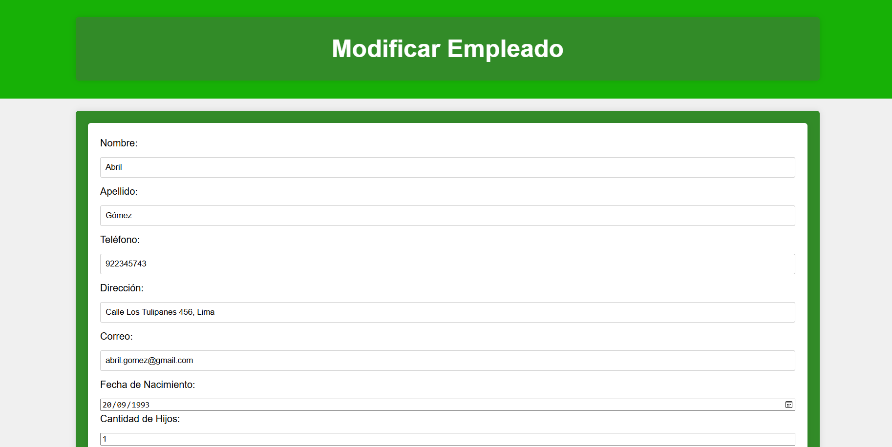
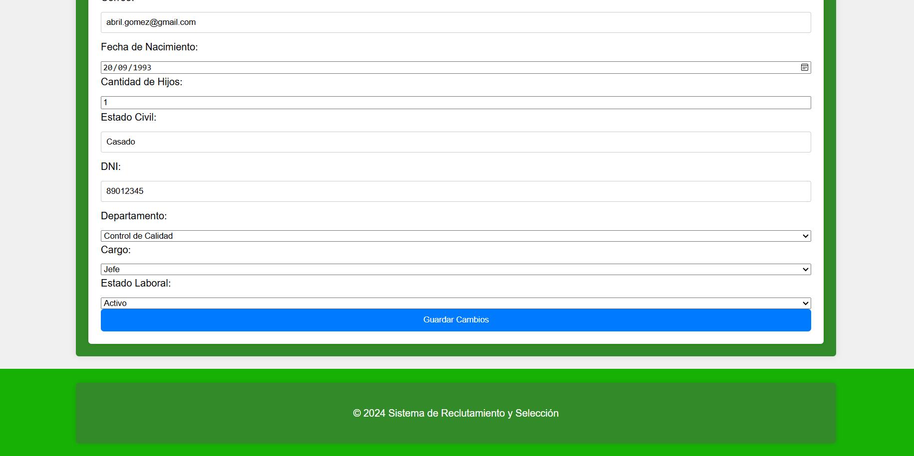

---

