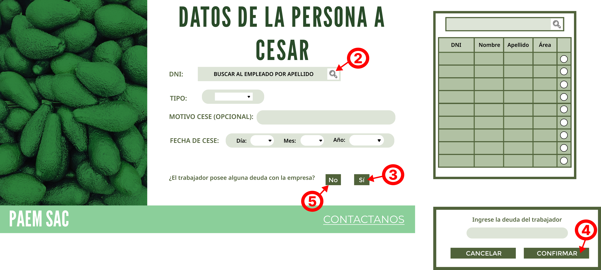

# Querys para registrar acciones

## R-005 / Caso de Uso 5: Registrar cese de personal

### Primera pantalla / I-001

#### Acción 1:
Elegir la opción de cese de personal en la intranet del supervisor

	@Id_cese = (SELECT id_cese FROM cese ORDER BY id_cese DESC LIMIT 1)+1

### Segunda pantalla / I-002

#### Accion 2
Seleccionar la lupa para buscar el empleado por medio de su Apellido

	SELECT 
		E.DNI, 
		E.nombre_empleado as NOMBRE,
		E.apellido_empleado as APELLIDO,
		D.nombre_departamento
	FROM empleado as E
	INNER JOIN departamento AS D ON E.id_departamento=D.id_departamento
	WHERE E.apellido_empleado LIKE 'INGRESO%'

Aqui se selecciona el @DNI y se guarda este valor

#### Accion 3
Seleccionar el botón de SI para responder la pregunta sobre la deuda que podría poseer el trabajador con la empresa

	INSERT INTO cese (id_cese, tipo_cese, motivo_cese, fecha_inicio_cese, id_supervisor, id_empleado)
	VALUES (
			@Id_cese,
			@Tipo,
			@Motivo,
			@Fecha,
			@Sup,
			(SELECT id_empleado FROM empleado WHERE DNI = @DNI)
	);

#### Accion 4
Al escoger el botón de SI antes, se abre una pestaña donde el supervisor puede insertar el monto que debe el trabajador a cesar a la empresa

- Insertar la deuda con la empresa:

		INSERT INTO beneficios_cese (id_beneficios, id_tipo, monto, id_Cese)
			VALUES (
				(SELECT id_beneficios FROM beneficios_cese
				ORDER BY id_beneficios DESC
				LIMIT 1)+1,
				5, 
				-1*@Deuda, 
				@Id_cese
			);

- Insertar los beneficios que resivirá el empleado:

		INSERT INTO beneficios_cese (id_beneficios, id_tipo, monto, id_Cese)
		VALUES
			((SELECT id_beneficios FROM beneficios_cese
			ORDER BY id_beneficios DESC
			LIMIT 1)+1,
			1, 
			(SELECT Monto_pagar FROM Pago_Total as P INNER JOIN Nomina as N ON P.ID_Pago_Total=N.ID_Pago_Total WHERE N.id_empleado=(SELECT id_empleado FROM empleado WHERE DNI = @DNI))/6*((SELECT EXTRACT(MONTH FROM Fecha_Ingreso) FROM Empleado WHERE DNI=@DNI)- (SELECT EXTRACT(MONTH FROM fecha_inicio_cese) FROM cese WHERE Id_cese=@Id_cese)),
			3);

- Seleccionar datos para visualización en la siguiente pantalla:

		SELECT
			E.DNI,
			E.nombre_empleado ||' '|| 	E.apellido_empleado AS Nombre_Completo,
			D.nombre_departamento,
			CA.nombre AS cargo,
			SUM(B.monto) as Beneficio,
			C.fecha_inicio_cese,
			CASE
				WHEN C.tipo_cese = 'D' THEN 'Despido'
				WHEN C.tipo_cese = 'R' THEN 'Renuncia'
				WHEN C.tipo_cese = 'C' THEN 'Término de contrato'
				WHEN C.tipo_cese = 'J' THEN 'Jubilación'
				ELSE 'No especificado'
			END AS Tipo_Cese,
			C.motivo_cese,
			(SELECT DNI FROM empleado WHERE id_empleado = (SELECT Id_empleado FROM cese where Id_Cese=@Id_cese))
		FROM cese AS C
		INNER JOIN empleado AS E ON C.id_empleado = E.id_empleado
		INNER JOIN departamento AS D ON E.id_departamento = D.id_departamento
		INNER JOIN cargo AS CA ON E.id_cargo = CA.id_cargo
		INNER JOIN beneficios_cese AS B ON C.id_cese = B.id_cese
		WHERE C.id_cese = @Id_cese
		GROUP BY E.apellido_empleado,E.DNI,C.id_empleado, E.nombre_empleado, C.tipo_cese, D.nombre_departamento, CA.nombre, C.fecha_inicio_cese, C.motivo_cese, C.id_supervisor;

#### Accion 5
Seleccionar el botón NO en la pregunta

- Registrar el cese:

		INSERT INTO cese (id_cese, tipo_cese, motivo_cese, fecha_inicio_cese, id_supervisor, id_empleado)
		VALUES (
				(SELECT id_cese FROM cese ORDER BY id_cese DESC LIMIT 1)+1,
				@Tipo,
				@Motivo,
				@Fecha,
				@Sup,
				(SELECT id_empleado FROM empleado WHERE DNI = @DNI)
				);

- Ingresar los beneficios:

		INSERT INTO beneficios_cese (id_beneficios, id_tipo, monto, id_Cese)
		VALUES
			((SELECT id_beneficios FROM beneficios_cese
			ORDER BY id_beneficios DESC
			LIMIT 1)+1,
			1, 
			(SELECT Monto_pagar FROM Pago_Total as P INNER JOIN Nomina as N ON P.ID_Pago_Total=N.ID_Pago_Total WHERE N.id_empleado=(SELECT id_empleado FROM empleado WHERE DNI = @DNI))/6*((SELECT EXTRACT(MONTH FROM Fecha_Ingreso) FROM Empleado WHERE DNI=@DNI)- (SELECT EXTRACT(MONTH FROM fecha_inicio_cese) FROM cese WHERE Id_cese=@Id_cese)),
			3);

- Hacer la seleccion de datos para la siguiente pantalla:

		SELECT
			E.DNI,
			E.nombre_empleado ||' '|| 	E.apellido_empleado AS Nombre_Completo,
			D.nombre_departamento,
			CA.nombre AS cargo,
			SUM(B.monto) as Beneficio,
			C.fecha_inicio_cese,
			CASE
				WHEN C.tipo_cese = 'D' THEN 'Despido'
				WHEN C.tipo_cese = 'R' THEN 'Renuncia'
				WHEN C.tipo_cese = 'C' THEN 'Término de contrato'
				WHEN C.tipo_cese = 'J' THEN 'Jubilación'
				ELSE 'No especificado'
			END AS Tipo_Cese,
			C.motivo_cese,
			(SELECT DNI FROM empleado WHERE id_empleado = (SELECT Id_empleado FROM cese where Id_Cese=@Id_cese))
		FROM cese AS C
		INNER JOIN empleado AS E ON C.id_empleado = E.id_empleado
		INNER JOIN departamento AS D ON E.id_departamento = D.id_departamento
		INNER JOIN cargo AS CA ON E.id_cargo = CA.id_cargo
		INNER JOIN beneficios_cese AS B ON C.id_cese = B.id_cese
		WHERE C.id_cese = @Id_cese
		GROUP BY E.apellido_empleado,E.DNI,C.id_empleado, E.nombre_empleado, C.tipo_cese, D.nombre_departamento, CA.nombre, C.fecha_inicio_cese, C.motivo_cese, C.id_supervisor;

- Crear el cuestionario:

		INSERT INTO Cuestionario_salida
		VALUES(
			(SELECT id_Cuestionario FROM Cuestionario_salida
			ORDER BY id_Cuestionario DESC
			LIMIT 1)+1,
			@Id_cese,
			@Fecha_hoy
		);

### Tercera pantalla / I-003

### Cuarta pantalla / I-004

#### Accion 6
Si seleccionan el botón que dice "Usar preguntas predeterminadas"

	WITH 
		last_id AS (SELECT COALESCE(MAX(id_pregunta), 0) AS id_pregunta FROM pregunta_salida),
		last_cuestionario AS (SELECT COALESCE(MAX(id_cuestionario), 0) AS id_cuestionario FROM cuestionario_salida)
		
	INSERT INTO pregunta_salida (id_pregunta, pregunta_salida, id_cuestionario)
	VALUES
		((SELECT id_pregunta FROM last_id) + 1, '¿Cómo describirías tu experiencia en tu empresa?', (SELECT id_cuestionario FROM last_cuestionario)),
		((SELECT id_pregunta FROM last_id) + 2, '¿Qué mejorarías en la empresa?', (SELECT id_cuestionario FROM last_cuestionario)),
		((SELECT id_pregunta FROM last_id) + 3, '¿Qué no te gusta de tu empresa?', (SELECT id_cuestionario FROM last_cuestionario));

#### Accion 7
Cuando seleccionan el botón de CONFIRMAR y han escrito más preguntas propias (a parte de las predeterminadas)

	WITH 
		last_id AS (SELECT COALESCE(MAX(id_pregunta), 0) AS id_pregunta FROM pregunta_salida),
		last_cuestionario AS (SELECT COALESCE(MAX(id_cuestionario), 0) AS id_cuestionario FROM cuestionario_salida)
	
	INSERT INTO pregunta_salida (id_pregunta, pregunta_salida, id_cuestionario)
			VALUES 
			((SELECT id_pregunta FROM last_id)+1,
			@Pregunta,
			(SELECT id_cuestionario FROM last_cuestionario)
		);

## R-027 / Caso de uso 27: Responder cuestionario de salida

### Quinta pantalla / I-005

#### Accion 8
El empleado cesado entra a un link que se le envía al correo registrado donde aparece la pantalla 5, cuando le da click al botón CONTINUAR para poder cargar las preguntas del cuestionario

	SELECT pregunta_salida 
	FROM pregunta_salida
	WHERE id_cuestionario=@Id_cese

### Sexta pantalla / I-006

#### Accion 9
Luego de llenar las preguntas de su cuestionario seleccionar el boton de SIGUIENTE

	INSERT INTO respuesta_salida (id_respuesta, respuesta_salida, id_pregunta)
		VALUES (
			(SELECT id_respuesta FROM respuesta_salida
			ORDER BY id_respuesta DESC
			LIMIT 1)+1,
			@RESP ,
			@ID_P);
	
# Funcionalidad primaria elegida

Elegí al registro de cese de personal como mi actividad primaria ya que tiene más contenido con el cual trabajar que con la operación del empleado de responder el cuestionario de salida.

Usaré el requerimiento R-005 y las especificaciones de cómo va a funcionar se encuentran al inicio de esta página
