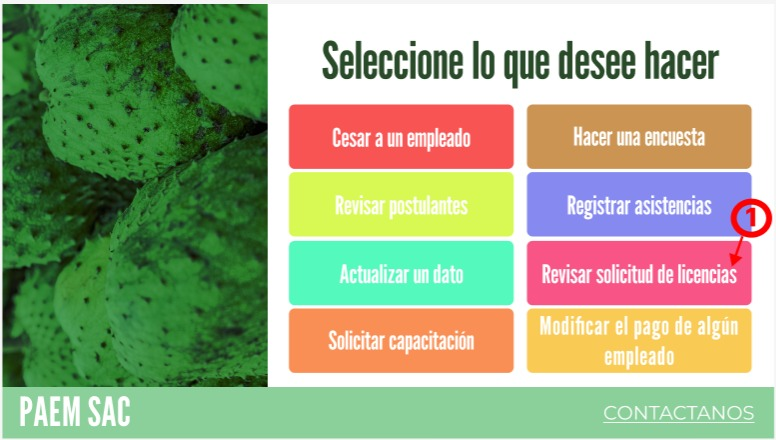
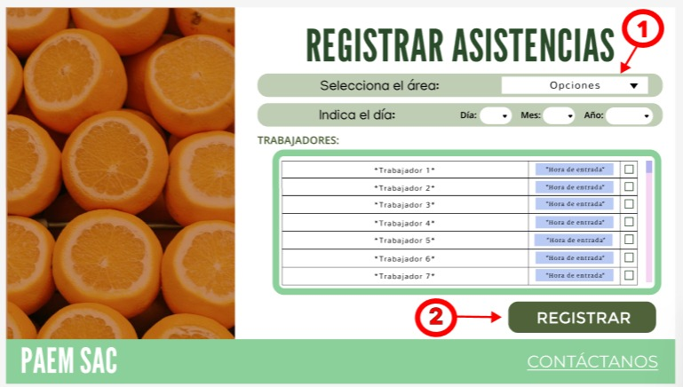

# Querys para registrar acciones

## Para el supervisor

### Primera pantalla opcional:

#### Acción opcional 1.1:
Se elige la opción de registrar asistencias del personal en la intranet del supervisor:

	@Id_asistencia = (SELECT id_asistencia FROM asistencia ORDER BY id_asistencia DESC LIMIT 1)

### Segunda pantalla opcional:

#### Acción opcional 1.2:
Se elige la opción de revisar solicitudes de licencias del personal en la intranet del supervisor:

	@Id_licencia = (SELECT id_licencia FROM licencia ORDER BY id_licencia DESC LIMIT 1)

## R-016 / Caso de Uso 16: Gestión de solicitudes de ausencia

### Acción 1: Búsqueda del empleado por su código (En la barra de códigos)
Si el empleado escribe su código, digamos '20220003' y le da a buscar se ejecuta:

	SELECT 
		E.ID_Empleado, 
		D.nombre_departamento,
	FROM empleado as E
	INNER JOIN departamento AS D ON E.id_departamento=D.id_departamento
	WHERE E.ID_Empleado= '%20220003%'

### Acción 2.1: Solicitar licencia de cualquier tipo:
El empleado con id @emp ya identificó su código de empleado, ya redactó el motivo de su solicitud de licencia, aclaró las fechas de inicio y de fin y adjuntó su constancia médica.

Si el empleado le da al botón 'CONFIRMAR':

        INSERT INTO Asistencia (ID_Asistencia, Estado, Observacion, Fecha, Hora_entrada, Hora_salida, ID_Empleado) VALUES ((SELECT COALESCE(MAX(ID_Asistencia), 0) + 1 FROM Asistencia), %s, %s, %s, %s, %s, %s)

### Acción 2.2: Solicitar permiso de cualquier tipo:
El empleado con id @emp ya identificó su código de empleado, ya redactó el motivo de su solicitud de licencia, aclaró las fechas de inicio y de fin y adjuntó su constancia médica.

Si el empleado le da al botón 'CONFIRMAR':

        INSERT INTO Permiso (ID_Permiso, Tipo, Motivo, Duracion, Estado, ID_Empleado, ID_Supervisor)
        VALUES ((SELECT COALESCE(MAX(ID_Permiso), 0) + 1 FROM Permiso), %s, %s, %s, %s, %s, %s)

## R-017 / Caso de Uso 17: Aprobación de solicitudes de ausencia

### Acción única para licencias (2 posibilidades, aceptar o rechazar):

    -- Para aceptar o rechazar las solicitudes:

    UPDATE Licencia
    SET Estado = %s
    WHERE ID_Licencia = %s

    -- Para actualizar la lista de solicitudes:

    SELECT l.ID_Licencia, l.Tipo, l.Estado, l.Fecha_inicio, l.Fecha_fin, e.Nombre_Empleado, e.Apellido_Empleado
        FROM Licencia l
        JOIN Empleado e ON l.ID_Empleado = e.ID_Empleado
        WHERE l.Estado = 'Pendiente'

### Acción única para permisos (2 posibilidades, aceptar o rechazar):
    
    -- Para aceptar o rechazar las solicitudes:

    UPDATE Permiso
    SET Estado = %s
    WHERE ID_Permiso = %s

    -- Para actualizar la lista de solicitudes:

     SELECT p.ID_Permiso, p.Tipo, p.Estado, p.duracion, e.Nombre_Empleado, e.Apellido_Empleado
        FROM Permiso p
        JOIN Empleado e ON p.ID_Empleado = e.ID_Empleado
        WHERE p.Estado = 'Pendiente'

## R-015 / Caso de Uso 15: Registro de asistencias diarias

### Acción 1: Seleccionar área de donde se va a registrar la asistencia

    SELECT Id_Departamento, Nombre_Departamento FROM Departamento;

### Acción 2: Registrar asistencia

    INSERT INTO Asistencia (ID_Asistencia, Estado, Observacion, Fecha, Hora_entrada, Hora_salida, ID_Empleado) VALUES ((SELECT COALESCE(MAX(ID_Asistencia), 0) + 1 FROM Asistencia), %s, %s, %s, %s, %s, %s)

## R-018 / Caso de Uso 18: Reporte de asistencia

### Acción 1: Elegir las especificaciones para el reporte de asistencias:

    SELECT Id_Departamento, Nombre_Departamento FROM Departamento;

### Acción 2: Generar el reporte de asistencia

    SELECT a.ID_Asistencia, a.Estado, a.Observacion, a.Fecha, a.Hora_entrada, a.Hora_salida, e.Nombre_Empleado, e.Apellido_Empleado
        FROM Asistencia a
        JOIN Empleado e ON a.ID_Empleado = e.ID_Empleado
        WHERE e.ID_Departamento = %s AND a.Fecha BETWEEN %s AND %s
 