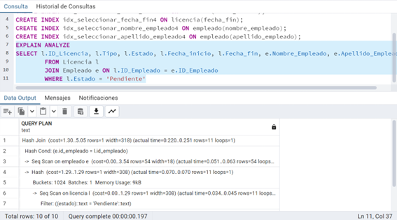
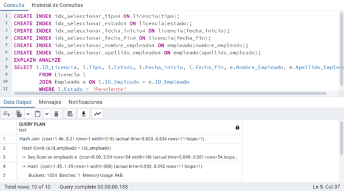
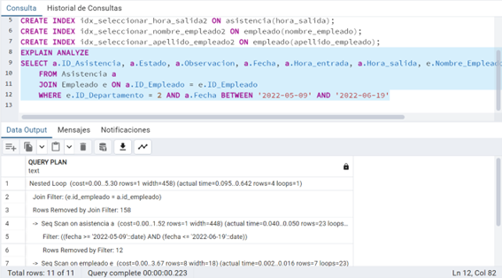
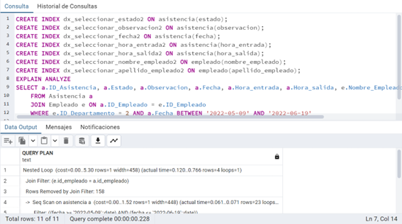
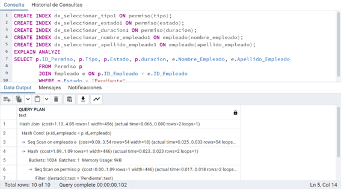

# Capítulo 7: Índices y otros objetos de BD
## 7.1 ÍNDICES

| Codigo Interfaz          |                 I006                  |
| ------------------------ | :-----------------------------------: |
| Imagen Interfaz          |  |
| Sentencia SQL sin índice |                        |
| Sentencia SQL con índice |                        |

| Codigo Interfaz          |                 I007                  |
| ------------------------ | :-----------------------------------: |
| Imagen Interfaz          |  |
| Sentencia SQL sin índice |                        |
| Sentencia SQL con índice |                        |

| Codigo Interfaz          |                 I008                  |
| ------------------------ | :-----------------------------------: |
| Imagen Interfaz          |  |
| Sentencia SQL sin índice |                        |
| Sentencia SQL con índice |                        |