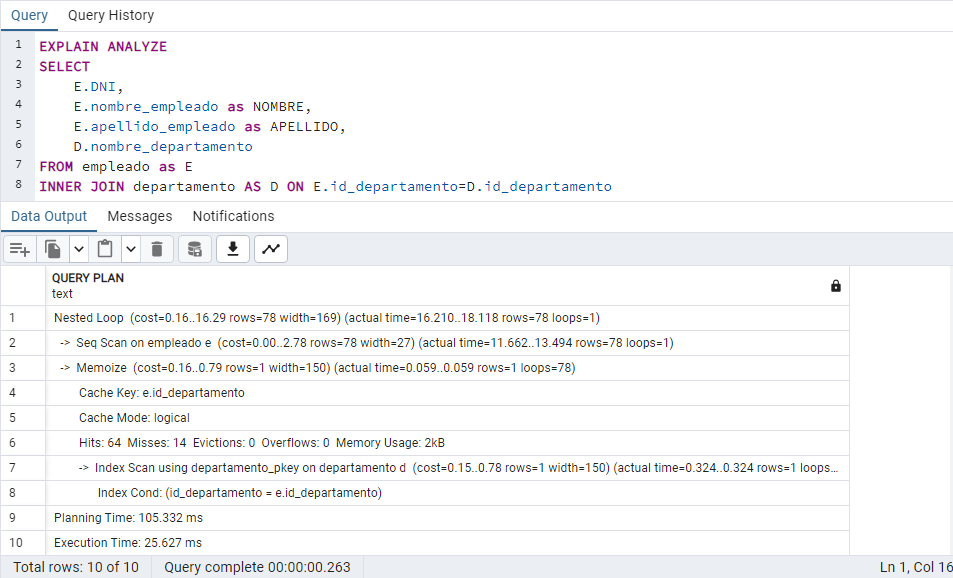
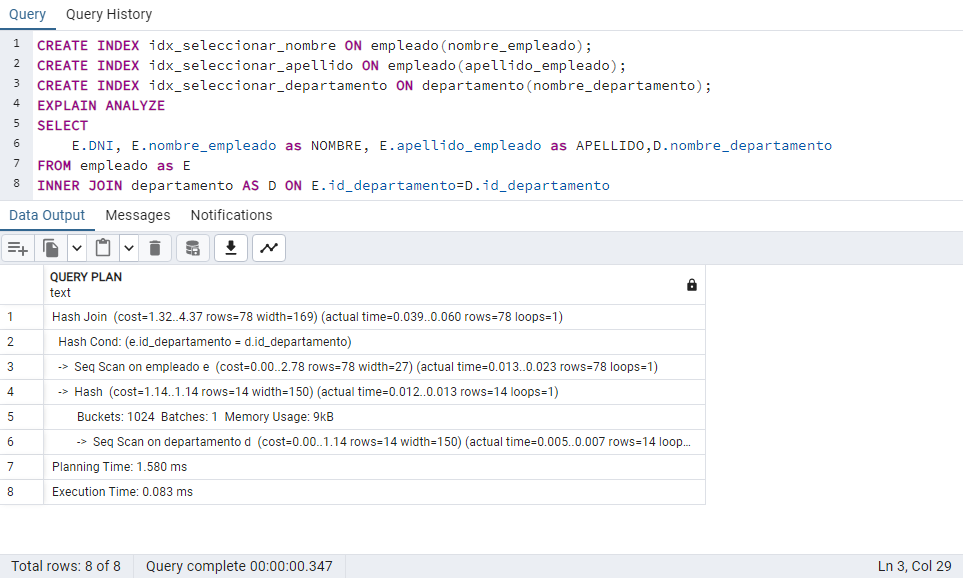
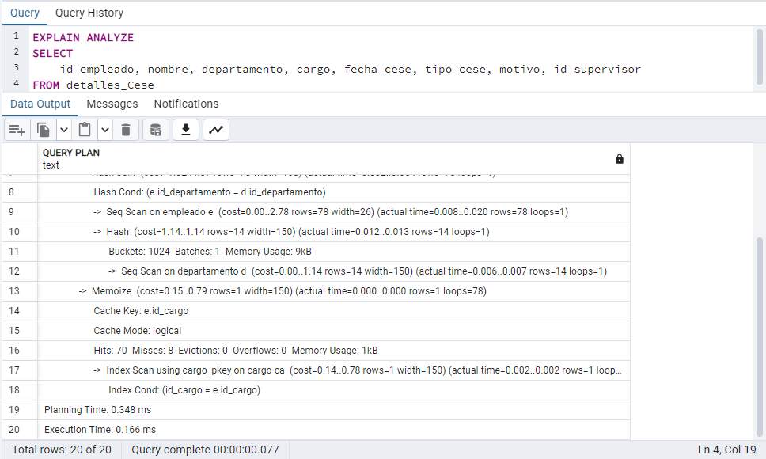
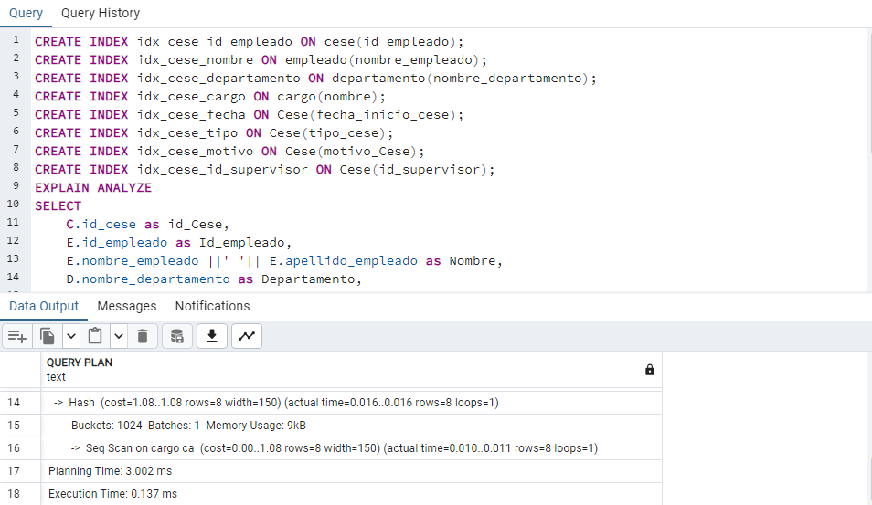
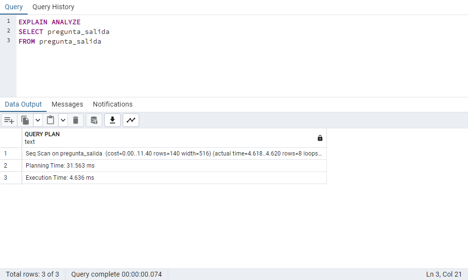
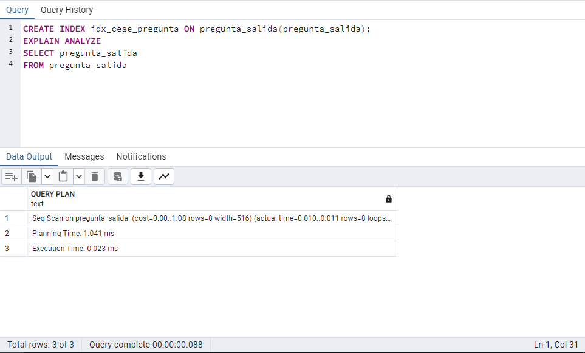

# Capítulo 7: Índices y otros objetos de BD
## 7.1 ÍNDICES

|Codigo Interfaz|I003|
|---|:---:|
|Imagen Interfaz||
|Sentencia SQL sin índice||
|Sentencia SQL con índice||

|Codigo Interfaz|I004|
|---|:---:|
|Imagen Interfaz||
|Sentencia SQL sin índice||
|Sentencia SQL con índice||

|Codigo Interfaz|I008|
|---|:---:|
|Imagen Interfaz||
|Sentencia SQL sin índice||
|Sentencia SQL con índice||