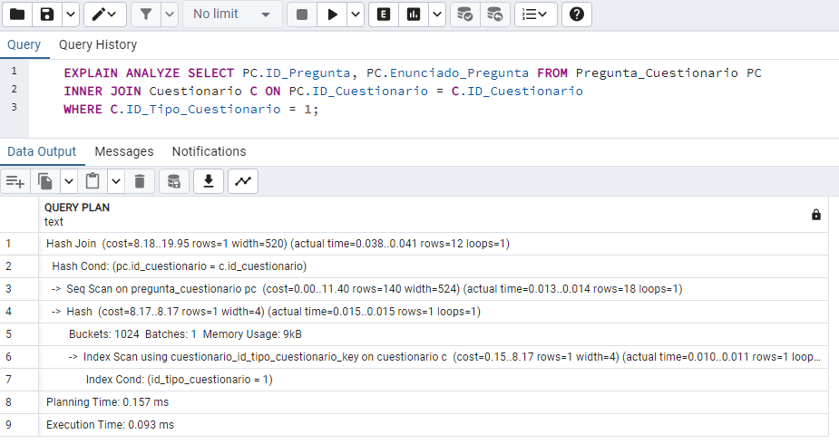
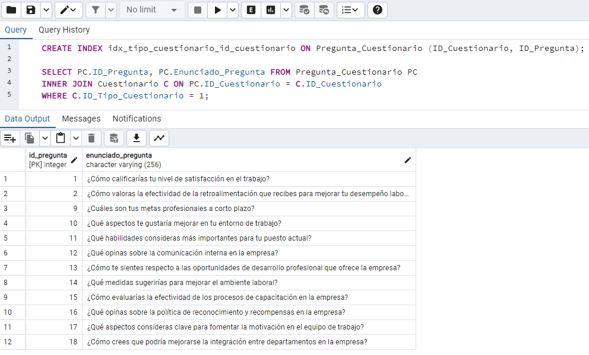
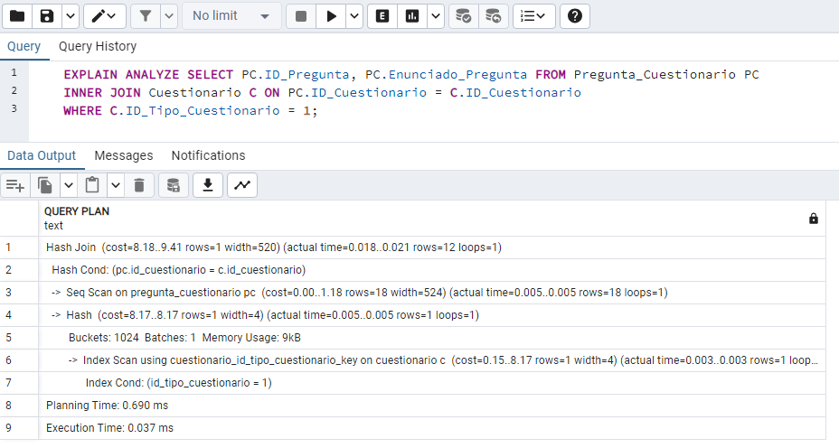
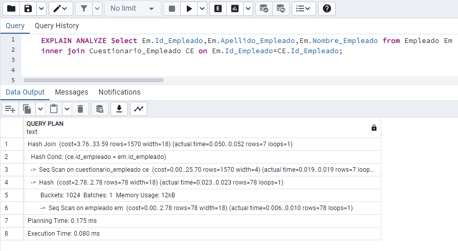
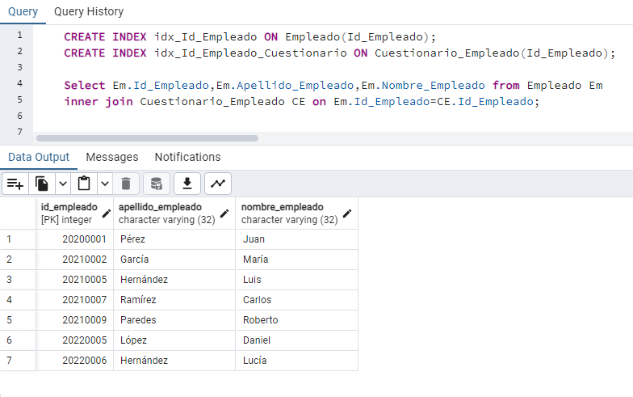
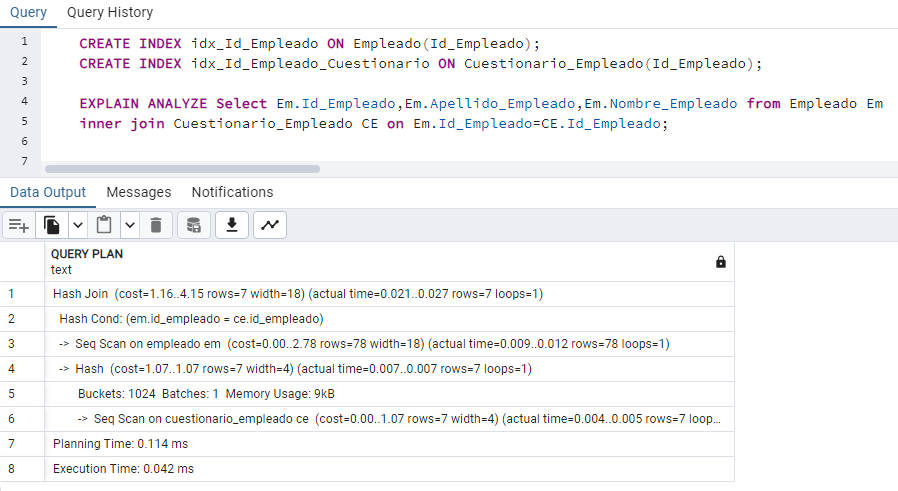

# Evaluación de Desempeño
Enfocándonos en el módulo "Evaluación de Desempeño", nos planteamos cómo mejorar el rendimiento a través del uso estratégico de índices. Identificaremos consultas frecuentes y seleccionaremos aquellas que podrían beneficiarse más significativamente de la indexación. Para ello es necesario:

• Ejecución sin Índices: Comenzaremos ejecutando las consultas seleccionadas sin índices para medir el rendimiento inicial y establecer un punto de referencia del costo de consulta.

• Creación de Índices: Basándonos en los resultados de la fase anterior, procederemos a crear índices relevantes en las columnas utilizadas en las consultas críticas de nuestro módulo "Evaluación de Desempeño".

• Costo de Consulta en Ambos Casos: Después de implementar los índices, reejecutaremos las mismas consultas para comparar y analizar la mejora de rendimiento.

## Índices
### Primer caso
| **Código Interfaz** | **I-025** |
|:-------------------:|:---------:|
|          Imagen Interfaz           |           |

|                          | **SIN EXPLAIN ANALIZE** | **CON EXPLAIN ANALIZE** |
|:------------------------:|:-----------------------:|:-----------------------:|
| Sentencia SQL sin Índice |                          |                            |
| Sentencia SQL con Índice |                            |                            |

### Segundo caso
| **Código Interfaz** | **I-025** |
|:-------------------:|:---------:|
|          Imagen Interfaz           |           |

|                          | **SIN EXPLAIN ANALIZE** | **CON EXPLAIN ANALIZE** |
|:------------------------:|:-----------------------:|:-----------------------:|
| Sentencia SQL sin Índice |                          |                            |
| Sentencia SQL con Índice |                            |                            |

## Secuencias
En el contexto del módulo de "Evaluación de Desempeño", las secuencias en SQL desempeñan un papel crucial al generar identificadores únicos para cada cuestionario de desempeño registrado en la base de datos. Estas secuencias aseguran, por ejemplo, que el campo ID_Cuestionario  e ID_Pregunta_Cuestionario actúen de manera eficiente como clave primaria, proporcionando identificaciones únicas y consistentes para cada evaluación realizada.

Al utilizar secuencias, garantizamos la integridad y la unicidad de los datos, simplificando la gestión de identificadores y mejorando el rendimiento del sistema. Este enfoque automatizado facilita la asignación de identificadores sin conflictos, lo que es fundamental para un seguimiento preciso y una gestión eficaz de los cuestionarios de evaluación.

### Ejemplo 1 - ID_Cuestionario:
      CREATE SEQUENCE seq_id_cuestionario START WITH 1;
      INSERT INTO Cuestionario(ID_Cuestionario, ID_Especialista_Relaciones_Laborales, ID_Tipo_Cuestionario, Fecha_Creacion, Hora_Creacion, ID_Estado_Envio, Fecha_Envio_Gerencia, Hora_Envio_Gerencia, ID_Gerente, ID_Estado_Aprobacion, Fecha_Revision, Hora_Revision)
      VALUES (
          NEXTVAL('seq_id_cuestionario'),
          20210006, -- Valor fijo para ID_Especialista_Relaciones_Laborales (ejemplo)
          1, -- Valor fijo para ID_Tipo_Cuestionario (ejemplo)
          CURRENT_DATE,
          CURRENT_TIME(0),
          2, -- Valor fijo para ID_Estado_Envio (ejemplo)
          NULL,
          NULL,
          20200001, -- Valor fijo para ID_Gerente (ejemplo)
          2, -- Valor fijo para ID_Estado_Aprobacion (ejemplo)
          NULL,
          NULL
      );

### Ejemplo 2 - ID_Pregunta_Cuestionario:
      CREATE SEQUENCE seq_id_pregunta_cuestionario START WITH 1;
      INSERT INTO Pregunta_Cuestionario(ID_Pregunta, ID_Cuestionario, Enunciado_Pregunta)
      VALUES (
          NEXTVAL('seq_id_pregunta_cuestionario'),
          1, -- ID del cuestionario al que se va a agregar la pregunta (ejemplo)
          '¿Cómo calificarías tu nivel de satisfacción en el trabajo?' -- Pregunta para el tipo de cuestionario elegido (ejemplo)
      );

## Views
Se creó una vista que contiene información sobre los empleados dentro de la empresa, las preguntas del cuestionario que respodieron y las respectivas respuestas, de esta forma, la consulta se simplifica. 

    CREATE VIEW Empleados_Respuestas AS SELECT 
    	E.Nombre_Empleado,
    	E.Apellido_Empleado,
    	Ca.nombre as Cargo_Empleado,
    	D.Nombre_Departamento,
    	TC.Tipo,
    	PC.Enunciado_Pregunta, 
    	TR.Tipo as Tipo_Respuesta,
    	CE.Fecha_Rellenado,
    	CE.Hora_Rellenado
    FROM 
    	Empleado E
    JOIN 
    	Cargo Ca on Ca.ID_cargo=E.ID_Cargo
    JOIN 
    	Departamento D ON E.ID_Departamento = D.ID_Departamento
    JOIN 
    	Cuestionario_Empleado CE ON E.ID_Empleado = CE.ID_Empleado
    JOIN 
    	Cuestionario C ON CE.ID_Cuestionario = C.ID_Cuestionario
    JOIN 
    	Pregunta_Cuestionario PC ON C.ID_Cuestionario = PC.ID_Cuestionario
    JOIN 
    	Respuesta_Cuestionario RC ON PC.ID_Pregunta = RC.ID_Pregunta AND CE.ID_Cuestionario_Empleado = RC.ID_Cuestionario_Empleado
    JOIN 
    	Reporte R ON CE.ID_Cuestionario_Empleado = R.ID_Cuestionario_Empleado
    JOIN
    	Tipo_Cuestionario TC ON C.Id_Tipo_Cuestionario=TC.Id_Tipo_Cuestionario
    JOIN
    	Tipo_Respuesta TR ON RC.Id_Tipo_Respuesta=TR.Id_Tipo_Respuesta;

     
