# Evaluación de Desempeño
Enfocándonos en el módulo "Reclutamiento y Selección de Personal", nos planteamos cómo mejorar el rendimiento a través del uso estratégico de índices. Identificaremos consultas frecuentes y seleccionaremos aquellas que podrían beneficiarse más significativamente de la indexación. Para ello es necesario:

• Ejecución sin Índices: Comenzaremos ejecutando las consultas seleccionadas sin índices para medir el rendimiento inicial y establecer un punto de referencia del costo de consulta.

• Creación de Índices: Basándonos en los resultados de la fase anterior, procederemos a crear índices relevantes en las columnas utilizadas en las consultas críticas de nuestro módulo "Evaluación de Desempeño".

• Costo de Consulta en Ambos Casos: Después de implementar los índices, reejecutaremos las mismas consultas para comparar y analizar la mejora de rendimiento.

## Índices
### Primer caso
| **Código Interfaz** | **I-025** |
|:-------------------:|:---------:|
|          Imagen Interfaz           |     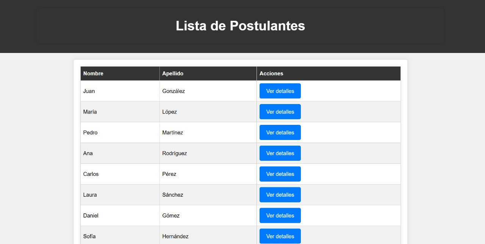      |

|                          | **SIN EXPLAIN ANALIZE** | **CON EXPLAIN ANALIZE** |
|:------------------------:|:-----------------------:|:-----------------------:|
| Sentencia SQL sin Índice |        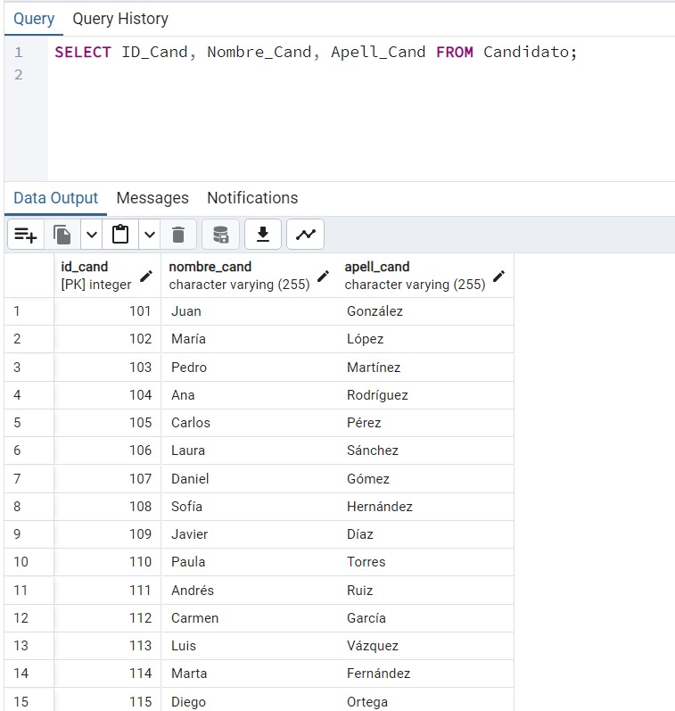                  |           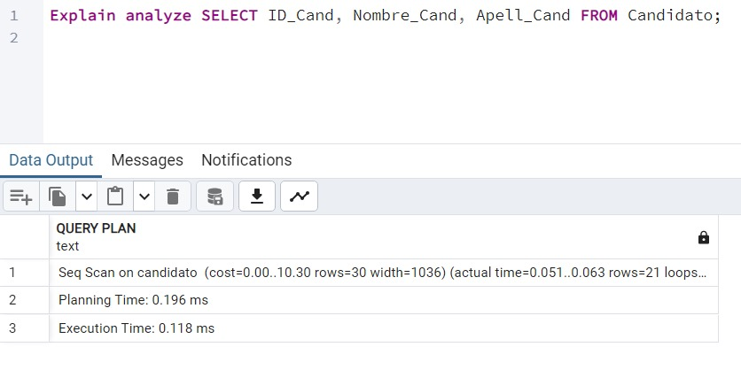                 |
| Sentencia SQL con Índice |             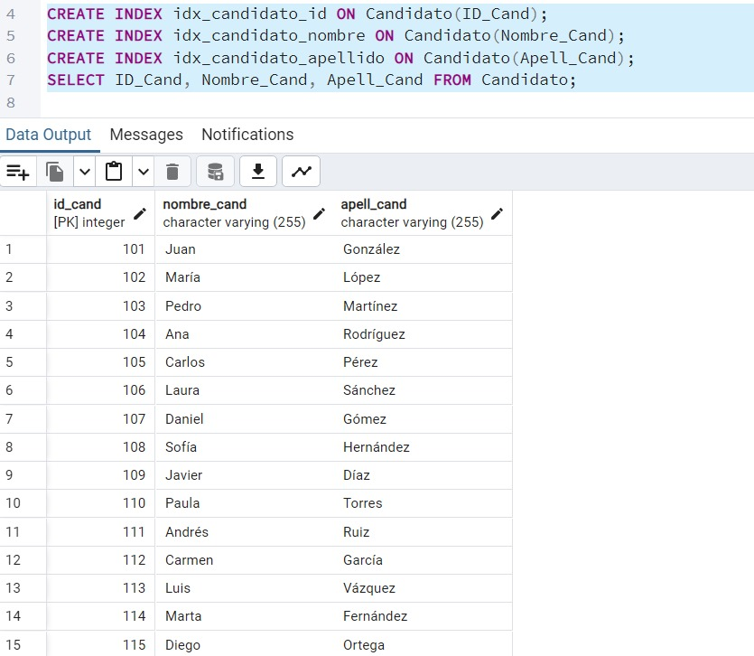               |            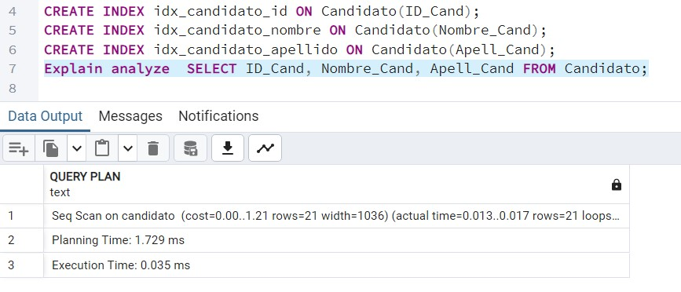                |

### Segundo caso
| **Código Interfaz** | **I-025** |
|:-------------------:|:---------:|
|          Imagen Interfaz           |     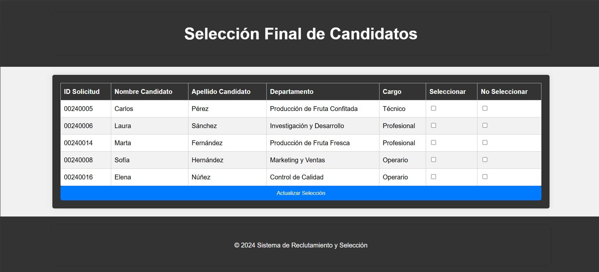      |

|                          | **SIN EXPLAIN ANALIZE** | **CON EXPLAIN ANALIZE** |
|:------------------------:|:-----------------------:|:-----------------------:|
| Sentencia SQL sin Índice |        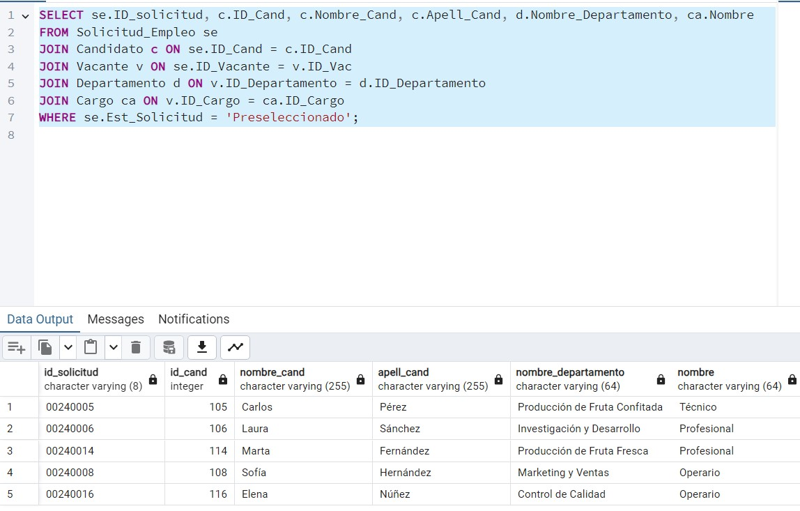                  |           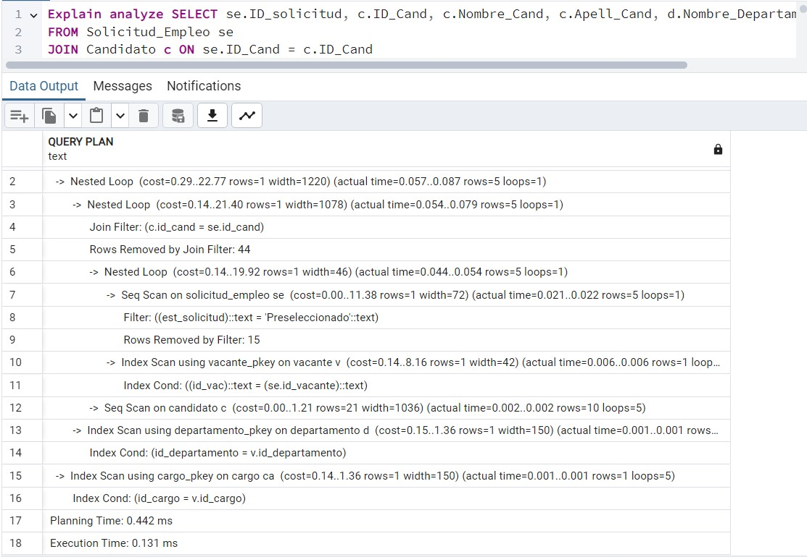                 |
| Sentencia SQL con Índice |             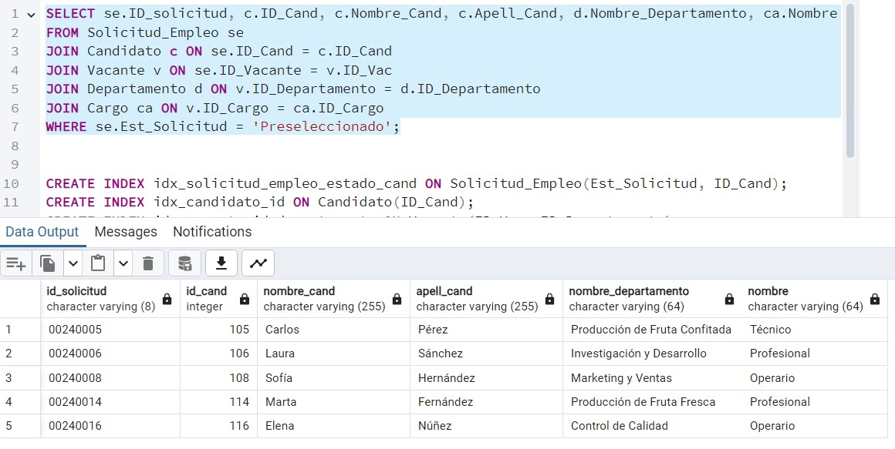               |            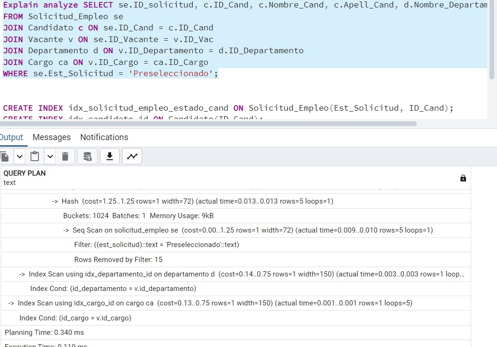                |

## Secuencias

En el contexto del módulo de "Selección y Reclutamiento de Personal", las secuencias en SQL desempeñan un papel crucial al generar identificadores únicos para cada registro en la base de datos. Estas secuencias aseguran, por ejemplo, que los campos "ID_Cand" en la tabla Candidato y "ID_Curriculum" en la tabla Curriculum actúen de manera eficiente como claves primarias, proporcionando identificaciones únicas y consistentes para cada registro.

Al utilizar secuencias, se garantiza la integridad y la unicidad de los datos, simplificando la gestión de identificadores y mejorando el rendimiento del sistema. Este enfoque automatizado facilita la asignación de identificadores sin conflictos, lo que es fundamental para un seguimiento preciso y una gestión eficaz de los registros.

### Ejemplo en Registrar Postulante:
    -- Crear secuencia para Candidato
    CREATE SEQUENCE seq_candidato START WITH 1;

    -- Crear secuencia para Curriculum
    CREATE SEQUENCE seq_curriculum START WITH 1;

    -- Crear secuencia para Experiencia_Laboral
    CREATE SEQUENCE seq_experiencia_laboral START WITH 1;

    -- Crear secuencia para Certificados
    CREATE SEQUENCE seq_certificados START WITH 1;

    -- Registrar experiencias laborales
    INSERT INTO Experiencia_Laboral (ID_Experiencia, Nombre_Lugar, Cargo_Ejercido, Tiempo_Ejercido)
    VALUES (NEXTVAL('seq_experiencia_laboral'), %s, %s, %s);

    -- Registrar certificados
    INSERT INTO Certificados (ID_Certificado, Curso_Certificado, Nivel_Certificado)
    VALUES (NEXTVAL('seq_certificados'), %s, %s);

    -- Registrar curriculum
    INSERT INTO Curriculum (ID_Curriculum, Grado_Educacion, ID_Experiencia, ID_Certificado, archivo_pdf)
    VALUES (NEXTVAL('seq_curriculum'), %s, %s, %s, %s);

    -- Registrar relaciones entre curriculum y experiencias laborales
    INSERT INTO CurriculumXExperiencia (id_curriculum, id_experiencia)
    VALUES (%s, %s);

    -- Registrar relaciones entre curriculum y certificados
    INSERT INTO CurriculumXCertificado (id_curriculum, id_certificado)
    VALUES (%s, %s);

    -- Registrar candidato
    INSERT INTO Candidato (ID_Cand, Nombre_Cand, Apell_Cand, Fecha_Nac_Cand, Direccion_Cand, Correo_Cand, Num_Telefono, Id_Curriculum)
    VALUES (NEXTVAL('seq_candidato'), %s, %s, %s, %s, %s, %s, %s);

### Ejemplo 2 - ID_Pregunta_Cuestionario:
      CREATE SEQUENCE seq_id_pregunta_cuestionario START WITH 1;
      INSERT INTO Pregunta_Cuestionario(ID_Pregunta, ID_Cuestionario, Enunciado_Pregunta)
      VALUES (
          NEXTVAL('seq_id_pregunta_cuestionario'),
          1, -- ID del cuestionario al que se va a agregar la pregunta (ejemplo)
          '¿Cómo calificarías tu nivel de satisfacción en el trabajo?' -- Pregunta para el tipo de cuestionario elegido (ejemplo)
      );

## Views

Para simplificar las consultas relacionadas con los postulantes, se puede crear una vista que combine la información de los candidatos, sus currículums, experiencias laborales y certificados. Esta vista facilitará la obtención de datos completos sobre los postulantes con una única consulta. 

    CREATE VIEW Vista_Postulantes AS
    SELECT 
        C.ID_Cand,
        C.Nombre_Cand,
        C.Apell_Cand,
        C.Fecha_Nac_Cand,
        C.Direccion_Cand,
        C.Correo_Cand,
        C.Num_Telefono,
        CU.ID_Curriculum,
        CU.Grado_Educacion,
        CU.archivo_pdf,
        EL.ID_Experiencia,
        EL.Nombre_Lugar,
        EL.Cargo_Ejercido,
        EL.Tiempo_Ejercido,
        CE.ID_Certificado,
        CE.Curso_Certificado,
        CE.Nivel_Certificado
    FROM 
        Candidato C
    LEFT JOIN 
        Curriculum CU ON C.Id_Curriculum = CU.ID_Curriculum
    LEFT JOIN 
        CurriculumXExperiencia CXE ON CU.ID_Curriculum = CXE.id_curriculum
    LEFT JOIN 
        Experiencia_Laboral EL ON CXE.id_experiencia = EL.ID_Experiencia
    LEFT JOIN 
        CurriculumXCertificado CXC ON CU.ID_Curriculum = CXC.id_curriculum
    LEFT JOIN 
        Certificados CE ON CXC.id_certificado = CE.ID_Certificado;
## Utilización de la Vista
Una vez creada la vista, se puede realizar una consulta para obtener información completa de los postulantes de manera simplificada:

    SELECT * FROM Vista_Postulantes;

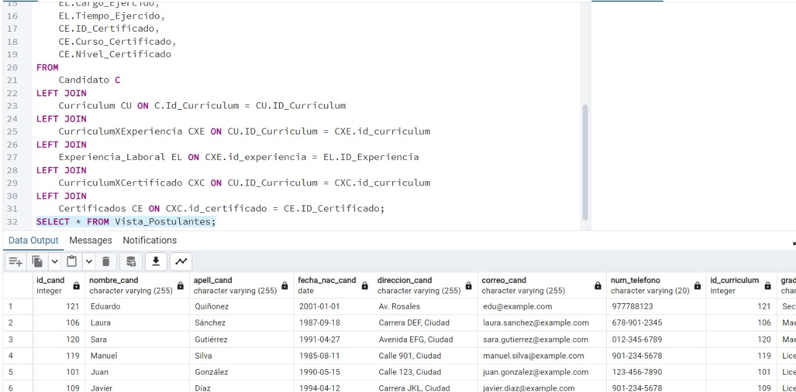     
