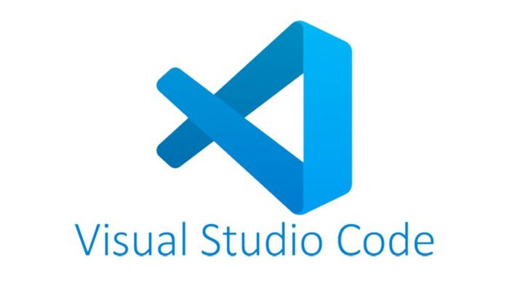
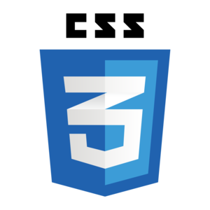
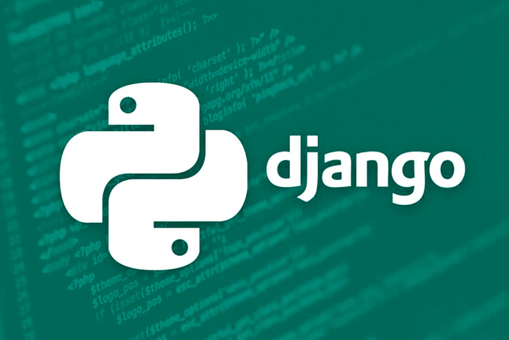

# Capítulo 09: Versión Final de la Aplicación

## 9.1 Aplicación
DIRECCION DE LA CARPETA DEL PROYECTO: [Proyecto](https://github.com/N4VHI/Proyecto_DBD)

## 9.2 Estructura de la aplicación

## 9.3 Tecnología usada
### 9.3.1 Descripción General
La arquitectura de la aplicación está dividida en tres capas principales:

- Frontend: La interfaz de usuario construida con ayuda de HTML y CSS.
- Backend: Servidor y lógica de la aplicación manejados por Django.
- Base de Datos: PostgreSQL gestionada a través de la librería psycopg2 en Python.

### 9.2.2 Herramientas
1. Herramienta de Desarrollo:
- Visual Studio Code: Editor de código versátil y extensible utilizado para el desarrollo de software.

2. Frontend:
- HTML: HTML (HyperText Markup Language) es el lenguaje estándar utilizado para estructurar y presentar contenido en la web mediante el uso de etiquetas y elementos.

- CSS: Lenguaje de diseño utilizado para controlar la presentación visual de los elementos HTML en una página web, incluyendo colores, fuentes, diseño y animaciones. Permite crear sitios web visualmente atractivos y responsivos.

3. Backend:
- Django: Framework web de alto nivel en Python que fomenta el desarrollo rápido y el diseño limpio y pragmático.
- Django REST framework: Conjunto de herramientas potentes y flexibles para construir APIs web en Django.
- psycopg2: Librería PostgreSQL para Python. Se usará para interactuar con la base de datos desde el backend.

 

4. Base de Datos:
- PostgreSQL: Sistema de gestión de bases de datos relacional y orientado a objetos, conocido por su robustez y rendimiento.

### 9.2.3 Descripción de la Interacción entre Componentes
1. Frontend:

- El usuario interactúa con la aplicación a través de la interfaz construida con CSS.
- Las acciones del usuario en el frontend disparan solicitudes HTTP (GET, POST, PUT, DELETE) hacia el backend.

2. Backend:

- Django recibe las solicitudes HTTP desde el frontend y las procesa.
- Se utiliza Django REST framework para manejar estas solicitudes y devolver las respuestas adecuadas.
- Django interactúa con la base de datos PostgreSQL utilizando la librería psycopg2 para realizar operaciones CRUD (Crear, Leer, Actualizar, Eliminar).

3. Base de Datos:

- PostgreSQL almacena los datos de la aplicación.
- psycopg2 permite a Django ejecutar consultas SQL y manejar transacciones con PostgreSQL.

### 9.2.4 Herramientas y Librerías
#### 9.2.4.1 Frontend
- React.js: react, react-dom
- Herramientas de desarrollo: npm, webpack, babel

#### 9.2.4.2 Backend
- Django: django, djangorestframework
- psycopg2: psycopg2-binary

#### 9.2.4.3 Base de Datos
- PostgreSQL: Asegúrate de tener PostgreSQL instalado en tu servidor o utilizar un servicio gestionado como Heroku Postgres, Amazon RDS, etc.

El diagrama se vería algo así:
 
<link rel="stylesheet" type="text/css" href="estilos.css">
 

## Referencia

Para buscar alternativas del cómo realizar este proyecto nos basamos en el documento:
[Investigación de referencia](https://dspace.lib.ntua.gr/xmlui/bitstream/handle/123456789/54652/%CE%94%CE%99%CE%A0%CE%9B_%CE%91%CE%92%CE%A1%CE%91%CE%9C%CE%99%CE%94%CE%97%CE%A3_%CE%A8%CE%91%CE%A1%CE%A1%CE%91%CE%A3.pdf?sequence=1)
